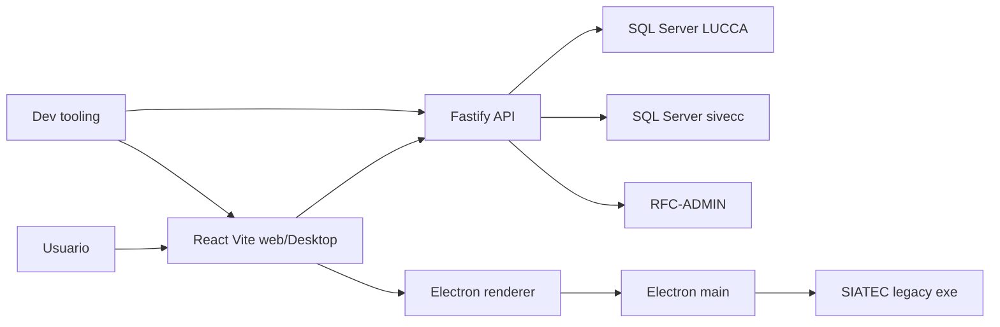

# Analysis: Harden Env, Security Y Tooling

## Propuestas De Skills

Estas son propuestas para que el equipo trabaje el cambio con el mismo criterio tecnico. Aqui importa para que serviria cada skill, como se podria instalar o versionar, y que documentacion consultar.

| Skill | Propuesta para el equipo | Donde se descarga o versiona | Documentacion util |
| --- | --- | --- | --- |
| [`security-best-practices`](https://www.skills.sh/openai/skills/security-best-practices) | Usarlo como checklist principal para secretos, storage, XSS, headers, supply-chain y validacion de entrada. | Hoy esta instalado localmente en Codex. Si el equipo lo adopta, versionarlo como skill interno bajo [`tools/skills/`](../../../tools/skills/README.md) para que no dependa de una maquina. | [OWASP Cheat Sheet Series](https://cheatsheetseries.owasp.org/), [OWASP NPM Security](https://cheatsheetseries.owasp.org/cheatsheets/NPM_Security_Cheat_Sheet.html), [Vite env docs](https://vite.dev/guide/env-and-mode). |
| [`security-threat-model`](https://www.skills.sh/openai/skills/security-threat-model) | Usarlo despues de aprobar alcance para convertir los hallazgos en amenazas, activos, limites de confianza y mitigaciones verificables. | Hoy esta instalado localmente en Codex. Propuesta: versionar una variante interna en [`tools/skills/`](../../../tools/skills/README.md) si se vuelve parte del proceso. | [OWASP Threat Modeling](https://owasp.org/www-community/Threat_Modeling), [Electron security docs](https://www.electronjs.org/docs/latest/tutorial/security). |
| [`fastify-typescript`](https://www.skills.sh/mindrally/skills/fastify-typescript) | Usarlo para refinar API: rutas pequenas, schemas por modulo, Zod/JSON schema, rate limiting, CORS y pruebas con `app.inject`. | Ya hay fuente registrada en [`skills-lock.json`](../../../skills-lock.json) y skill local en [`.agents/skills/fastify-typescript/SKILL.md`](../../../.agents/skills/fastify-typescript/SKILL.md). | [Fastify docs](https://fastify.dev/docs/latest/), [`@fastify/cors`](https://github.com/fastify/fastify-cors), [`@fastify/rate-limit`](https://github.com/fastify/fastify-rate-limit). |
| [`playwright`](https://www.skills.sh/openai/skills/playwright) | Usarlo solo para smoke tests de UI/desktop despues de cambios de auth, CORS, storage, print o login. | Instalacion normal por paquete cuando se apruebe: `pnpm add -D @playwright/test` o usar el skill local si Codex lo tiene disponible. | [Playwright docs](https://playwright.dev/docs/intro). |
| [`human-writing`](https://www.skills.sh/factory-ai/factory-plugins/human-writing) | Usarlo para convertir hallazgos tecnicos en texto claro para Jira, PR y presentacion, sin suavizar riesgos. | Hoy esta instalado localmente. Si el equipo lo adopta, versionarlo como skill interno en [`tools/skills/`](../../../tools/skills/README.md). | Guia interna recomendada: plantillas de Jira y PR del repo; no require dependencia runtime. |
| `multi-agent-workflow` | Usarlo cuando el cambio se divida por dominios (`apps/api`, `apps/web`, `apps/desktop`, `shared/contracts`) para evitar drift entre agentes. | Ya existe como skill versionado del repo: [`tools/skills/multi-agent-workflow/SKILL.md`](../../../tools/skills/multi-agent-workflow/SKILL.md). | Reglas de agentes: [`agents.md`](../../../agents.md). |

Decision propuesta sobre skills:

- No bloquear el hardening por instalar skills.
- Si una skill se vuelve obligatoria para el equipo, versionarla dentro del repo y sincronizarla con [`tools/scripts/sync-skills.ps1`](../../../tools/scripts/sync-skills.ps1).
- No presentar skills locales como dependencia official si no hay fuente versionada o reproducible.

## Reglas Locales Que Guian El Analysis

Estas reglas pesan mas que una recomendacion generica.

| Regla | Implicacion practica |
| --- | --- |
| [`agents.md`](../../../agents.md) exige Jira-first, SDD/OpenSpec y cambios acotados | Este archivo vive en OpenSpec. La implementacion debe dividirse por fases y preparar handoff para `npm run commit-jira`, no commits automaticos. |
| [`agents.md`](../../../agents.md) define dominios y allowlists | Este documento es `ci`. La implementacion real tocara `apps/api`, `apps/web`, `apps/desktop` y posiblemente `shared/contracts` con aprobacion por fase. |
| [`.codex/rules/security.md`](../../../.codex/rules/security.md) prohibe secretos en repo y exige Zod | Secretos locales se rotan; env se valida al arranque; IPC y payloads externos se parsean. |
| [`.codex/rules/backend.md`](../../../.codex/rules/backend.md) centraliza configuracion en `apps/api/src/lib/env.ts` | Connection strings y config SQL no se arman dispersas en repositorios o bootstrap. |
| [`.codex/rules/frontend.md`](../../../.codex/rules/frontend.md) exige `apps/web/src/shared/lib/api.ts` para HTTP | Cambios de base URL o auth deben pasar por el wrapper, no por fetch sueltos. |
| [`.codex/rules/database.md`](../../../.codex/rules/database.md) exige SQL parametrizado y respeto a schema legacy | No se renombran tablas legacy; identificadores dinamicos se allowlistean. |
| [`.codex/rules/errors.md`](../../../.codex/rules/errors.md) prohibe exponer detalles internos | Errores de DB/config se loguean para operador sin filtrar secrets al cliente. |
| [`.codex/rules/api-design.md`](../../../.codex/rules/api-design.md) exige OpenAPI completo | Endpoints publicados deben tener `summary`, `description`, params/body, responses y auth. |
| [`.codex/rules/shared-client-api.md`](../../../.codex/rules/shared-client-api.md) evita contratos duplicados | DTOs cruzados API/web van a `shared/contracts` cuando sean publicos. |
| [`.codex/rules/testing-friendly.md`](../../../.codex/rules/testing-friendly.md) pide DI y pruebas | Validadores, builders SQL, handlers e IPC deben poder probarse sin SQL Server real cuando aplique. |
| [`.codex/rules/database-schema.md`](../../../.codex/rules/database-schema.md) exige documentar schema real | Tablas no documentadas deben agregarse o marcarse antes de cambiar SQL. |

## Resumen

El riesgo principal no viene de React, Fastify o Electron por si mismos. Viene de configuracion duplicada, secretos locales, fronteras sin contrato estricto y tooling que todavia permite drift.

La propuesta es atacar en capas:

1. Container secretos y unificar env.
2. Convertir DB config a estructura validada, no strings manuales.
3. Cerrar CORS, limites de request y login abuse.
4. Endurecer Electron IPC y el flujo legacy.
5. Eliminar sinks DOM y storage sensible donde sea possible.
6. Separar remediacion de dependencias de refactors cosmeticos.
7. Agregar pruebas minimas por fase.

No propongo reescribir la arquitectura ni mover todo a un framework nuevo ni affectar la funcionalidad. El cambio defendible es reforzar las desiciones existentes: `env.ts`, `db/*.ts`, `create-app.ts`, `api.ts`, preload/main de Electron y contratos compartidos.

## Formato De Decision Por Issue

Cada issue usa este formato:

- Prioridad: alta, media o baja.
- Donde esta: ligas a los archivos.
- Codigo actual: extracto verificable del repo.
- Mejora possible: ejemplo de direction tecnica, no parche final.
- Riesgo: impacto de hacerlo y de no hacerlo.
- Decision: casillas para aprobar, rechazar o pedir diseno.

## Issues Y Propuestas Aprobables

### ENV-001: Contrato Real De Env Debe Vivir En Raiz

Prioridad: baja

Explicacion:

Hoy hay dos contratos compitiendo. El ejemplo publico vive en `.env.example`, pero el parser real de API exige `DATABASE_URL` y `ACCOUNTING_DATABASE_URL`. Al mismo tiempo, `.env.example` declara variables planas de SQL Server que el runtime no usa. Esto facilita que cada desarrollador edite un archivo distinto, copie secretos o apunte a un puerto/base equivocados.

Donde esta:

- [`.env.example`](../../../.env.example)
- [`apps/api/src/lib/env.ts`](../../../apps/api/src/lib/env.ts)
- [`tools/scripts/dev/start-dev.js`](../../../tools/scripts/dev/start-dev.js)

Codigo actual:

```env
# .env.example
PORT=3001
HOST=0.0.0.0
DB_HOST=10.10.60.229
DB_PORT=1433
DB_NAME=""
DB_USER=""
DB_PASSWORD=

DATABASE_URL="Server=HOST\INSTANCE;Database=LUCCA;User Id=USER;Password=<redacted>;TrustServerCertificate=True;Encrypt=False"
ACCOUNTING_DATABASE_URL="Server=HOST\INSTANCE;Database=sivecc;User Id=USER;Password=<redacted>;TrustServerCertificate=True;Encrypt=False"
```

```ts
// apps/api/src/lib/env.ts
const envSchema = z.object({
	NODE_ENV: z.enum(["development", "production", "test"]).default("development"),
	PORT: z.coerce.number().default(5000),
	HOST: z.string().default("0.0.0.0"),
	DATABASE_URL: z.string().min(1),
	ACCOUNTING_DATABASE_URL: z.string().optional(),
	JWT_SECRET: z.string().min(1),
	JWT_EXPIRES_IN: z.string().default("8h"),
	FIRMA_PASSPHRASE: z.string().min(1),
	TENANT_RFC: z.string().optional(),
});
```

Mejora possible:

```ts
const envSchema = z.object({
	NODE_ENV: z.enum(["development", "production", "test"]).default("development"),
	PORT: z.coerce.number().default(5000),
	HOST: z.string().default("0.0.0.0"),

	DB_HOST: z.string().min(1),
	DB_PORT: z.coerce.number().int().positive().default(1433),
	DB_NAME: z.string().min(1),
	DB_USER: z.string().min(1),
	DB_PASSWORD: z.string().min(1),
	DB_ENCRYPT: z.coerce.boolean().default(false),
	DB_TRUST_SERVER_CERTIFICATE: z.coerce.boolean().default(true),

	ACCOUNTING_DB_NAME: z.string().optional(),
	DATABASE_URL: z.string().optional(), // escape hatch temporal
	JWT_SECRET: z.string().min(32),
	JWT_EXPIRES_IN: z.string().default("8h"),
	FIRMA_PASSPHRASE: z.string().min(1),
});
```

La mejora no elimina `DATABASE_URL` de golpe. Lo deja como compatibilidad temporal mientras todos migran a variables planas.

Riesgo:

- De hacerlo: mediano. Puede romper arranque local si alguien depende de `apps/api/.env` o de strings manuales.
- De no hacerlo: bajo. Se mantiene drift de env, secretos copiados y fallos por bases/puertos inconsistentes.

Decision:

- [ ] Aprobar env raiz con compatibilidad temporal.
- [x] Rechazar y mantener env por paquete.
- [ ] Pedir diseno mas detallado para loader de env.

### ENV-002: Connection Strings Deben Construirse Desde Config Validada

Prioridad: alta

Explicacion:

La API crea la connection desde el `.env` con strings directos. Para tenants, cambia la base con regex sobre `Database=…`. Esto funciona hasta que cambia el formato del string, aparece un character especial como me paso ami o la base activa no es la esperada.

Donde esta:

- [`apps/api/src/db/mssql.ts`](../../../apps/api/src/db/mssql.ts)
- [`apps/api/src/db/accounting-mssql.ts`](../../../apps/api/src/db/accounting-mssql.ts)
- [`apps/api/src/db/tenant-mssql.ts`](../../../apps/api/src/db/tenant-mssql.ts)

Codigo actual:

```ts
// apps/api/src/db/mssql.ts
export async function getPool(env: Env): Promise<mssql.ConnectionPool> {
	if (pool) return pool;
	pool = await new mssql.ConnectionPool(env.DATABASE_URL).connect();
	return pool;
}
```

```ts
// apps/api/src/db/tenant-mssql.ts
function buildTenantConnectionString(
	baseUrl: string,
	rfc: string,
	year: number,
): string {
	const db = `${rfc}${year}`;
	return baseUrl.replace(/Database=[^;]+/i, `Database=${db}`);
}
```

Mejora possible:

```ts
interface SqlServerConfigInput {
	host: string;
	port: number;
	database: string;
	user: string;
	password: string;
	encrypt: boolean;
	trustServerCertificate: boolean;
}

export function buildSqlConfig(input: SqlServerConfigInput): mssql.config {
	return {
		server: input.host,
		port: input.port,
		database: input.database,
		user: input.user,
		password: input.password,
		options: {
			encrypt: input.encrypt,
			trustServerCertificate: input.trustServerCertificate,
		},
	};
}

export function buildTenantSqlConfig(env: Env, rfc: string, year: number) {
	return buildSqlConfig({ ...env.sql, database: `${rfc}${year}` });
}
```

Riesgo:

- De hacerlo: medio. `mssql` acepta strings y objetos, pero hay que validar contra SQL Server real.
- De no hacerlo: alto. La base destino puede cambiar por un string mal formado y generar fallos o lectura contra DB equivocada.

Decision:

- [x] Aprobar builder de SQL config.
- [ ] Mantener strings pero agregar tests y validacion.
- [ ] Rechazar por ahora.

### API-001: CORS Debe Usar Allowlist Explicita

Prioridad: baja

Explicacion:

`origin: true` refleja origenes. En dev es comodo, pero como default de API aumenta superficie si se expone fuera de local o si en el futuro cambia el modo de auth. La regla local pide CORS explicito para `apps/web`.

Donde esta:

- [`apps/api/src/app/create-app.ts`](../../../apps/api/src/app/create-app.ts)
- [`.codex/rules/security.md`](../../../.codex/rules/security.md)

Codigo actual:

```ts
await app.register(fastifyHelmet);
await app.register(fastifyCors, { origin: true });
await app.register(fastifySensible);
await app.register(fastifyJwt, { secret: env.JWT_SECRET });
```

Mejora possible:

```ts
const allowedOrigins = new Set(env.CORS_ALLOWED_ORIGINS);

await app.register(fastifyCors, {
	origin(origin, cb) {
		if (!origin && env.NODE_ENV !== "production") return cb(null, true);
		if (origin && allowedOrigins.has(origin)) return cb(null, true);
		return cb(new Error("CORS origin is not allowed"), false);
	},
});
```

Env asociado:

```ts
CORS_ALLOWED_ORIGINS: z
	.string()
	.default("http://localhost:5173,http://127.0.0.1:5173")
	.transform((value) => value.split(",").map((v) => v.trim()).filter(Boolean)),
```

Riesgo:

- De hacerlo: medio. Puede romper docs, desktop o previews si usan origenes no listados.
- De no hacerlo: medio. La API queda mas abierta de lo necesario.

Decision:

- [ ] Aprobar allowlist por env.
- [x] Solo cerrar CORS en produccion.
- [ ] Rechazar por ahora.

### API-002: OpenAPI Esta Incompleto Y Rutas Grandes Suben El Costo De Cambio

Prioridad: media

Explicacion:

La regla local exige `summary`, `description`, params/body, responses y auth. Hoy hay `summary` en `auth` y `dashboard`, pero falta `description` consistente. `usuarios/routes.ts` concentra muchos endpoints, schemas y handlers en un solo archivo. No rompe runtime, pero encarece revision y pruebas.

Donde esta:

- [`apps/api/src/modules/auth/routes.ts`](../../../apps/api/src/modules/auth/routes.ts)
- [`apps/api/src/modules/dashboard/routes.ts`](../../../apps/api/src/modules/dashboard/routes.ts)
- [`apps/api/src/modules/usuarios/routes.ts`](../../../apps/api/src/modules/usuarios/routes.ts)
- [`.codex/rules/api-design.md`](../../../.codex/rules/api-design.md)

Codigo actual:

```ts
schema: {
	tags: ["Usuarios"],
	security: [{ bearerAuth: [] }],
	querystring: ListQuerySchema,
	response: { 200: PagedUsuariosSchema },
},
```

```ts
schema: {
	tags: ["Auth"],
	summary: "Iniciar sesion",
	body: LoginRequestSchema,
	response: {
		200: LoginResponseSchema,
		401: ProblemDetailsSchema,
		403: ProblemDetailsSchema,
	},
},
```

Mejora possible:

```ts
schema: {
	tags: ["Usuarios"],
	summary: "Listar usuarios",
	description: "Devuelve usuarios del sistema legacy con filtros, paginacion y ordenamiento permitidos.",
	security: [{ bearerAuth: [] }],
	querystring: ListQuerySchema,
	response: {
		200: PagedUsuariosSchema,
		401: ProblemDetailsSchema,
	},
},
```

Para estructura:

```text
apps/api/src/modules/usuarios/
  routes.ts                  -> agregador
  routes/list.routes.ts
  routes/permisos.routes.ts
  routes/autorizaciones.routes.ts
  schemas.ts
  service.ts
  repository.ts
```

Riesgo:

- De hacerlo: bajo a medio. Refactor de rutas puede cambiar registros si no hay tests.
- De no hacerlo: medio. Cada hardening futuro tocara archivos grandes y sera mas dificil revisar impacto.

Decision:

- [x] Aprobar completar OpenAPI primero.
- [ ] Aprobar split gradual de `usuarios/routes.ts`.
- [ ] Rechazar split y solo documentar.

### API-003: Commit `061fcc4` Agrego Rutas REST Por modulo

Prioridad: media

Explicacion:

El commit `061fcc4` de Hauske, `(refactor) [Routes] Added REST and agregated them`, cambio la forma en que la API arma sus rutas. Antes `create-app.ts` registraba cada modulo directo bajo `/api/v1`, y cada modulo repetia su propio segmento en el path. Por ejemplo, `authRoutes` declaraba `/auth/login`, `usuariosRoutes` declaraba `/usuarios/:id`, y `createApp` les agregaba el prefijo comun `/api/v1`.

Despues del commit, la version del API sigue en un solo lugar, pero se agrego un router central en `apps/api/src/app/routes.ts`. Ese router monta cada modulo por recurso: `/auth`, `/dashboard`, `/grupos`, `/catalogos`, `/usuarios`. Dentro de cada modulo, las rutas quedaron relativas al recurso. Eso es mas sano para Fastify porque el modulo `usuarios` ya no necesita saber que vive en `/usuarios`; solo define `/`, `/:id`, `/:id/permisos`, etc.

El motivo tecnico es claro: quitar duplicacion, acercar el API a un estilo REST y evitar que `/api/v1` se copie por todo el frontend. El cambio ayuda, pero no es gratis. Algunos endpoints conservaron la URL final y otros cambiaron. Por eso desarrollo debe revisarlo como un refactor con impacto de compatibilidad, no solo como limpieza interna.

Donde esta:

- Commit local: `061fcc4`
- [`apps/api/src/app/create-app.ts`](../../../apps/api/src/app/create-app.ts)
- [`apps/api/src/app/routes.ts`](../../../apps/api/src/app/routes.ts)
- [`apps/api/src/modules/auth/routes.ts`](../../../apps/api/src/modules/auth/routes.ts)
- [`apps/api/src/modules/dashboard/routes.ts`](../../../apps/api/src/modules/dashboard/routes.ts)
- [`apps/api/src/modules/grupos/routes.ts`](../../../apps/api/src/modules/grupos/routes.ts)
- [`apps/api/src/modules/usuarios/routes.ts`](../../../apps/api/src/modules/usuarios/routes.ts)
- [`apps/api/src/modules/catalogs/routes.ts`](../../../apps/api/src/modules/catalogs/routes.ts)
- [`apps/web/src/shared/lib/api.ts`](../../../apps/web/src/shared/lib/api.ts)
- [`apps/web/src/routes/login.tsx`](../../../apps/web/src/routes/login.tsx)
- [`apps/web/src/features/usuarios/control-de-usuarios/useUsuarios.ts`](../../../apps/web/src/features/usuarios/control-de-usuarios/useUsuarios.ts)
- [`apps/web/src/features/usuarios/control-de-usuarios/useUsuarioEdit.ts`](../../../apps/web/src/features/usuarios/control-de-usuarios/useUsuarioEdit.ts)

Codigo antes del commit:

```ts
// apps/api/src/app/create-app.ts
import { authRoutes } from "../modules/auth/routes";
import { catalogsRoutes } from "../modules/catalogs/routes";
import { dashboardRoutes } from "../modules/dashboard/routes";
import { gruposRoutes } from "../modules/grupos/routes";
import { usuariosRoutes } from "../modules/usuarios/routes";

await app.register(authRoutes, { prefix: "/api/v1" });
await app.register(dashboardRoutes, { prefix: "/api/v1" });
await app.register(gruposRoutes, { prefix: "/api/v1" });
await app.register(catalogsRoutes, { prefix: "/api/v1" });
await app.register(usuariosRoutes, { prefix: "/api/v1" });
```

```ts
// apps/api/src/modules/auth/routes.ts
app.post("/auth/login", options, handler);

// apps/api/src/modules/usuarios/routes.ts
app.get("/usuarios/:id", options, handler);
app.get("/usuarios/:id/fondo-revolvente", options, handler);
```

```ts
// apps/web/src/routes/login.tsx
await apiRequest<LoginResponse>({
	path: "/api/v1/auth/login",
	method: "POST",
	body: JSON.stringify({ login: values.login, password: values.password }),
});
```

Cambio implementado:

```ts
// apps/api/src/app/create-app.ts
import { routes } from "./routes";

await app.register(routes, { prefix: "/api/v1" });
```

```ts
// apps/api/src/app/routes.ts
export const routes: FastifyPluginAsync = async (app) => {
	await app.register(authRoutes, { prefix: "/auth" });
	await app.register(dashboardRoutes, { prefix: "/dashboard" });
	await app.register(gruposRoutes, { prefix: "/grupos" });
	await app.register(catalogsRoutes, { prefix: "/catalogos" });
	await app.register(usuariosRoutes, { prefix: "/usuarios" });
};
```

```ts
// apps/api/src/modules/auth/routes.ts
app.post("/login", options, handler);

// apps/api/src/modules/usuarios/routes.ts
app.get("/:id", options, handler);
app.get("/:id/fondos-revolventes", options, handler);
```

```ts
// apps/web/src/shared/lib/api.ts
const DEFAULT_API_URL = "http://localhost:5000";
const API_PREFIX = "/api/v1";

const response = await fetch(`${resolveBaseUrl()}${API_PREFIX}${path}`, {
	...init,
	headers: reqHeaders,
});
```

```ts
// apps/web/src/routes/login.tsx
await apiRequest<LoginResponse>({
	path: "/auth/login",
	method: "POST",
	body: JSON.stringify({ login: values.login, password: values.password }),
});
```

Impacto en endpoints:

| Area | Antes | Despues | Impacto |
| --- | --- | --- | --- |
| Auth | `/api/v1/auth/login` | `/api/v1/auth/login` | URL final igual; el modulo ya no repite `/auth`. |
| Usuarios | `/api/v1/usuarios/:id/permisos` | `/api/v1/usuarios/:id/permisos` | URL final casi igual; el modulo queda relativo. |
| Grupos | `/api/v1/grupos/:id` | `/api/v1/grupos/:id` | URL final igual; el modulo queda relativo. |
| Catalogos | `/api/v1/areas`, `/api/v1/bancos` | `/api/v1/catalogos/areas`, `/api/v1/catalogos/bancos` | Cambio de contrato. |
| Dashboard | `/api/v1/tesoreria/dashboard` | `/api/v1/dashboard/tesoreria` | Cambio de contrato para dashboards por modulo. |
| Fondo revolvente | `/api/v1/usuarios/:id/fondo-revolvente` | `/api/v1/usuarios/:id/fondos-revolventes` | Cambio de nombre y pluralizacion. |

> reivsar el orden de tesoreria/dashboard, que en el modulo, porque tesoreria tiene su dashboard
revisar tambien si el cambio plural affecta lo legacy

Por que importa para este analysis:

- El API ahora tiene version global, router agregado y modulos por recurso.
- El wrapper web es la fuente unica de `/api/v1`.
- Algunos endpoints cambiaron de URL final; consumidores externos, scripts o pruebas viejas pueden fallar con `404`.
- Refuerza la necesidad de OpenAPI completo y pruebas de contrato.
- Para desktop embebido, el renderer debe usar `apiRequest`, no URLs hardcodeadas.

Mejora possible:

Primero documentar el contrato final despues de `061fcc4`. Luego decidir si el equipo quiere aliases legacy temporales para las rutas que cambiaron. Esa decision debe salir de desarrollo, porque mantener dos URLs para lo mismo tambien tiene costo.

```ts
// Alias legacy limitado si hay consumidores reales.
// Colocarlo en el router agregado, no dentro de dashboardRoutes.
app.get("/tesoreria/dashboard", legacyOptions, async (_req, reply) => {
	return reply.redirect(308, "/api/v1/dashboard/tesoreria");
});
```

```ts
// Pruebas de contrato con app.inject.
await app.inject({ method: "POST", url: "/api/v1/auth/login" });
await app.inject({ method: "GET", url: "/api/v1/catalogos/areas" });
await app.inject({ method: "GET", url: "/api/v1/dashboard/tesoreria" });
await app.inject({
	method: "GET",
	url: "/api/v1/usuarios/1/fondos-revolventes",
});
```

Riesgo:

- De mantener el cambio sin documentarlo: medio. El frontend actual puede funcionar, pero un consumidor externo o prueba vieja puede seguir apuntando a rutas anteriores.
- De agregar aliases legacy sin control: medio. Se duplican contratos y Swagger puede terminar mostrando rutas que el equipo ya no quiere soportar.
- De revertir el cambio: medio. Se pierde la separacion nueva entre version global, router agregado y rutas internas por modulo.

Decision:

- [x] Aprobar el patron nuevo de `routes.ts` agregado y rutas internas relativas. - rutas por modulo
- [x] Documentar en OpenAPI las rutas finales despues de `061fcc4`.
- [ ] Agregar aliases temporales para endpoints legacy que ya tengan consumidores.
- [ ] No agregar aliases y tratarlo como cambio de contrato controlado.

### DB-001:Ejemplo `DatosGrales` O la DB Necesita Contrato De Columnas Y Migracion Por Base

Prioridad: alta

Explicacion:

El problema no es solo si la tabla se consulta como `DatosGrales` o `dbo.DatosGrales`. Ese ajuste puede resolver un caso, pero no resuelve el fondo: el codigo assume que `DatosGrales` tiene ciertas columnas y que esas columnas existen igual en todas las bases donde corre SIATEC.

En la practica podemos tener varias bases con versiones distintas. Una puede tener `RFC`; otra puede no tener `TIEMPOINACTIVIDADBLOQUEO`; otra puede tener la tabla, pero con columnas incompletas o tipos distintos. `ISNULL(…)` ayuda cuando el valor viene nulo, pero no sirve si la columna no existe. En ese caso SQL Server falla antes de regresar datos.

Este issue deberia servir para que desarrollo revise la forma real de `DatosGrales`, decida que columnas son obligatorias y proponga una migracion segura. No conviene que la API "arregle" tablas automaticamente al arrancar. Lo correcto es detectar la diferencia, reportarla con claridad y aplicar scripts revisados por base.

Donde esta:

- [`apps/api/src/modules/auth/repository.ts`](../../../apps/api/src/modules/auth/repository.ts)
- [`apps/api/src/db/tenant-mssql.ts`](../../../apps/api/src/db/tenant-mssql.ts)
- [`database/schema/tables-index.md`](../../../database/schema/tables-index.md)

Codigo actual:

```ts
const DATOS_GRALES_SQL = `
  SELECT
    CAST(ISNULL(NODIASINHABLITARINACTIVO, 0) AS int)   AS diasInactividadCuenta,
    CAST(ISNULL(TIEMPOINACTIVIDADBLOQUEO, 0) AS int)   AS minutosInactividadUi,
    ISNULL(NOMBREENTIDAD, '')                          AS nombreEntidad,
    ISNULL(RFC, '')                                    AS rfc
  FROM DatosGrales WHERE CODIGO = 1
`;
```

Ese query assume que existen estas columnas:

```text
DatosGrales.CODIGO
DatosGrales.NODIASINHABLITARINACTIVO
DatosGrales.TIEMPOINACTIVIDADBLOQUEO
DatosGrales.NOMBREENTIDAD
DatosGrales.RFC
```

```ts
const result = await pool.request().query(`
	SELECT NULLIF(LTRIM(RTRIM(RFC)), '') AS Rfc
	FROM DatosGrales
	WHERE CODIGO = 1
`);
```

Mejora possible:

Crear un contrato minimo de la tabla y un diagnostico que se pueda correr contra cada base antes de depender del query. El objetivo no es cambiar el schema a ciegas, sino decirle al equipo exactamente que falta y en que base falta.

```ts
const DATOS_GRALES_REQUIRED_COLUMNS = [
	"CODIGO",
	"NODIASINHABLITARINACTIVO",
	"TIEMPOINACTIVIDADBLOQUEO",
	"NOMBREENTIDAD",
	"RFC",
] as const;

export async function inspectDatosGralesShape(pool: mssql.ConnectionPool) {
	const result = await pool.request().query<{
		databaseName: string;
		schemaName: string;
		tableName: string;
		columnName: string | null;
		dataType: string | null;
	}>(`
		SELECT
			DB_NAME() AS databaseName,
			S.name AS schemaName,
			T.name AS tableName,
			C.name AS columnName,
			TY.name AS dataType
		FROM sys.tables T
		INNER JOIN sys.schemas S ON S.schema_id = T.schema_id
		LEFT JOIN sys.columns C ON C.object_id = T.object_id
		LEFT JOIN sys.types TY ON TY.user_type_id = C.user_type_id
		WHERE T.name = N'DatosGrales'
	`);

	const databaseName = result.recordset[0]?.databaseName ?? "";
	const columns = new Set(
		result.recordset
			.map((row) => row.columnName?.toUpperCase())
			.filter((name): name is string => Boolean(name)),
	);

	const missingColumns = DATOS_GRALES_REQUIRED_COLUMNS.filter(
		(column) => !columns.has(column),
	);

	return { databaseName, missingColumns, columns: [...columns] };
}
```

Con eso, el arranque o un commando de diagnostico puede fallar con un mensaje util:

```ts
const shape = await inspectDatosGralesShape(pool);

if (shape.missingColumns.length > 0) {
	throw new Error(
		`DatosGrales in ${shape.databaseName} is missing columns: ${shape.missingColumns.join(", ")}`,
	);
}
```

La migracion deberia quedar como script revisado, idempotente y ejecutado por base. Un ejemplo de direction tecnica:

```sql
DECLARE @schema sysname;
DECLARE @objectName nvarchar(300);

SELECT TOP (1) @schema = S.name
FROM sys.tables T
INNER JOIN sys.schemas S ON S.schema_id = T.schema_id
WHERE T.name = N'DatosGrales'
ORDER BY CASE WHEN S.name = N'dbo' THEN 0 ELSE 1 END;

IF @schema IS NULL
BEGIN
	THROW 51000, 'DatosGrales does not exist in this database.', 1;
END;

SET @objectName = QUOTENAME(@schema) + N'.[DatosGrales]';

IF COL_LENGTH(@objectName, 'RFC') IS NULL
BEGIN
	EXEC(N'ALTER TABLE ' + @objectName + N' ADD RFC varchar(13) NULL;');
END;

IF COL_LENGTH(@objectName, 'TIEMPOINACTIVIDADBLOQUEO') IS NULL
BEGIN
	EXEC(N'ALTER TABLE ' + @objectName + N' ADD TIEMPOINACTIVIDADBLOQUEO int NULL;');
END;
```

Este script no debe tomarse como parche final. Es el tipo de solucion que el equipo debe revisar con el schema real, tipos correctos, defaults, permisos, respaldos y orden de rollout.

Riesgo:

- De hacerlo: medio. Crear o ajustar columnas en bases legacy necesita respaldo, revision de tipos y coordinacion con quien opera SQL Server.
- De no hacerlo: alto. Login, tenant loader o dashboard pueden fallar en una base que no tenga la misma version de `DatosGrales`.

Decision:

- [ ] Aprobar diagnostico de shape de `[x]osGrales` por base.
- [ ] Pedir a desarrollo/DBA una migracion idempotente para columnas faltantes.
- [ ] Documentar primero el schema real y decidir despues si se migra.
- [ ] Rechazar por ahora.
- [x] Aprobado migracion con typeorm, Se quedan sql quieries 

### DESK-003: Desktop Necesita Orden De Arranque Y API Embebida

Prioridad: alta

Explicacion:

Desktop no deberia arrancar como si fuera una pieza aislada. El orden real importa: primero contratos, despues API, UI compartido, web, y al final Electron. Si Electron abre la ventana antes de que el API determine de cargar, el renderer puede marcar errores falsos: login caido, dashboard vacio, permisos sin cargar o "API no disponible" cuando el backend simplemente sigue iniciando SQL Server, tenant RFC o pools.

En dev ya hay un intento de orquestacion en `tools/scripts/dev/start-dev.js`: construye `shared/contracts`, construye `shared/ui`, levanta API, espera respuesta, levanta preview web y despues arranca desktop. Eso va en la direction correcta. La brecha esta en que ese comportamiento vive en el script, no en el contrato del desktop ni en el build final.

Para build la expectativa debe quedar escrita: el exe de desktop necesita incluir el API compilado y arrancarlo como proceso administrado por Electron, en paralelo al renderer, con un readiness check antes de mostrar la experiencia. Si el API no puede iniciar, desktop debe mostrar un error controlado. No debe dejar que el frontend falle primero con sintomas confusos.

Donde esta:

- [`package.json`](../../../package.json)
- [`turbo.json`](../../../turbo.json)
- [`tools/scripts/dev/start-dev.js`](../../../tools/scripts/dev/start-dev.js)
- [`apps/api/src/index.ts`](../../../apps/api/src/index.ts)
- [`apps/desktop/package.json`](../../../apps/desktop/package.json)
- [`apps/desktop/electron/main.ts`](../../../apps/desktop/electron/main.ts)
- [`apps/web/src/shared/lib/api.ts`](../../../apps/web/src/shared/lib/api.ts)

Codigo actual:

```json
// package.json
"scripts": {
	"dev:api-web": "node tools/scripts/dev/start-dev.js api+web",
	"dev:api-desktop": "node tools/scripts/dev/start-dev.js api+desktop"
}
```

```json
// turbo.json
"@siatec/desktop #build ": {
	"dependsOn": [
		"@siatec/contracts #build ",
		"@siatec/ui #build ",
		"@siatec/api #build ",
		"@siatec/web #build "
	],
	"outputs": ["dist/**", "build/**", "release/**", ".turbo/**"]
}
```

```js
// tools/scripts/dev/start-dev.js
run("Building shared contracts", "corepack", [
	"pnpm",
	"--filter",
	"@siatec/contracts",
	"build",
]);
run("Building shared UI", "corepack", [
	"pnpm",
	"--filter",
	"@siatec/ui",
	"build",
]);

// perfil api+desktop
run("Building API for desktop embedding", "corepack", [
	"pnpm",
	"--filter",
	"@siatec/api",
	"build",
]);
run("Building web client for desktop embedding", "corepack", [
	"pnpm",
	"--filter",
	"@siatec/web",
	"build",
]);

const apiChild = start("Starting API", "pnpm", [
	"--filter",
	"@siatec/api",
	"exec",
	"tsx",
	"src/index.ts",
]);

await waitForApi("http://127.0.0.1:5000/health").catch(() =>
	waitForApi("http://127.0.0.1:5000/"),
);
```

```json
// apps/desktop/package.json
"scripts": {
	"dev": "electron dist/main.js",
	"build": "tsc"
}
```

```ts
// apps/desktop/electron/main.ts
if (isDev) {
	await win.loadURL(devUrl);
} else {
	await win.loadFile(indexFile);
}
```

Mejora possible:

Definir dos contratos separados: uno para desarrollo y otro para el ejecutable.

```text
Dev:
1. build shared/contracts
2. start apps/api
3. wait API ready
4. build shared/ui
5. start apps/web dev o preview
6. start apps/desktop

Build/package:
1. build shared/contracts
2. build apps/api
3. build shared/ui
4. build apps/web
5. build apps/desktop
6. package desktop con api/dist y web/dist incluidos
```

En runtime desktop, Electron deberia administrar el API antes de abrir la ventana:

```ts
async function startEmbeddedApi(): Promise<ChildProcess> {
	const apiEntry = app.isPackaged
		? path.join(process.resourcesPath, "api", "dist", "index.js")
		: path.resolve(__dirname, "../../api/dist/index.js");

	const child = spawn(process.execPath, [apiEntry], {
		env: {
			...process.env,
			PORT: process.env.PORT ?? "5000",
			HOST: "127.0.0.1",
		},
		stdio: "pipe",
		windowsHide: true,
	});

	await waitForApiReady("http://127.0.0.1:5000/");
	return child;
}

app.whenReady().then(async () => {
	const apiProcess = await startEmbeddedApi();
	registerApiProcessLifecycle(apiProcess);
	await createWindow();
});
```

El equipo debe definir el detalle final: si el API se ejecuta con `node`, con un binario empaquetado, con `asarUnpack`, o con otro mecanismo de packaging. La decision importante es que el exe no dependa de que alguien haya levantado el API manualmente.

Riesgo:

- De hacerlo: medio. Empaquetar y administrar un API dentro de Electron cambia instalador, rutas, variables de entorno, logs, puertos y ciclo de vida.
- De no hacerlo: alto. Desktop puede producir falsos negativos de API en dev y, en build, puede quedar un exe que abre la UI pero no tiene backend d[x]onible.

Decision:

- [x] Aprobar orden official de dev: contracts, ui, web, desktop.
- [ ] Aprobar build/package con API embebida dentro del exe.
- [ ] Pedir diseno tecnico para lifecycle, logs, puertos y shutdown del API embebido.
- [ ] Rechazar por ahora.

### WEB-001: Password Legacy no Debe Persistir En `localStorage`

Prioridad: alta

Explicacion:

`localStorage` es legible por cualquier JavaScript que corra en el origen. Un XSS, extension o acceso local al perfil puede leer el password legacy. El token auth tambien persiste con Zustand, pero el password legacy es mas sensible porque puede reutilizarse fuera de la app y ademas se pasa al launcher.

Donde esta:

- [`apps/web/src/shared/lib/legacy-auth.ts`](../../../apps/web/src/shared/lib/legacy-auth.ts)
- [`apps/web/src/shared/stores/authStore.ts`](../../../apps/web/src/shared/stores/authStore.ts)
- [`apps/desktop/electron/legacy-launcher.ts`](../../../apps/desktop/electron/legacy-launcher.ts)

Codigo actual:

```ts
const LEGACY_PASSWORD_KEY = "siatec-legacy-password";

export function setLegacyPassword(password: string | null | undefined): void {
	if (!isStorageAvailable()) return;
	const value = password ?? "";
	if (value) {
		window.localStorage.setItem(LEGACY_PASSWORD_KEY, value);
	} else {
		window.localStorage.removeItem(LEGACY_PASSWORD_KEY);
	}
}
```

```ts
export const useAuthStore = create<AuthState>()(
	persist(
		(set) => ({
			token: null,
			user: null,
			setAuth: (token, user) => set({ token, user: normalizeUser(user) }),
			clearAuth: () => set({ token: null, user: null }),
		}),
		{
			name: "siatec-auth",
			partialize: (state): PersistedAuthState => ({
				token: state.token,
				user: state.user,
			}),
		},
	),
);
```

Mejora possible:

```ts
let legacyPasswordInMemory: string | null = null;

export function setLegacyPassword(password: string | null | undefined): void {
	legacyPasswordInMemory = password && password.length > 0 ? password : null;
}

export function getLegacyPassword(): string | null {
	return legacyPasswordInMemory;
}

export function clearLegacyPassword(): void {
	legacyPasswordInMemory = null;
}
```

Si el flujo exige persistencia, la decision debe documentar alternativa: pedir password por session, usar storage seguro de Electron en main process, o emitir token corto para launcher en vez de persistir password.

Riesgo:

- De hacerlo: medio. Puede cambiar UX si hoy se espera recordar password entre sesiones.
- De no hacerlo: alto. Un XSS puede exfiltrar password legacy.

Decision:

- [ ] Aprobar memoria de session para password legacy.
- [x] Investigar almacenamiento seguro en Electron main process.
- [ ] Rechazar por requerimiento de UX, documentando riesgo.

### MONO-001: Workspace De Pnpm Y `package.json` no Coinciden

Prioridad: media

Explicacion:

`pnpm-workspace.yaml` declara `apps/*` y `shared/*`, pero `package.json` declara `apps/*` y `packages/*`. En pnpm manda `pnpm-workspace.yaml`, pero la inconsistencia confunde tooling, agentes y onboarding.

Donde esta:

- [`package.json`](../../../package.json)
- [`pnpm-workspace.yaml`](../../../pnpm-workspace.yaml)

Codigo actual:

```json
{
	"workspaces": [
		"apps/*",
		"packages/*"
	]
}
```

```yaml
packages:
  - apps/*
  - shared/*
```

Mejora possible:

```json
{
	"workspaces": [
		"apps/*",
		"shared/*"
	]
}
```

Riesgo:

- De hacerlo: bajo. Alinea metadata.
- De no hacerlo: bajo a medio. Tooling externo puede buscar paquetes en una ruta inexistente.

Decision:

- [x] Aprobar alinear `workspaces` en packages.
- [ ] Remover `workspaces` de `package.json` y dejar solo `pnpm-workspace.yaml`.
- [ ] Rechazar por ahora.

### TS-001: Imports Profundos En Web Pueden Migrarse a Alias Existente

Prioridad: baja a media

Explicacion:

`apps/web` ya tiene alias `@/*` en TypeScript y Vite, pero muchas rutas siguen usando `../../../`. En web la migracion es de bajo riesgo porque el runtime Vite ya lo soporta. En API y desktop no conviene hacer lo mismo hasta validar runtime Node/Electron.

Donde esta:

- [`apps/web/tsconfig.json`](../../../apps/web/tsconfig.json)
- [`apps/web/vite.config.ts`](../../../apps/web/vite.config.ts)
- [`apps/api/tsconfig.json`](../../../apps/api/tsconfig.json)
- [`apps/desktop/tsconfig.json`](../../../apps/desktop/tsconfig.json)

Codigo actual:

```ts
// apps/web/tsconfig.json
"paths": {
	"@/*": ["./src/*"],
	"@siatec/ui": ["../../shared/ui/src"],
	"@siatec/contracts": ["../../shared/contracts/src"]
}
```

```ts
// Ejemplos detectados
import { UsuariosPage } from "../../../../features/usuarios/control-de-usuarios/UsuariosPage";
import { ApiError, formatApiError } from "../../../shared/lib/api";
```

Mejora possible:

```ts
import { UsuariosPage } from "@/features/usuarios/control-de-usuarios/UsuariosPage";
import { ApiError, formatApiError } from "@/shared/lib/api";
```

Para API/desktop:

```json
{
	"imports": {
		" #api/ *": "./dist/*"
	}
}
```

Solo despues de validar `node dist/index.js` o build Electron. No agregar aliases locales que compilen pero fallen en runtime.

Riesgo:

- De hacerlo: bajo en web, medio en API/desktop.
- De no hacerlo: bajo. Es deuda de mantenibilidad, no vulnerabilidad directa.

Decision:

- [x] Aprobar migracion web a `@/`.
- [ ] Aprobar spike runtime-safe para API/desktop.
- [ ] Rechazar por ahora.

### DEP-001: Remediacion De Dependencias Debe Separarse Por Blast Radius

Prioridad: alta para advisories runtime; media para upgrades mayores

Explicacion:

`package.json` y `pnpm-lock.yaml` muestran dependencias sensibles: `@fastify/jwt`, `fast-jwt`, `vite`, `vitest`, `electron`, `mssql`. El documento anterior registro audit local el 2026-06-30. Para presentar al equipo, no debemos prometer un upgrade ciego: hay que correr `pnpm audit` en el memento de implementar y separar runtime API de tooling

> creo que debemos de impidir que la IA instale paquetes y lokiar las dependencias aprobados por el euipo de dessarloo para evitar temas con que se baja las versiones.

Donde esta:

- [`apps/api/package.json`](../../../apps/api/package.json)
- [`apps/web/package.json`](../../../apps/web/package.json)
- [`apps/desktop/package.json`](../../../apps/desktop/package.json)
- [`pnpm-lock.yaml`](../../../pnpm-lock.yaml)

Codigo actual:

```json
// apps/api/package.json
"dependencies": {
	"@fastify/cors": "^10.0.0",
	"@fastify/jwt": "^9.0.0",
	"mssql": "^11.0.0"
},
"devDependencies": {
	"vitest": "^2.1.0"
}
```

```json
// apps/web/package.json
"dependencies": {
	"vite": "^6.0.0" // antes era 8.0
},
"devDependencies": {
	"vitest": "^2.1.0"
}
```

```json
// apps/desktop/package.json
"dependencies": {
	"electron": "^42.5.1"
}
```

Mejora possible:

```text
Grupo 0: advisories runtime API
- @fastify/jwt / fast-jwt
- Validar login, verify JWT y rutas protegidas.

Grupo A: patches de bajo riesgo
- patches sin cambios de contrato.

Grupo B: backend runtime
- Fastify plugins, mssql.

Grupo C: frontend tooling
- Vite, Vitest, plugin React/Tailwind.

Grupo D: Electron
- build, preload, packaged app, smoke desktop.
```

Commandos de validacion:

```powershell
pnpm audit --audit-level high
pnpm check
pnpm test
pnpm build
```

Riesgo:

- De hacerlo: medio. Upgrades pueden cambiar APIs o build.
- De no hacerlo: alto si hay advisory runtime aplicable a JWT/auth.

Decision:

- [x] Aprobar remediacion de advisories runtime primero.Que la ia pregunte que si instala y que nos justifque el porque lo quiere.
- [ ] Aprobar upgrades por grupos.
- [ ] Rechazar upgrades no criticos por ahora.

### TOOL-001: Secret Scanning Existe, Pero no Esta Integrado Como Contrato De CI

Prioridad: media

Explicacion:

El repo ya tiene un script de secret scan, pero el `package.json` raiz no lo expone como script y no se ve como gate de `turbo` o CI. Para el equipo, esto es una mejora pequena con impacto alto: hacer visible el control y correrlo en staged/CI.

Donde esta:

- [`tools/scripts/security/scan-secrets.ps1`](../../../tools/scripts/security/scan-secrets.ps1)
- [`package.json`](../../../package.json)
- [`turbo.json`](../../../turbo.json)

Codigo actual:

```json
"scripts": {
	"dev": "turbo run dev",
	"build": "turbo run build",
	"test": "turbo run test",
	"lint": "turbo run lint",
	"check": "turbo run check",
	"check:fix": "biome check --write ."
}
```

Mejora possible:

```json
"scripts": {
	"secrets:scan": "powershell -NoProfile -ExecutionPolicy Bypass -File tools/scripts/security/scan-secrets.ps1",
	"secrets:scan:staged": "powershell -NoProfile -ExecutionPolicy Bypass -File tools/scripts/security/scan-secrets.ps1 -StagedOnly",
	"security:check": "pnpm secrets:scan"
}
```

Riesgo:

- De hacerlo: bajo. Puede arrojar falsos positivos que hay que revisar.
- De no hacerlo: medio. El control existe pero no se usa de forma reproducible.

Decision:

- [x] Aprobar scripts de secret scan.
- [ ] Integrar a pre-commit/pre-push.
- [ ] Dejar manual por ahora.

## Modelo Inicial De Amenazas

Supuestos actuales:

- La API Fastify corre para web y desktop; podria exponerse fuera de local.
- SQL Server legacy contiene datos sensibles de usuarios, permisos, nomina, presupuesto y tesoreria.
- Electron envuelve la experiencia web y puede lanzar un ejecutable legacy.
- La app usa JWT Bearer, no cookies de session como mecanismo principal.
- El flujo legacy necesita credenciales para abrir ventanas del sistema anterior.

Preguntas que cambian prioridad:

1. La API quedara expuesta fuera de VPN/red interna?
2. El flujo legacy necesita recordar password entre sesiones?
3. Cada instalacion es aislada o hay multi-tenant real compartido?
4. Existe reverse proxy/gateway que ya aplique CORS, rate limit, CSP y headers?



| ID | Abuso | Impacto | Probabilidad | Prioridad |
| --- | --- | --- | --- | --- |
| TM-001 | Se filtra `.env` local con DB/Jira/JWT. | Acceso a sistemas o firma de JWT segun secreto. | Media. | Alta |
| TM-002 | XSS lee password legacy en storage. | Uso no autorizado del SIATEC legacy. | Media. | Alta |
| TM-003 | Renderer manipula IPC y lanza path/ventana no esperada. | Ejecucion o flujo legacy indebido. | Media. | Alta |
| TM-004 | CORS abierto permite origenes no previstos. | Aumenta superficie si API queda expuesta o cambia auth. | Media baja. | Media |
| TM-005 | Connection string apunta a DB equivocada. | Fallos o lectura/escritura contra base incorrecta. | Alta. | Alta |
| TM-006 | Dependencia vulnerable en auth/JWT sigue sin remediar. | Riesgo de autenticacion si advisory aplica. | Media. | Alta |
| TM-007 | Datos no confiables llegan a `document.write`. | XSS en browser/Electron. | Media baja a media. | Alta |
| TM-008 | Password legacy viaja como argumento de proceso. | Exposicion local por inspeccion de procesos/logs. | Media. | Alta |
| TM-009 | Identificadores SQL dinamicos reciben input externo en el futuro. | SQL injection por tabla/columna. | Baja hoy, media si se copia el patron. | Media |

## Fuentes Y Referencias

Fuentes del repo:

- [`agents.md`](../../../agents.md)
- [`.codex/rules/security.md`](../../../.codex/rules/security.md)
- [`.codex/rules/backend.md`](../../../.codex/rules/backend.md)
- [`.codex/rules/frontend.md`](../../../.codex/rules/frontend.md)
- [`.codex/rules/database.md`](../../../.codex/rules/database.md)
- [`.codex/rules/api-design.md`](../../../.codex/rules/api-design.md)
- [`.env.example`](../../../.env.example)
- [`apps/api/src/lib/env.ts`](../../../apps/api/src/lib/env.ts)
- [`apps/api/src/app/create-app.ts`](../../../apps/api/src/app/create-app.ts)
- [`apps/api/src/app/routes.ts`](../../../apps/api/src/app/routes.ts)
- [`apps/api/src/db/mssql.ts`](../../../apps/api/src/db/mssql.ts)
- [`apps/api/src/db/accounting-mssql.ts`](../../../apps/api/src/db/accounting-mssql.ts)
- [`apps/api/src/db/tenant-mssql.ts`](../../../apps/api/src/db/tenant-mssql.ts)
- [`apps/api/src/modules/auth/repository.ts`](../../../apps/api/src/modules/auth/repository.ts)
- [`apps/api/src/modules/auth/routes.ts`](../../../apps/api/src/modules/auth/routes.ts)
- [`apps/api/src/modules/catalogs/repository.ts`](../../../apps/api/src/modules/catalogs/repository.ts)
- [`apps/api/src/modules/catalogs/routes.ts`](../../../apps/api/src/modules/catalogs/routes.ts)
- [`apps/api/src/modules/dashboard/routes.ts`](../../../apps/api/src/modules/dashboard/routes.ts)
- [`apps/api/src/modules/grupos/routes.ts`](../../../apps/api/src/modules/grupos/routes.ts)
- [`apps/api/src/modules/usuarios/routes.ts`](../../../apps/api/src/modules/usuarios/routes.ts)
- [`apps/api/src/modules/usuarios/repository.ts`](../../../apps/api/src/modules/usuarios/repository.ts)
- [`apps/web/src/shared/lib/api.ts`](../../../apps/web/src/shared/lib/api.ts)
- [`apps/web/src/shared/lib/legacy-auth.ts`](../../../apps/web/src/shared/lib/legacy-auth.ts)
- [`apps/web/src/shared/stores/authStore.ts`](../../../apps/web/src/shared/stores/authStore.ts)
- [`apps/web/src/routes/login.tsx`](../../../apps/web/src/routes/login.tsx)
- [`apps/web/src/features/usuarios/control-de-usuarios/UsuarioAddEditPage.tsx`](../../../apps/web/src/features/usuarios/control-de-usuarios/UsuarioAddEditPage.tsx)
- [`apps/web/src/features/usuarios/control-de-usuarios/useUsuarios.ts`](../../../apps/web/src/features/usuarios/control-de-usuarios/useUsuarios.ts)
- [`apps/web/src/features/usuarios/control-de-usuarios/useUsuarioEdit.ts`](../../../apps/web/src/features/usuarios/control-de-usuarios/useUsuarioEdit.ts)
- [`apps/desktop/electron/main.ts`](../../../apps/desktop/electron/main.ts)
- [`apps/desktop/electron/preload.ts`](../../../apps/desktop/electron/preload.ts)
- [`apps/desktop/electron/legacy-launcher.ts`](../../../apps/desktop/electron/legacy-launcher.ts)
- [`tools/scripts/security/scan-secrets.ps1`](../../../tools/scripts/security/scan-secrets.ps1)

Referencias externas:

- [OWASP Cheat Sheet Series](https://cheatsheetseries.owasp.org/)
- [OWASP DOM Based XSS Prevention](https://cheatsheetseries.owasp.org/cheatsheets/DOM_based_XSS_Prevention_Cheat_Sheet.html)
- [OWASP NPM Security](https://cheatsheetseries.owasp.org/cheatsheets/NPM_Security_Cheat_Sheet.html)
- [Vite env variables and modes](https://vite.dev/guide/env-and-mode)
- [Electron security](https://www.electronjs.org/docs/latest/tutorial/security)
- [Fastify documentation](https://fastify.dev/docs/latest/)
- [`@fastify/cors`](https://github.com/fastify/fastify-cors)
- [`@fastify/rate-limit`](https://github.com/fastify/fastify-rate-limit)
- [MDN `document.write`](https://developer.mozilla.org/en-US/docs/Web/API/Document/write)
- [Playwright documentation](https://playwright.dev/docs/intro)
