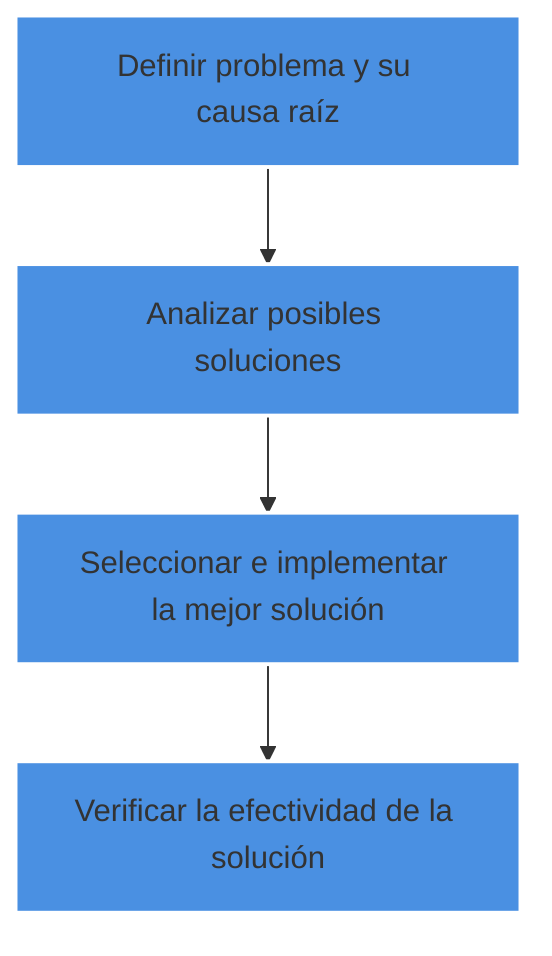
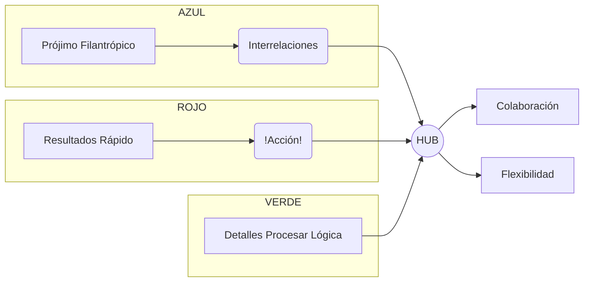
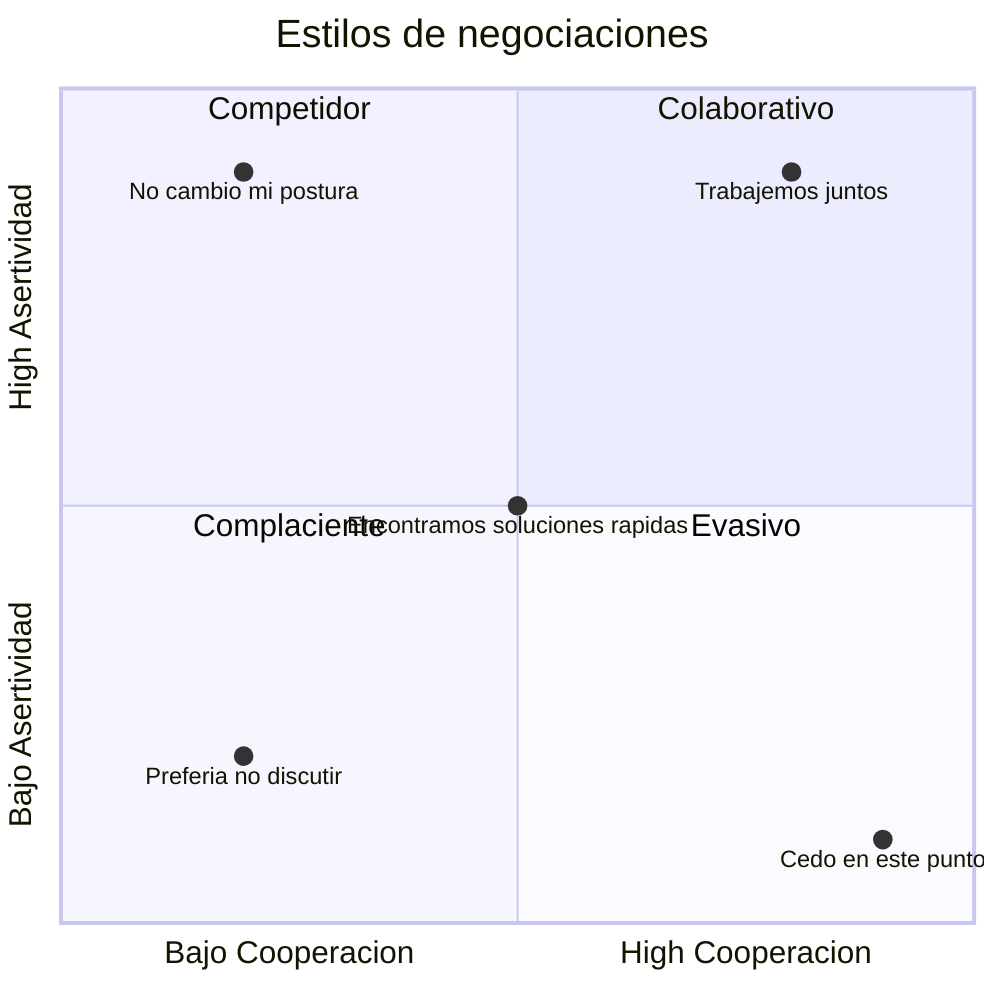
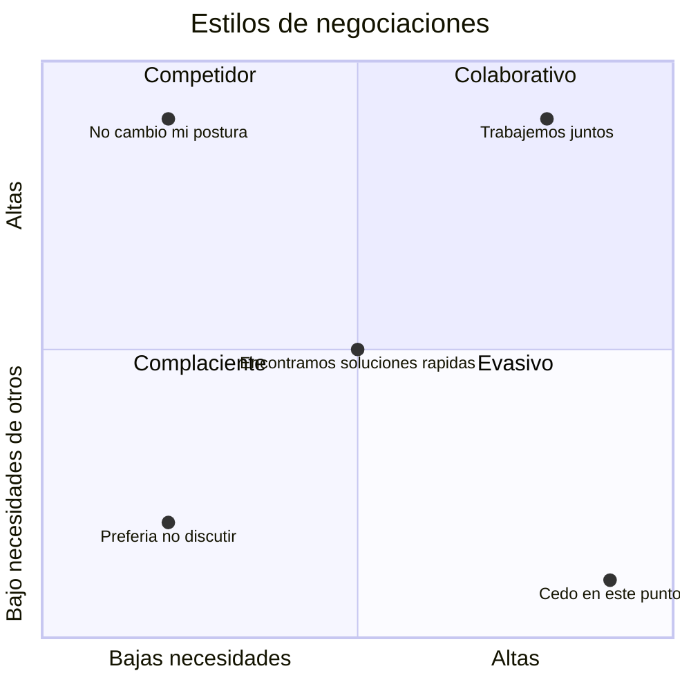

## Introducion y objetivos

En el entorno actual, el trabajo es cada vez más colaborativo. Un equipo no es solo un grupo de personas trabajando juntas, sino un esfuerzo conjunto que supera los logros individuales.

Este tema aborda:

- Qué es un equipo, sus tipos y el significado del trabajo en equipo.
- Competencias clave para una colaboración efectiva.
- El modelo de formación de equipos de Tuckman y las cinco disfunciones de Lencioni.
- Gestión de conflictos mediante el SDI de Elías Porter y el Instrumento de Modos de Conflicto Thomas-Kilmann (TKI).

## Equipos de alto rendimiento

Los equipos de alto rendimiento son aquellos que cumplen con los objetivos y alcanzan los resultados para los que fue creado.

Hay que diferenciar entre los equipos de proyecto y los equipos funcionales. Ambos pueden o no ser de alto rendimiento. Pero ¿qué es el rendimiento? De la RAE no sirven las dos primeras acepciones:

- Producto o utilidad que rinde o da alguien o algo.
- Proporción entre el producto o el resultado obtenido y los medios utilizados.

Así, pues, el rendimiento deseado lo deberá establecer la empresa en función de los objetivos que haya fijado y del tiempo que se disponga para alcanzarlos.

Los equipos de alto rendimiento logran más de lo que cada miembro podría alcanzar individualmente. Un gran ejemplo son las hormigas: reparten roles, colaboran, se adaptan y se comprometen por el bien de su colonia.

El rendimiento, asociado al trabajo eficiente, ha sido adoptado por el deporte y la empresa como motivador de equipos. Diferenciamos entre equipos tradicionales y de alto rendimiento según su eficiencia y resultados.

Los factores clave del rendimiento incluyen: motivación, clima, entorno, desarrollo profesional y herramientas.

| **TRADICIONALES VS. ALTO RENDIMIENTO** |                                                              |                                             |                                                   |
| :------------------------------------: | :----------------------------------------------------------: | ------------------------------------------- | ------------------------------------------------- |
|   Equipo tradicional (_Las cigarras)   |                                                              | Equipo de Alto Rendimiento (_Las hormigas)_ |                                                   |
|                   1                    |                Poca identificación con metas                 | 1                                           | Metas claras. Propósito común                     |
|                   2                    |            Intervención constante de los líderes             | 2                                           | Líderes claros y aceptados + líderes alternativos |
|                   3                    |           Especialización individual no relevante            | 3                                           | Procesos efectivos                                |
|                   4                    |                Roles no relevantes. Rotación                 | 4                                           | Roles claros                                      |
|                   5                    |        No hay normas claras ni cómo tomar decisiones         | 5                                           | Normas claras. Pautas para la toma de decisiones  |
|                   6                    | Relaciones deficientes. Competencia perjudicial entre grupos | 6                                           | Relaciones solidarias, efectivas y satisfactorias |

**Rendimiento** es el _cuánto_, vinculado a objetivos y resultados. **Desempeño** es el _cómo_, relacionado con el desarrollo de competencias. La combinación de ambos influye en el salario.

El rendimiento implica esfuerzo y perseverancia. Como decía Picasso: _Cuando llegue la inspiración, que me pille trabajando._ Para lograrlo, se crean hábitos y rituales, como los equipos que comienzan el día juntos tomando café, más por conexión que por la bebida.

## **Fases por las que pasan los equipos**
Bruce Tuckman estableció en 1965, en un artículo llamado «_Developmental sequence in small groups»_, cuatro fases en la formación de equipos en su camino hacia tener un alto rendimiento. Más tarde, añadió una quinta. Estas fases son:

- _Forming_ (Formación).
- _Storming_ (Tormenta, enfrentamiento o conflicto).
- _Norming_ (Normalización).
- _Performing_ (Desempeño).
- _Adjourning_ (Finalización).

### **Fase 1: Forming (Formación)**

En esta etapa el grupo está formándose, así que también se le llama etapa de preparación o de orientación. En esta fase, la gente trata de destacar y se nota cierta inseguridad y deficiencia entre los miembros del equipo. Hay una alta dependencia en el líder en cuanto a guía y dirección. **El líder dirige.**

### **Fase 2: _Storming_ (Tormenta, enfrentamiento/Conflicto)**

Los miembros luchan entre sí para adquirir posiciones mientras tratan de establecer relaciones con otros miembros del equipo y con el líder. Se forman pandillas y agrupaciones y se pueden dar luchas de poder. **El líder actúa como coach.**

### **Fase 3: _Norming_ (Normalización)**

Los conflictos se reducen. Se llegan a acuerdos y consensos dentro del equipo. Empiezan a estar claros y a aceptarse los roles y responsabilidades. El equipo lleva a cabo reuniones para discutir y desarrollar sus procesos y su forma de trabajo. El líder es respetado y parte del liderazgo se comparte con el equipo. **El líder actúa como facilitador.**

### **Fase 4: _Performing_ (Desempeño)**

El equipo trabaja con un buen rendimiento y pocos conflictos, toma decisiones sin la participación del líder, está enfocado en lograr resultados y tiene un alto grado de autonomía. Existen conflictos y desacuerdos, eso es inevitable, pero son resueltos positivamente dentro del equipo. **El líder delega.**

### **Fase 5: _Adjourning_ (Finalización/Disolución)**

Esta última etapa, incluida en 1977, ve al grupo desde una perspectiva global e integradora, mas allá del propósito de las cuatro primeras fases. En esta quinta fase, el grupo contempla su disolución y sus miembros se pueden mover a nuevas tareas o proyectos, sintiéndose bien por lo que han conseguido. Esta fase muchas veces viene marcada por el sentimiento de vulnerabilidad de los miembros del equipo, ya que pueden ver dicha disolución como una amenaza o sentir inseguridad por el cambio.

## **Patrick Lencioni y las 5 disfunciones de equipo**

En _Las cinco disfunciones de un equipo_, Patrick Lencioni identifica los principales obstáculos que impiden el éxito de un equipo y propone soluciones. Estas disfunciones, representadas en una pirámide, deben resolverse en orden para avanzar:

- **Falta de confianza**: surge cuando los miembros del equipo no muestran vulnerabilidad, lo que genera recelo y falta de comunicación.
- **Miedo al conflicto**: evita que se expresen ideas diferentes, lo que impide la resolución de problemas y el avance del equipo.
- **Falta de compromiso**: tras discutir y tomar decisiones, los miembros deben cumplir lo acordado con confianza en el equipo.
- **Evitar rendir cuentas** (_accountability_): implica no solo reportar avances, sino asumir plena responsabilidad por tareas y objetivos, asegurando su cumplimiento y evaluación.
- **Falta de atención a los resultados:** cuando esto sucede, los miembros del equipo están más preocupados por sus resultados personales e individuales, no de los del equipo; es decir, no prestan atención a cómo contribuyen o no al éxito del proyecto. Los miembros que no prestan atención a los resultados de equipo suelen escudarse diciendo que ellos ya han cumplido con su trabajo, sin pararse a ver el impacto que ese trabajo tiene en el equipo. En este punto, lo que le sucede al equipo es que se frustra y empieza a buscar excusas en vez de soluciones.

Por supuesto, los diferentes estilos comunicativos, formas de resolver conflictos y, en definitiva, los rasgos de personalidad que definen a las personas influyen en cómo estas se relacionan y se tendrá que comprender y tener en cuenta para poder facilitar el funcionamiento de los equipos.

##  Tipos de equipos

Se puede establecer una clasificación de los diferentes equipos de trabajo, atendiendo a diferentes criterios:

- Según su duración en el tiempo:
	- Permanentes: realizan una función de forma permanente en el tiempo y están integrados en la estructura organizativa de la empresa.
	- Temporales: se crean con una finalidad concreta, una vez conseguida, desaparecen.
- Según el grado de formalidad:
	- Formales: creados por la propia empresa con una finalidad concreta, ya sea permanente o temporal.
	- Informales: Surgen espontáneamente de entre los miembros de la empresa, para atender necesidades concretas.
- Según su finalidad:
	- De solución de conflictos: su misión es resolver conflictos concretos que puedan surgir y afecten a la marcha normal de la empresa.
	- De toma de decisiones: encargados de adoptar decisiones relevantes para la marcha de la empresa. Por ejemplo, el equipo directivo.
	- De producción: equipo formado por trabajadores de la empresa, mediante la creación de estos equipos se busca una motivación de los trabajadores haciéndoles sentir parte de la empresa.
-  Según la jerarquización o no de sus miembros:
	- Horizontales: son equipos integrados por empleados de un mismo nivel jerárquico.
	- Verticales: a diferencia del anterior, lo integran trabajadores de diferentes niveles jerárquicos.
- **Tipos concretos actuales:**
	- **Círculos de Calidad**: nacidos en los años 60 en Japón, están formados por 4 a 8 trabajadores de la misma área que, voluntariamente, se reúnen para solucionar problemas o proponer mejoras. Sus conclusiones son presentadas a sus superiores para su aprobación y ejecución.
	- **Equipos de Alto Rendimiento**: integrados por expertos de distintas áreas, dirigidos por un líder para alcanzar objetivos claros y desafiantes. Se caracterizan por su alto compromiso y participación, siendo recompensados de manera colectiva o individual.
	- **Equipos de Mejora**: buscan optimizar la calidad del trabajo, identificando y resolviendo fallos. Están formados por los propios trabajadores, quienes mejor conocen sus procesos.

## **La comunicación en el equipo**

Hay una serie de habilidades de comunicación que son necesarias para generar una buena interacción en el equipo. Sin duda, son habilidades que el líder del equipo debería tener y que sería conveniente que los miembros también compartieran. Estas son:

- Identificar y gestionar las expectativas de información.
- Transmitir un mensaje correcto (gramática y ortografía), conciso (sin exceso de palabras), claro (objeto acorde a las necesidades del lector) y coherente (las ideas fluyen lógicamente).
- Comunicación no verbal: lenguaje corporal, tono de voz, expresiones faciales, contacto visual…
- Escucha activa: compromiso con quien habla, resumir las conversaciones.
- Identificar los ruidos entre emisor-receptor y gestionar conflictos.
- Presentaciones y reuniones efectivas. Para reuniones efectivas:
	- Preparar y distribuir la agenda con anticipación.
	- Asegurar que asistan los participantes apropiados.
	- Establecer horario de inicio-fin y respetarlo.
	- No desviarse de los temas de la agenda.
	- Publicar la minuta de la reunión con acciones y responsables.
	- Verificar que todos comprendan el mismo mensaje.
	- Retroalimentación continua.

En el momento de planificar los métodos de comunicación, se deben considerar las dimensiones y enfoques de la comunicación. Dimensiones de la comunicación:

- Interna: entre las personas que forman parte del proyecto.
- Externa: hacia los interesados externos del proyecto.
- Vertical: entre jefe-empleado y viceversa.
- Horizontal: entre colegas del proyecto.
- Escrita formal: planes, solicitudes…
- Escrita informal: memos, mails, nota…
- Oral formal: presentaciones.
- Oral informal: reuniones, conversaciones.
- Oficial: notas de prensa, versiones finales aprobadas…
- No oficial: información preliminar, confidencial…
- No verbal: Lenguaje corporal, tono de voz, acciones…

Enfoques de la comunicación:

- Interpersonal: cara a cara.
- Grupos pequeños: 3-6 personas.
- Pública: 1 emisor y varios receptores.
- Masiva: poca comunicación entre emisor y receptor.
- Redes sociales: varios emisores y receptores.

En el momento de seleccionar el método de distribución deberíamos considerar:

- Cuántos emisores-receptores hay involucrados: uno, pocos, muchos.
- Cómo es la dirección: unidireccional o bidireccional.
- Cuál es la complejidad de la información: baja, media, alta

## **Gestión de conflictos**

### Estrategias de gestión de conflictos

En la gestión de conflictos dentro de un equipo de alto rendimiento, el líder debe abordarlos de manera constructiva y oportuna, fomentando la colaboración y una comunicación abierta. Además, debe crear oportunidades para fortalecer la conexión entre los miembros.

Los conflictos son inevitables, pero bien gestionados pueden impulsar la creatividad y productividad del equipo. Para manejarlos correctamente, se recomienda:

- Abordarlos tempranamente y en privado.
- Usar un enfoque directo y constructivo.
- Aplicar medidas disciplinarias solo como último recurso.

Figura 1. Fases para la resolución de conflictos.

Formas de resolución de conflictos:

- Evitar/Retirarse: retirarse del conflicto o postergarlo hasta estar mejor preparado o hasta que lo resuelvan otros.
- Suavizar/Acomodar: resaltar los puntos en común acuerdo en lugar de las diferencias. Hacer concesiones para mantener la armonía del grupo.
- Compromiso/Conciliación: cada parte debe ceder algo.
- Forzar/Dirigir: imponer una posición sobre las otras.
- Colaborar: incorporar múltiples perspectivas a través de la cooperación y del diálogo abierto para buscar compromiso y consenso.

Dependerá de diferentes factores cuál usar, pero la mejor suele ser colaborar, que suele ser un _win-win_, Compromiso suele ser un perder-perder. La peor es forzar, que es ganar-perder, aunque se puede usar por quien tenga el poder para resolver problemas en situaciones de emergencia.

**El SDI de Elias Porter**

El SDI (Strength Development Inventory), desarrollado por el Dr. Elias Porter, es un modelo basado en valores motivacionales que ayuda a comprender el comportamiento y prevenir conflictos. Clasifica la motivación en siete colores, destacando tres principales:

- **Rojo (Asertivo – Director):** Personas orientadas a la acción y decisiones rápidas. Seguros, ambiciosos y persuasivos, pero a veces desafiantes y arriesgados. Les motiva alcanzar metas.
- **Verde (Analítico – Autónomo):** Priorizan el análisis detallado y la autosuficiencia. Cautos, metódicos y justos, necesitan tiempo para decidir y buscan entender el porqué de todo.
- **Azul (Altruista – Alentador):** Se enfocan en el bienestar común, confiados, leales y optimistas. Son idealistas y buscan ayudar a los demás.

**HUB (Flexible – Coherente):** Motivado por el trabajo en equipo, combina rasgos de todos los colores. Son tolerantes, sociables, curiosos y abiertos al cambio, lo que los hace valiosos en equipos.

Otros colores:

- **Rojo-Azul (Resuelto – Protector):** Enfocados en decisiones firmes y apoyo a los demás.
- **Rojo-Verde (Juicioso – Competidor):** Analíticos y orientados a la competencia.
- **Azul-Verde (Cauteloso – Motivador):** Cuidadosos y motivadores con visión estratégica.

Todos tenemos rasgos de cada color, pero el predominante define nuestra personalidad. Conocerlos ayuda a gestionar conflictos en equipos.

Figura 2. Color y predominio.

#### **Instrumento de Modos de Conflicto de Thomas-Kilmann (TKI)**

Existen dos tipos de conflictos: los **destructivos**, que deben evitarse, y los **constructivos**, que deben permitirse. Para gestionarlos, es crucial comprender cómo manejar tanto los propios como los ajenos.

El **Instrumento de Modos de Conflicto** fue desarrollado por Kenneth W. Thomas y Ralph H. Kilmann en los años 70. Este clásico ayuda a las personas a identificar su estilo predominante al abordar conflictos. El cuestionario no tiene respuestas correctas o incorrectas, ya que cada estilo es valioso en distintas situaciones.

El cuestionario mide el comportamiento en situaciones conflictivas, donde las preocupaciones de al menos dos personas son incompatibles. En estas situaciones, se analizan dos dimensiones:

- **Asertividad:** Cuánto se procura satisfacer los propios intereses.
- **Cooperación:** Cuánto se procura satisfacer los intereses de los demás.

Estas dimensiones definen cinco métodos de gestión de conflictos.

Figura 3. Dimensiones básicas del comportamiento

Descripción de los cinco modos de gestión del conflicto:

- **Competitivo**: Asertivo y poco colaborador. Un individuo persigue sus propios intereses a costa del otro. Este estilo está orientado al poder, usando medios como la habilidad para discutir, rango o sanciones económicas. Competir implica defender una postura, ya sea correcta o incorrecta, solo para ganar.
    
- **Complaciente**: No asertivo, pero colaborativo. El individuo deja de lado sus propios intereses para satisfacer los del otro, con un elemento de "auto-sacrificio". Puede ser visto como generosidad altruista, obedecer órdenes o ceder al punto de vista de otra persona.
    
- **Evasivo**: Ni asertivo ni cooperativo. El individuo no busca satisfacer ni sus propios intereses ni los del otro. Evita enfrentar el conflicto, pospone la cuestión o se retira de situaciones conflictivas.
    
- **Colaborativo**: Asertivo y cooperativo. El opuesto al evasivo. Colaborar implica trabajar con la otra persona para encontrar una solución que satisfaga ambas partes, profundizando en los intereses subyacentes y buscando una alternativa que beneficie a ambos.

**Comprometido**: Es el punto medio entre asertividad y cooperación. El objetivo es encontrar una solución mutuamente aceptada que satisfaga a ambas partes. Cede más que el competitivo, pero menos que el complaciente. Afronta el conflicto de manera más directa que el evasivo, pero no tan profunda como el colaborativo. Implica dividir la diferencia, intercambiar concesiones o buscar rápidamente una postura intermedia.

Cada estilo tiene fortalezas y debilidades, dependiendo de la situación de conflicto. Para gestionar y maximizar la habilidad de influir, es clave adaptar el estilo según la situación.

![[Pasted image 20250212173936.png]]
