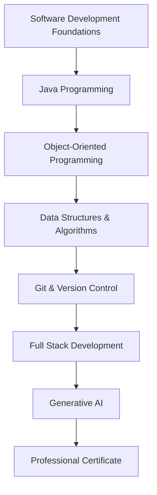
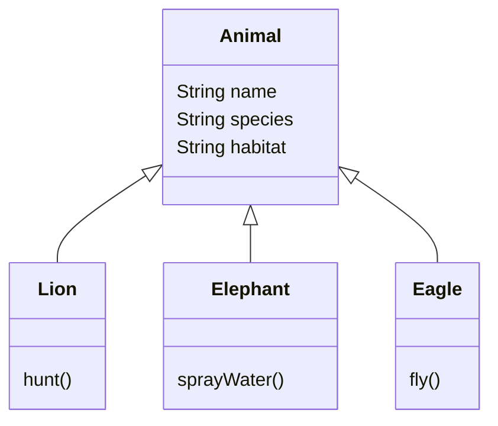
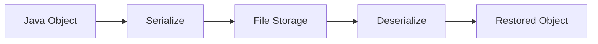
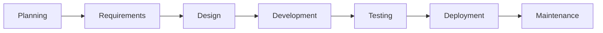
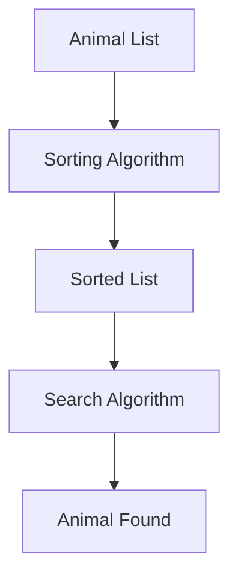
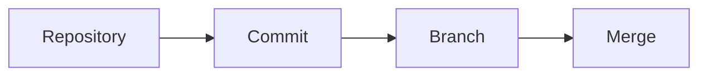
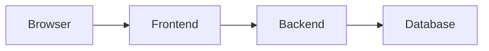

# Junior Software Development Professional Certificate (Coursera + Amazon)

## Program Overview

The **Junior Software Development Professional Certificate** is a hands-on training program designed to prepare learners for entry-level software development roles.

### Main Objectives

- Learn software development fundamentals.
    
- Develop practical Java programming skills.
    
- Build real-world projects.
    
- Understand the Software Development Lifecycle (SDLC).
    
- Learn version control with Git.
    
- Create full-stack web applications.
    
- Explore Generative AI for automation.
    
- Prepare for technical assessments and junior developer positions.

---

# Program Structure



---

# Virtual Zoo Management Project

A central project throughout the program is the development of a **Virtual Zoo Management System**.

## Purpose

The project serves as a practical application of Java programming concepts and software development principles.

### Features

- Create animal classes.
    
- Instantiate animal objects.
    
- Allow user interaction.
    
- Store and retrieve animal data.
    
- Implement file handling and serialization.
    
- Potentially extend into a web application.

---

# Java Fundamentals

## Java Development Environment

### Definition

A collection of tools required to write, compile, and run Java applications.

### Importance

Provides the foundation for software development activities.

---

## Java Syntax and Structure

### Definition

The set of rules that determines how Java programs are written.

### Importance

Understanding syntax is necessary to create executable programs.

---

## Variables

### Definition

Variables are containers used to store data values.

### Example

```java
String animalName = "Lion";
int age = 5;
```

### Why They Matter

Variables allow programs to store and manipulate information dynamically.

---

## Data Types

### Definition

Data types determine what kind of data can be stored.

|Data Type|Example|Purpose|
|---|---|---|
|int|10|Whole numbers|
|double|3.14|Decimal numbers|
|String|"Lion"|Text|
|boolean|true|True/False values|

### Example

```java
String species = "Elephant";
int weight = 5000;
double height = 3.5;
```

---

## Operators

### Definition

Symbols used to perform calculations or comparisons.

|Operator Type|Examples|
|---|---|
|Arithmetic|+, -, *, /|
|Comparison|==, !=, >, <|
|Logical|&&, \|, !|

### Example Calculator

```java
int a = 10;
int b = 5;

int sum = a + b;
int difference = a - b;
int product = a * b;
int quotient = a / b;
```

---

# Control Flow

## Definition

Control flow determines the order in which program instructions execute.

---

## Conditional Statements

### Definition

Statements that allow a program to make decisions.

### Example

Animal feeding schedule based on time of day.

```java
if (hour < 12) {
    System.out.println("Morning Feeding");
} else {
    System.out.println("Afternoon Feeding");
}
```

### Use Case

Different animals may require different feeding schedules.

---

## Loops

### Definition

Structures that repeat tasks automatically.

### Example

```java
for (int i = 0; i < animals.size(); i++) {
    System.out.println(animals.get(i));
}
```

### Use Case

Displaying all animals in the zoo.

---

# Object-Oriented Programming (OOP)

## Definition

A programming paradigm that organizes software using classes and objects.

### Benefits

- Reusability
    
- Maintainability
    
- Scalability
    
- Better organization

---

## Classes

### Definition

Blueprints that describe objects.

### Example

```java
public class Animal {
    String name;
    String species;
    String habitat;
}
```

---

## Objects

### Definition

Instances created from classes.

### Example

```java
Animal lion = new Animal();
lion.name = "Simba";
```

---

## Inheritance

### Definition

A mechanism where one class acquires properties and behaviors from another class.

### Example from the Zoo Project



---

## OOP Example

### Step 1: Create General Animal Class

```java
public class Animal {
    String name;
    String species;
    String habitat;
}
```

### Step 2: Create Specialized Classes

```java
public class Lion extends Animal {
    public void roar() {
        System.out.println("Roar!");
    }
}
```

```java
public class Eagle extends Animal {
    public void fly() {
        System.out.println("Flying");
    }
}
```

### Step 3: Create Objects

```java
Lion lion = new Lion();
lion.name = "Leo";

Eagle eagle = new Eagle();
eagle.name = "Sky";
```

### Result

The system becomes easier to expand when new animals are added.

---

# File I/O and Serialization

## File I/O

### Definition

Input/Output operations used to read from and write to files.

### Purpose

Allows persistent storage of animal data.

### Example Use Case

Saving zoo animal information.

```java
FileWriter writer = new FileWriter("animals.txt");
writer.write("Lion");
writer.close();
```

---

## Serialization

### Definition

The process of converting objects into a format that can be stored or transmitted.

### Purpose

Allows complete Java objects to be saved and later restored.

### Example Use Case

Saving the state of zoo animals between program executions.



---

# Software Development Lifecycle (SDLC)

## Definition

The structured process used to plan, build, test, deploy, and maintain software.

### Concert Planning Analogy

The transcript compares SDLC to organizing a large concert:

|Concert Activity|Software Equivalent|
|---|---|
|Booking venue|Project planning|
|Organizing guests|Requirements gathering|
|Managing event|Development process|
|Event execution|Software deployment|

---

## SDLC Stages



---

# Error Management

## Definition

The process of detecting, handling, and recovering from unexpected situations in software.

### Importance

- Improves reliability.
    
- Prevents crashes.
    
- Enhances user experience.

---

# Data Structures and Algorithms

## Data Structures

### Definition

Methods for organizing and storing data efficiently.

### Examples

- Arrays
    
- Lists
    
- Stacks
    
- Queues

---

## Algorithms

### Definition

Step-by-step procedures used to solve problems.

### Example from Transcript

Searching and sorting large lists of zoo animals.



### Importance

Efficient algorithms improve application performance.

---

# Git and Version Control

## Definition

Git is a version control system used to track changes in source code.

### Benefits

|Benefit|Description|
|---|---|
|Version Tracking|Keeps history of changes|
|Collaboration|Multiple developers can work together|
|Recovery|Restore previous versions|
|Branching|Develop features independently|

### Example Workflow



### Practical Use

Managing team projects without overwriting each other's work.

---

# Full Stack Web Development

## Definition

Development involving both frontend and backend components.

---

## Frontend

### Responsibilities

- User interface
    
- User interaction
    
- Visual presentation

Examples:

- HTML
    
- CSS
    
- JavaScript

---

## Backend

### Responsibilities

- Business logic
    
- Data processing
    
- Database interaction

Examples:

- Java server-side applications

---

## Example Project

Virtual Zoo Web Application

### Features

- Browse animals online.
    
- View animal information.
    
- Interact with zoo content.



---

# Generative AI in Software Development

## Definition

Generative AI tools assist developers by automating tasks and generating content.

### Example from Transcript

Automatically generating animal feeding schedules.

### Benefits

|Benefit|Description|
|---|---|
|Automation|Reduces repetitive work|
|Productivity|Speeds up development|
|Assistance|Supports decision-making|
|Innovation|Enables advanced features|

---

# Career Preparation

## Target Audience

- Beginners
    
- Junior Software Developers
    
- Entry-Level Professionals
    
- Career Changers

---

## Recommended Background

### Helpful

- Basic coding experience
    
- Fundamental programming concepts

### Not Required

- Professional software development experience

---

# Industry Demand

## Employment Outlook

The transcript cites projections indicating strong growth in software development careers through 2032.

### Reasons for Demand

- Digital transformation
    
- Software-driven innovation
    
- Growth of web applications
    
- Increasing automation needs
    
- Expansion of AI technologies

---

# Benefits of the Coursera + Amazon Partnership

|Coursera Contribution|Amazon Contribution|
|---|---|
|Flexible learning platform|Real-world software expertise|
|Interactive content|Industry best practices|
|Structured curriculum|Practical developer insights|
|Professional certificate|Exposure to real-world development|

---

# Program Outcomes

Upon completion, learners should be able to:

1. Develop Java applications independently.
    
2. Apply object-oriented programming principles.
    
3. Manage source code using Git.
    
4. Implement data structures and algorithms.
    
5. Build full-stack web applications.
    
6. Use Generative AI tools effectively.
    
7. Troubleshoot technical issues.
    
8. Collaborate within software development teams.
    
9. Prepare for technical assessments and interviews.

---

# Key Terms Reference

|Term|Definition|
|---|---|
|Variable|Container for storing data|
|Data Type|Classification of stored data|
|Operator|Symbol that performs operations|
|Class|Blueprint for objects|
|Object|Instance of a class|
|Inheritance|Mechanism for reusing class functionality|
|Algorithm|Procedure for solving a problem|
|Data Structure|Organized way to store data|
|Serialization|Converting objects for storage/transmission|
|Git|Version control system|
|Full Stack|Frontend and backend development|
|SDLC|Software Development Lifecycle|
|Generative AI|AI that creates content or automates tasks|

# Summary

The Professional Certificate provides a comprehensive pathway into software development through hands-on Java programming, object-oriented design, file handling, data structures, algorithms, Git, full-stack web development, and Generative AI. The central Virtual Zoo project reinforces these concepts through practical application, helping learners build real-world skills needed for junior software developer roles while preparing them for collaboration, technical assessments, and industry careers.