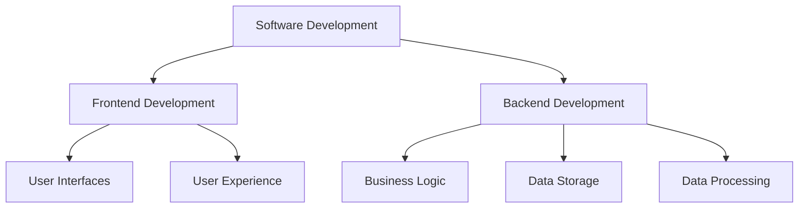
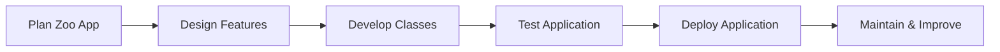
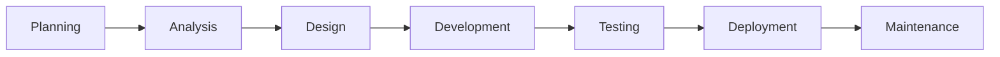
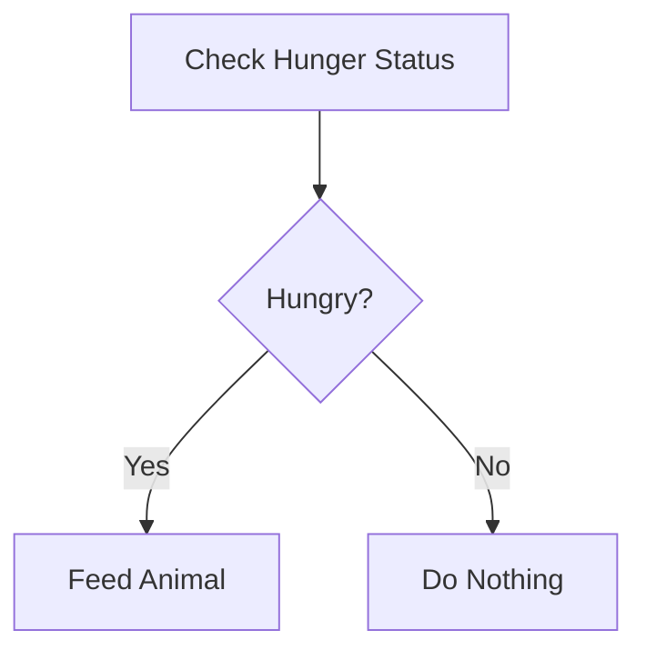
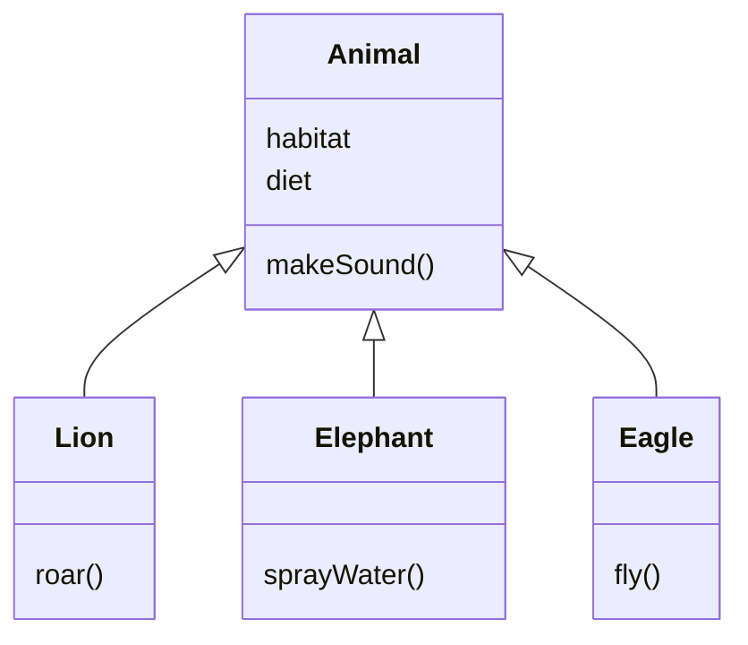
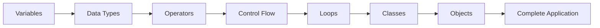

# Java Programming and Software Development Foundations

## Course Purpose

This course introduces the fundamental concepts of **Java programming** and **software development practices**, providing a foundation for future software engineering studies and professional development.

### Learning Goals

By completing the course, students will:

- Understand the role of software developers.
    
- Learn Java programming fundamentals.
    
- Apply programming concepts to practical projects.
    
- Understand the Software Development Lifecycle (SDLC).
    
- Learn Object-Oriented Programming (OOP).
    
- Build a functional Java application.
    
- Develop confidence in solving real-world software problems.

---

# Why Java?

## Definition

**Java** is a general-purpose, object-oriented programming language known for being:

- Versatile
    
- Fast
    
- Reliable
    
- Platform-independent ("Write Once, Run Anywhere")

## Real-World Applications

|Industry|Java Usage|
|---|---|
|Mobile Apps|Android applications|
|Banking|Financial transaction systems|
|Enterprise Software|Business applications|
|Web Development|Backend services|
|Cloud Computing|Distributed systems|

### Importance

Java powers many technologies people use daily, from social media applications to banking systems.

---

# Introduction to Software Development

## What is Software Development?

### Definition

Software development is the process of designing, building, testing, deploying, and maintaining software applications.

### Responsibilities of a Software Developer

|Responsibility|Description|
|---|---|
|Problem Solving|Creating solutions through code|
|Development|Writing software applications|
|Testing|Ensuring software works correctly|
|Maintenance|Fixing bugs and improving features|
|Collaboration|Working with teams and stakeholders|

---

## Areas of Software Development



### Frontend Development

Focuses on what users see and interact with.

Examples:

- Mobile applications
    
- Websites
    
- User interfaces

### Backend Development

Focuses on systems that process and store data.

Examples:

- Databases
    
- APIs
    
- Authentication systems

---

# Course Project: Virtual Zoo Application

## Project Overview

Students build a virtual zoo application that manages different animal species.

### Features

- Store animal information
    
- Manage habitats
    
- Track dietary preferences
    
- Create animal behaviors
    
- Allow user interactions

---

## Project Development Process



---

# Software Development Lifecycle (SDLC)

## Definition

The **Software Development Lifecycle (SDLC)** is a structured process used to create and maintain software systems.

## SDLC Phases

|Phase|Purpose|
|---|---|
|Planning|Define goals and requirements|
|Analysis|Understand user needs|
|Design|Create architecture and structure|
|Development|Write code|
|Testing|Verify correctness|
|Deployment|Release software|
|Maintenance|Improve and support software|

---

## SDLC Flow



### Relevance to the Zoo Project

Students apply each SDLC phase while creating the virtual zoo application.

---

# Java Fundamentals

## Variables

### Definition

Variables are named storage locations that hold data values.

### Example

```java
String habitat = "Savannah";
int animalCount = 12;
```

### Zoo Application Use Case

Store information such as:

- Animal names
    
- Habitats
    
- Diet types
    
- Ages

---

## Data Types

### Definition

A data type determines what kind of value a variable can store.

|Data Type|Example|Purpose|
|---|---|---|
|int|5|Whole numbers|
|double|3.14|Decimal numbers|
|String|"Lion"|Text|
|boolean|true|True/False values|

### Example

```java
String animalName = "Lion";
int age = 5;
boolean hungry = true;
```

---

## Operators

### Definition

Operators perform calculations, comparisons, and logical operations.

### Common Operators

|Type|Examples|
|---|---|
|Arithmetic|+, -, *, /|
|Comparison|==, !=, >, <|
|Logical|&&, \|, !|

### Example

```java
int foodStock = 100;
foodStock = foodStock - 20;
```

---

# Working with Text

## Strings

### Definition

A **String** is a sequence of characters used to represent text.

### Importance

Strings are used for:

- User input
    
- Animal descriptions
    
- Fun facts
    
- Quiz questions
    
- Data storage

### Example

```java
String description = "The lion is a carnivorous mammal.";
```

---

## Arrays

### Definition

An array stores multiple values of the same type in a single variable.

### Example

```java
String[] animals = {
    "Lion",
    "Elephant",
    "Tiger"
};
```

### Zoo Application Use Case

Store collections of animals or habitats.

---

# Control Flow

## Definition

Control flow determines how a program makes decisions and executes instructions.

---

## If, Else If, Else Statements

### Purpose

Allow programs to execute different actions depending on conditions.

### Example: Hungry Animal

#### Step 1: Check Hunger Status

```java
boolean hungry = true;
```

#### Step 2: Respond Based on Condition

```java
if (hungry) {
    System.out.println("Feed the animal");
} else {
    System.out.println("Animal is not hungry");
}
```

#### Result

The program behaves differently depending on the animal's condition.

---

## Decision-Making Flow



---

## Switch Statements

### Definition

A switch statement evaluates multiple possible values more efficiently than multiple if-else blocks.

### Example

```java
String weather = "Sunny";

switch(weather) {
    case "Sunny":
        System.out.println("Open zoo activities");
        break;

    case "Rainy":
        System.out.println("Move animals indoors");
        break;

    default:
        System.out.println("Normal operations");
}
```

### Use Case

The zoo can react differently depending on environmental conditions.

---

# Loops

## Definition

Loops repeat actions automatically until specified conditions are met.

---

## For Loop

### Purpose

Used when the number of repetitions is known.

### Example

```java
for(int i = 0; i < 5; i++) {
    System.out.println("Animal #" + i);
}
```

### Use Case

Displaying all animals in the zoo.

---

## While Loop

### Purpose

Used when repetition continues until a condition changes.

### Example

```java
int animalsRemaining = 5;

while(animalsRemaining > 0) {
    animalsRemaining--;
}
```

### Use Case

Processing tasks until all animals have been handled.

---

## Loop Comparison

|Loop Type|Best Use Case|
|---|---|
|for|Known number of repetitions|
|while|Unknown number of repetitions|

---

# Object-Oriented Programming (OOP)

## Definition

Object-Oriented Programming is a programming paradigm that organizes software using classes and objects.

### Benefits

- Code reuse
    
- Better organization
    
- Easier maintenance
    
- Improved scalability

---

# Classes

## Definition

A class is a blueprint for creating objects.

### Animal Class Example

```java
public class Animal {

    String habitat;
    String diet;

    public void makeSound() {
        System.out.println("Animal sound");
    }
}
```

---

# Objects

## Definition

Objects are instances created from classes.

### Example

```java
Animal lion = new Animal();
```

### Result

The object now contains the data and behaviors defined by the class.

---

# Methods

## Definition

Methods define actions that an object can perform.

### Example

```java
public void roar() {
    System.out.println("Roar!");
}
```

### Zoo Application Example

Methods can define behaviors such as:

- Roaring
    
- Eating
    
- Flying
    
- Sleeping

---

# Relationships Between Classes

The course introduces more advanced OOP concepts that support:

- Code reuse
    
- Flexibility
    
- Scalability

These concepts help establish relationships between classes.



## Benefit

Common functionality is stored in the parent class while specialized behavior exists in child classes.

---

# From Simple Programs to Complete Applications

## Learning Progression



### Development Journey

1. Learn Java fundamentals.
    
2. Practice decision-making and automation.
    
3. Build classes and objects.
    
4. Create a virtual zoo application.
    
5. Apply software development principles.
    
6. Complete a final project integrating all concepts.

---

# Final Project

## Purpose

The final project combines all major course concepts into a practical application.

### Skills Demonstrated

- Java programming
    
- Problem solving
    
- SDLC understanding
    
- Control flow
    
- Loops
    
- Data management
    
- Object-oriented programming

### Outcome

Students demonstrate their ability to apply software development concepts to solve real-world problems.

---

# Key Terms Reference

|Term|Definition|
|---|---|
|Java|Object-oriented programming language|
|Software Development|Process of creating software systems|
|SDLC|Structured process for software creation|
|Variable|Storage location for data|
|Data Type|Classification of data|
|Operator|Symbol that performs operations|
|String|Text data type|
|Array|Collection of similar values|
|Control Flow|Logic controlling execution paths|
|If Statement|Decision-making construct|
|Switch Statement|Multi-condition selection structure|
|Loop|Repeated execution structure|
|Class|Blueprint for objects|
|Object|Instance of a class|
|Method|Function belonging to a class|
|OOP|Programming paradigm based on objects|

# Summary

This course introduces the foundations of software development through Java programming. Students learn the Software Development Lifecycle, variables, data types, operators, strings, arrays, control flow, loops, and Object-Oriented Programming. These concepts are applied through a Virtual Zoo project, where learners progressively build a functional application while developing the skills necessary for future software development courses, internships, and junior developer roles.