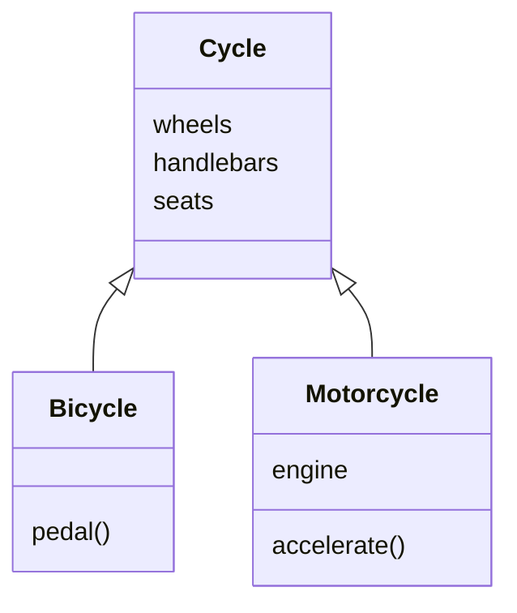
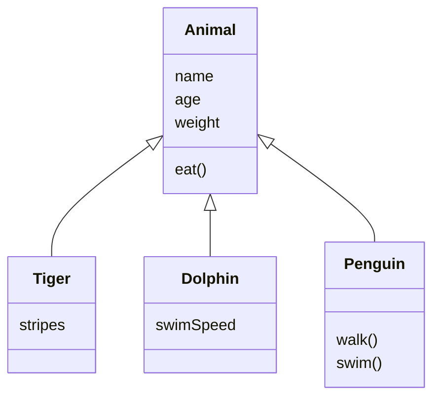
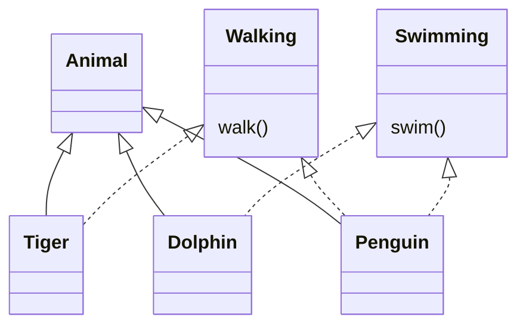
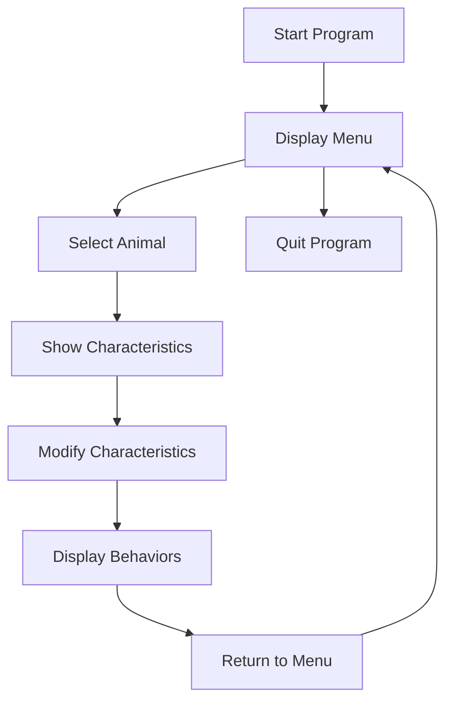
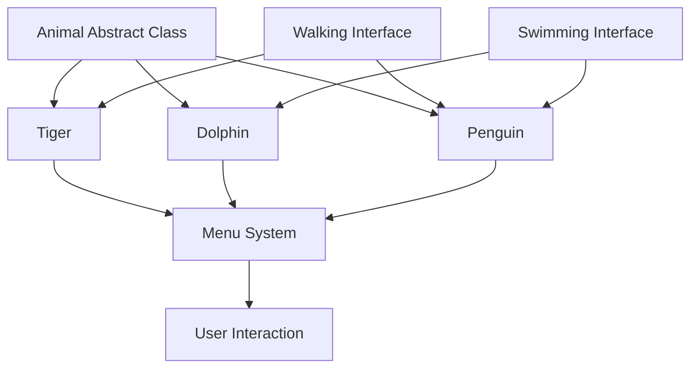

# Virtual Zoo Project – Object-Oriented Programming in Java

## Project Overview

The final project of the course requires students to build a **Virtual Zoo Application** that combines all previously learned Java concepts into a cohesive software solution.

### Main Goal

Create a menu-driven virtual zoo where users can:

- Select different animals.
    
- View animal characteristics.
    
- Modify animal attributes.
    
- Display animal behaviors.
    
- Navigate through a menu system.
    
- Exit the application through a controlled quit option.

---

# Purpose of the Project

The project serves as a comprehensive assessment of both Java programming knowledge and software design skills.

## Evaluation Objectives

### 1. Concept Understanding

Assess whether the student understands:

- Java fundamentals
    
- Classes and objects
    
- Inheritance
    
- Interfaces
    
- Abstract classes
    
- Object-Oriented Programming (OOP)

---

### 2. Integration of Skills

Evaluate whether students can combine multiple concepts into one complete software application.

Instead of solving isolated exercises, students must build a functioning system.

---

### 3. Professional Vocabulary

Students are expected to understand and use terminology commonly used by software developers.

Examples:

|Term|Meaning|
|---|---|
|Class|Blueprint for objects|
|Object|Instance of a class|
|Inheritance|Reusing and extending classes|
|Interface|Contract defining behavior|
|Abstract Class|Partially implemented parent class|
|Extend|Create a child class from a parent class|
|Implement|Use an interface|

---

# Software Design Requirements

The project emphasizes:

- Clean code
    
- Reusable code
    
- Minimal duplication
    
- Good organization
    
- Maintainability

## Key Principle

### DRY (Don't Repeat Yourself)

Instead of rewriting the same code for every animal, common functionality should be placed in shared classes.

---

# Object-Oriented Programming (OOP)

## Definition

Object-Oriented Programming is a programming paradigm that models real-world entities using classes and objects.

### Benefits

|Benefit|Description|
|---|---|
|Reusability|Write code once and reuse it|
|Organization|Structure code logically|
|Scalability|Easily add new features|
|Maintainability|Easier to update code|

---

# Base Class and Child Classes

## Base Class

### Definition

A base class (parent class) contains common characteristics shared by multiple objects.

### Example Analogy

The transcript uses a **Cycle** as a base class.



### Explanation

Both bicycles and motorcycles share:

- Wheels
    
- Handlebars
    
- Seats

Motorcycles additionally have:

- Engine
    
- Acceleration capability

---

# Applying the Concept to Animals

## Animal Base Class

The virtual zoo uses an `Animal` class as the parent class.

### Shared Characteristics

All animals may share:

- Name
    
- Age
    
- Species
    
- Weight

### Example

```java
public abstract class Animal {

    protected String name;
    protected int age;
    protected double weight;

    public void eat() {
        System.out.println(name + " is eating");
    }
}
```

---

## Child Classes

Specific animals inherit from Animal.



---

## Benefits of Inheritance

### Definition

Inheritance allows a child class to acquire properties and behaviors from a parent class.

### Advantages

|Without Inheritance|With Inheritance|
|---|---|
|Duplicate code|Reuse code|
|Harder maintenance|Easier maintenance|
|More errors|Less repetition|
|Difficult expansion|Easy expansion|

---

## Example

### Step 1: Define Common Features

```java
public abstract class Animal {

    protected String name;

    public void eat() {
        System.out.println("Eating");
    }
}
```

---

### Step 2: Create a Tiger

```java
public class Tiger extends Animal {

    private String stripePattern;

}
```

---

### Step 3: Create a Dolphin

```java
public class Dolphin extends Animal {

    private double swimSpeed;

}
```

### Result

Tiger and Dolphin automatically gain:

- name
    
- eat()

Without rewriting them.

---

# Abstract Classes

## Definition

An abstract class is a partially implemented class that cannot be instantiated directly.

### Purpose

Provide shared functionality while forcing child classes to implement specific behaviors.

### Example

```java
public abstract class Animal {

    protected String name;

    public abstract void makeSound();
}
```

### Why Use It?

Every animal has a sound, but the sound differs.

|Animal|Sound|
|---|---|
|Tiger|Roar|
|Dolphin|Click|
|Penguin|Squawk|

---

## Implementation

```java
public class Tiger extends Animal {

    @Override
    public void makeSound() {
        System.out.println("Roar");
    }
}
```

---

# Interfaces

## Definition

An interface defines a contract that classes agree to follow.

Interfaces specify what actions an object can perform but not how those actions are implemented.

---

## Walking Interface

```java
public interface Walking {

    void walk();
}
```

---

## Swimming Interface

```java
public interface Swimming {

    void swim();
}
```

---

# Why Interfaces?

Animals may have different movement methods.

Examples:

|Animal|Behavior|
|---|---|
|Tiger|Walk|
|Dolphin|Swim|
|Penguin|Walk and Swim|

Instead of placing all movement methods in the Animal class, interfaces separate behaviors.

---

# Tiger Example

```java
public class Tiger extends Animal
        implements Walking {

    @Override
    public void walk() {
        System.out.println("Tiger walking");
    }
}
```

---

# Dolphin Example

```java
public class Dolphin extends Animal
        implements Swimming {

    @Override
    public void swim() {
        System.out.println("Dolphin swimming");
    }
}
```

---

# Multiple Interfaces

## Definition

A class can implement more than one interface.

This allows an object to have multiple independent behaviors.

---

## Penguin Example

The transcript identifies the penguin as the showcase animal because it demonstrates:

- Inheritance
    
- Multiple interfaces

```java
public class Penguin extends Animal
        implements Walking, Swimming {

    @Override
    public void walk() {
        System.out.println("Penguin waddling");
    }

    @Override
    public void swim() {
        System.out.println("Penguin swimming");
    }
}
```

---

## Relationship Diagram



---

# Menu-Based User System

## Purpose

Allow users to interact with the zoo application.

### User Actions

- Choose an animal.
    
- View characteristics.
    
- Modify characteristics.
    
- Display behaviors.
    
- Exit application.

---

# Application Flow



---

# Example Menu

```java
public void displayMenu() {

    System.out.println("1. Tiger");
    System.out.println("2. Dolphin");
    System.out.println("3. Penguin");
    System.out.println("4. Quit");
}
```

---

# Example Menu Processing

```java
switch(choice) {

    case 1:
        tiger.displayInfo();
        break;

    case 2:
        dolphin.displayInfo();
        break;

    case 3:
        penguin.displayInfo();
        break;

    case 4:
        System.out.println("Exiting...");
        break;
}
```

---

# Core Concepts Used in the Project

|Concept|Purpose in Zoo Project|
|---|---|
|Classes|Create animal blueprints|
|Objects|Create actual animals|
|Inheritance|Share common animal functionality|
|Abstract Classes|Define common animal structure|
|Interfaces|Add specialized behaviors|
|Multiple Interfaces|Allow multiple behaviors|
|Methods|Define actions|
|Menu System|Enable user interaction|
|Switch Statements|Process menu choices|
|OOP|Organize entire application|

---

# Complete Architecture Overview



---

# Key Terms Reference

| Term                              | Definition                                                      |
| --------------------------------- | --------------------------------------------------------------- |
| Object-Oriented Programming (OOP) | Programming using classes and objects                           |
| Base Class                        | Parent class containing shared functionality                    |
| Child Class                       | Class inheriting from another class                             |
| Inheritance                       | Reusing and extending parent classes                            |
| Abstract Class                    | Class that provides shared structure but cannot be instantiated |
| Interface                         | Contract defining behaviors                                     |
| Implement                         | Use an interface in a class                                     |
| Extend                            | Create a subclass from a parent class                           |
| Multiple Interfaces               | Implementing more than one interface                            |
| Menu System                       | User-controlled navigation system                               |
| Reusability                       | Ability to reuse existing code                                  |
|                                   |                                                                 |

# Summary

The Virtual Zoo project serves as a capstone application that integrates Java fundamentals with Object-Oriented Programming concepts. Students create an abstract `Animal` base class, extend it through specific animals such as `Tiger`, `Dolphin`, and `Penguin`, implement behaviors through interfaces like `Walking` and `Swimming`, and build a menu-driven system that allows users to interact with the animals. The project emphasizes inheritance, abstraction, interfaces, code reuse, maintainability, and user interaction, providing a practical demonstration of professional software development practices.