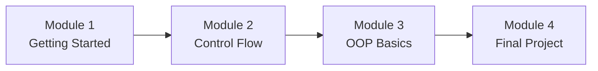
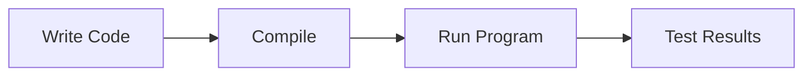
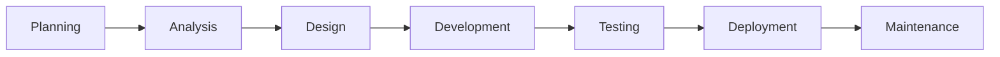
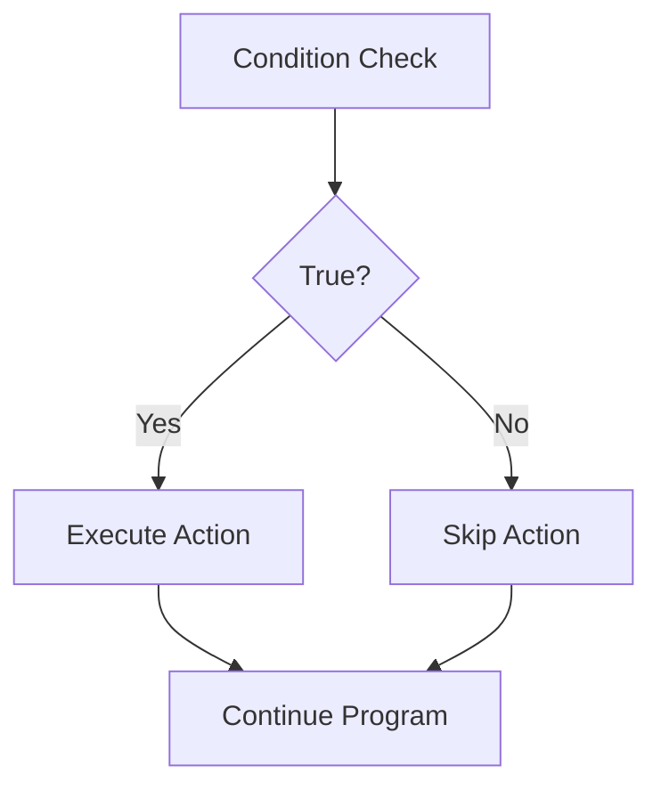
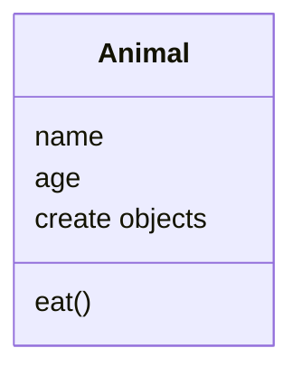
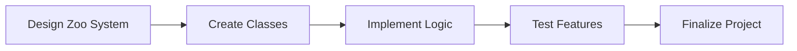
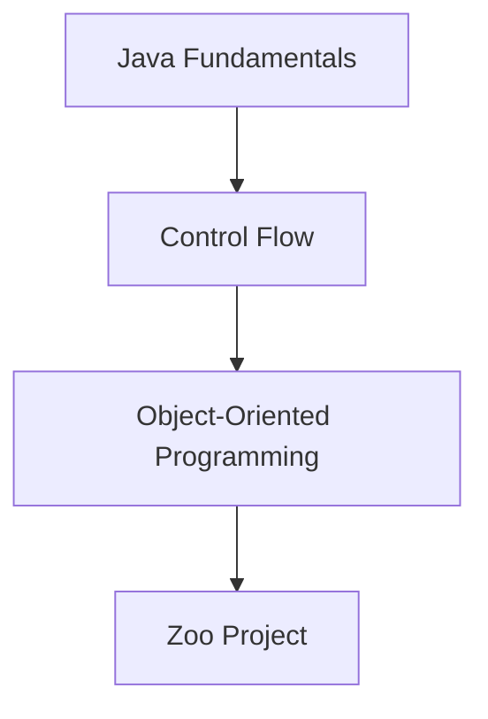

# Introduction to Software Development with Java

## Course Overview

### Purpose

This course introduces the foundational concepts of:

- Java programming
    
- Software development practices
    
- Object-Oriented Programming (OOP)
    
- Software Development Lifecycle (SDLC)

The course is designed for:

- Beginners with no coding experience
    
- Learners seeking to strengthen programming skills
    
- Future junior software developers

### Primary Goal

Develop the knowledge and practical skills necessary to begin building software applications using Java.

---

# Course Learning Outcomes

By the end of the course, students will be able to:

|Learning Outcome|Description|
|---|---|
|Use an IDE|Understand the advantages of Integrated Development Environments|
|Understand SDLC|Explain software development phases|
|Understand Java Fundamentals|Work with variables, data types, and operators|
|Write Java Programs|Create and execute simple Java applications|
|Apply OOP Concepts|Use classes, objects, and abstraction|

---

# Course Roadmap



Each module builds upon the previous one, gradually increasing complexity and practical application.

---

# Core Software Development Concepts

## What is Software Development?

### Definition

Software development is the process of designing, building, testing, deploying, and maintaining software applications.

### Importance

Software development enables organizations to:

- Solve business problems
    
- Automate tasks
    
- Improve efficiency
    
- Deliver digital products

---

## Responsibilities of a Software Developer

### Definition

A software developer creates and maintains software systems.

### Common Responsibilities

|Responsibility|Description|
|---|---|
|Coding|Writing software applications|
|Debugging|Fixing errors in code|
|Testing|Verifying software functionality|
|Design|Planning software structure|
|Maintenance|Updating and improving software|

---

# Getting Started with Java

## Java Programming Language

### Definition

Java is a high-level, object-oriented programming language widely used for software development.

### Why Learn Java?

- Platform-independent
    
- Object-oriented
    
- Industry-standard
    
- Used in enterprise systems
    
- Strong career demand

---

## Java Development Environment

### Integrated Development Environment (IDE)

#### Definition

An IDE is software that provides tools for writing, running, testing, and debugging programs.

### Advantages of an IDE

|Feature|Benefit|
|---|---|
|Code Editor|Easier code writing|
|Syntax Highlighting|Improved readability|
|Debugging Tools|Faster error detection|
|Auto-completion|Increased productivity|
|Project Management|Better organization|

### Development Workflow



---

# Java Fundamentals

## Variables

### Definition

Variables are named storage locations used to hold data.

### Example

```java
String animalName = "Tiger";
int age = 5;
```

### Purpose

Variables allow programs to store and manipulate information.

---

## Data Types

### Definition

Data types determine the kind of value a variable can store.

### Common Java Data Types

|Data Type|Example|Purpose|
|---|---|---|
|int|10|Whole numbers|
|double|5.75|Decimal values|
|String|"Tiger"|Text|
|boolean|true|True/False values|

### Example

```java
int animalCount = 15;
String habitat = "Jungle";
boolean hungry = true;
```

---

## Operators

### Definition

Operators perform calculations and comparisons.

### Types of Operators

|Type|Examples|
|---|---|
|Arithmetic|+, -, *, /|
|Comparison|==, !=, >, <|
|Logical|&&, \|, !|

### Calculator Example

The course mentions creating a calculator application.

```java
int num1 = 10;
int num2 = 5;

int sum = num1 + num2;
int difference = num1 - num2;
int product = num1 * num2;
int quotient = num1 / num2;
```

### Step-by-Step

1. Store numbers in variables.
    
2. Apply arithmetic operators.
    
3. Store results.
    
4. Display results to the user.

---

# Software Development Lifecycle (SDLC)

## Definition

The Software Development Lifecycle (SDLC) is a structured process used to create and maintain software systems.

### Importance

Provides an organized framework for software projects.

---

## SDLC Phases

|Phase|Purpose|
|---|---|
|Planning|Define objectives|
|Analysis|Gather requirements|
|Design|Create system structure|
|Development|Write code|
|Testing|Verify functionality|
|Deployment|Release software|
|Maintenance|Support and improve software|

---

## SDLC Flow



---

# Module 1: Getting Started with Java

## Focus Areas

### Learning Objectives

- Understand the role of software developers.
    
- Learn Java syntax.
    
- Create simple Java applications.
    
- Execute Java programs.

---

## Example Activity

### Build a Calculator

#### Skills Applied

- Variables
    
- Data types
    
- Operators
    
- Program execution

```java
public class Calculator {

    public static void main(String[] args) {

        int a = 10;
        int b = 20;

        System.out.println(a + b);
    }
}
```

---

# Module 2: Control Flow – Statements and Loops

## Control Flow

### Definition

Control flow determines the order in which program instructions are executed.

---

## Conditional Statements

### Definition

Conditional statements allow a program to make decisions based on conditions.

### Common Structures

- if
    
- else if
    
- else

---

## Zoo Feeding Example

The transcript uses a zoo management scenario.

### Requirement

Feed animals only during designated feeding times.

### Example

```java
if(currentHour == feedingHour) {
    System.out.println("Feed animals");
}
```

### Process

1. Check current time.
    
2. Compare with feeding schedule.
    
3. Execute feeding action if condition is true.

---

## Boolean Logic

### Definition

Boolean logic evaluates conditions using true or false values.

### Example

```java
boolean feedingTime = true;

if(feedingTime) {
    System.out.println("Feed animal");
}
```

---

## Loops

### Definition

Loops repeat instructions automatically.

### Types Covered

|Loop|Purpose|
|---|---|
|for|Known number of repetitions|
|while|Repeat until condition changes|

---

### For Loop Example

```java
for(int i = 0; i < 5; i++) {
    System.out.println("Animal " + i);
}
```

---

### While Loop Example

```java
while(foodAvailable) {
    feedAnimal();
}
```

### Purpose

Automate repetitive tasks efficiently.

---

## Control Flow Overview



---

# Module 3: Object-Oriented Programming (OOP) Basics

## Object-Oriented Programming

### Definition

A programming paradigm that organizes code using classes and objects.

### Goals

- Reusability
    
- Scalability
    
- Maintainability
    
- Better organization

---

## Classes

### Definition

A class is a blueprint used to create objects.

### Example

```java
public class Animal {

    String name;
    int age;

}
```

---

## Objects

### Definition

Objects are instances created from classes.

### Example

```java
Animal tiger = new Animal();
```

---

## Abstraction

### Definition

Abstraction hides unnecessary details and exposes only essential functionality.

### Benefits

|Benefit|Description|
|---|---|
|Simplicity|Reduces complexity|
|Reusability|Promotes code reuse|
|Maintainability|Easier updates|

---

## OOP Structure



---

# Module 4: Final Project and Assessment

## Project Overview

Students build software for a fictional zoo.

### Project Goals

Apply:

- Java fundamentals
    
- Control flow
    
- Loops
    
- OOP concepts
    
- Problem-solving techniques

---

## Project Workflow



---

## Skills Demonstrated

|Skill|Application|
|---|---|
|Variables|Store animal information|
|Control Flow|Manage zoo operations|
|Loops|Automate repetitive actions|
|OOP|Organize animal-related code|
|Problem Solving|Implement software solutions|

---

# Assessment Components

## Final Assignment

A practical software project that demonstrates understanding of all course concepts.

---

## Course Quiz

Evaluates theoretical understanding of:

- Java syntax
    
- SDLC
    
- Control flow
    
- OOP concepts
    
- Programming fundamentals

---

# Relationship Between Modules



Each module introduces concepts that are required for success in the final project.

---

# Key Terms Reference

|Term|Definition|
|---|---|
|Java|Object-oriented programming language|
|IDE|Tool for writing and running code|
|Variable|Storage location for data|
|Data Type|Category of data stored in variables|
|Operator|Symbol used for calculations or comparisons|
|SDLC|Software Development Lifecycle|
|Control Flow|Logic controlling execution order|
|Boolean|True/False data type|
|Loop|Repeated execution structure|
|Class|Blueprint for objects|
|Object|Instance of a class|
|OOP|Object-Oriented Programming|
|Abstraction|Hiding complexity while exposing essentials|

# Summary

The Introduction to Software Development course provides a foundation in Java programming and software engineering principles. Students learn Java syntax, variables, data types, operators, control flow, Boolean logic, loops, Object-Oriented Programming, abstraction, and the Software Development Lifecycle. These concepts are progressively developed across four modules and culminate in a zoo management project that demonstrates the practical application of programming and software development skills.