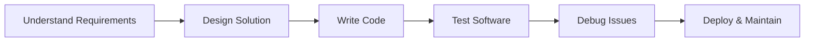
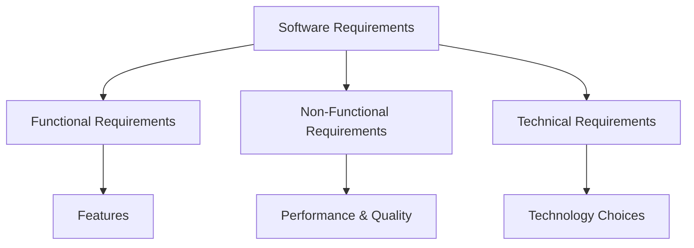
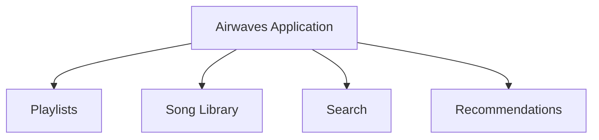
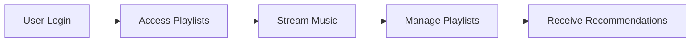
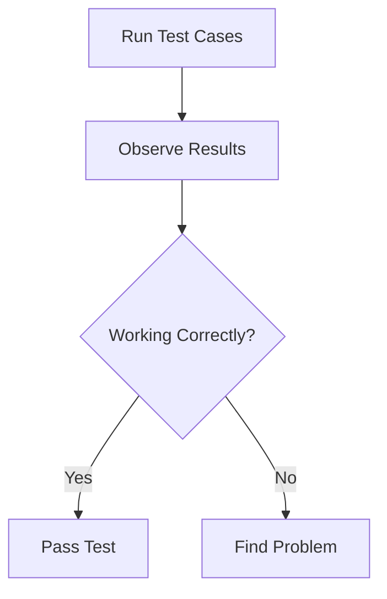
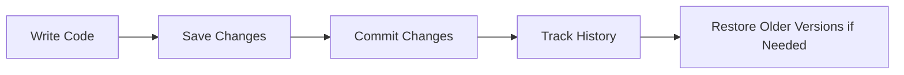
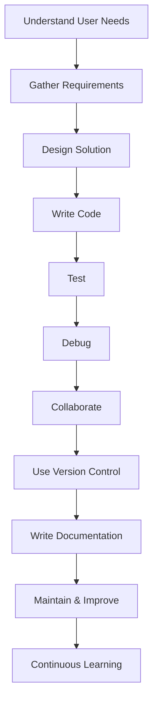

# The Role of a Software Developer

## Introduction to Software Development

### Definition

**Software Development** is the process of:

- Creating software
    
- Designing software solutions
    
- Implementing functionality
    
- Maintaining applications and systems

### Purpose

Software development solves real-world problems through technology.

### Examples from the Transcript

|Software|Purpose|
|---|---|
|Navigation App|Finds the fastest routes in a city|
|Healthcare Management System|Stores patient records and supports medical services|
|Travel Planning Tool|Helps users organize trips|
|Music Streaming App|Streams music and manages playlists|

### Key Idea

Software developers are often described as **digital architects** because they design and build systems that solve business and user problems.

---

# The Software Development Process

## High-Level Workflow



### Explanation

Every software project generally follows these stages:

1. Understand the problem.
    
2. Design a solution.
    
3. Write the code.
    
4. Test the software.
    
5. Fix defects.
    
6. Maintain and improve the system.

---

# Developer Tools

## Integrated Development Environment (IDE)

### Definition

An **Integrated Development Environment (IDE)** is software that helps developers write, organize, run, and test code.

### Functions of an IDE

|Function|Description|
|---|---|
|File Management|Organize project files|
|Code Editing|Write and modify source code|
|Output Display|View program results|
|Debugging|Identify and fix problems|
|Project Navigation|Work across multiple files|

### Benefits

- Increased productivity
    
- Easier code management
    
- Faster debugging
    
- Improved project organization

---

# Understanding Requirements

## Definition

Requirements describe what a software system must do and how it should behave.

### Importance

Before writing code, developers must understand the needs of:

- Clients
    
- Stakeholders
    
- End users

---

## Types of Requirements

### 1. Functional Requirements

#### Definition

Features and functions the software must provide.

#### Examples

- Detect light levels
    
- User interaction buttons
    
- Trip planning features
    
- Playlist creation

---

### 2. Non-Functional Requirements

#### Definition

Quality attributes that describe how the software should perform.

#### Examples

|Requirement|Example|
|---|---|
|Performance|Fast response times|
|Accuracy|Sensor precision|
|Security|Protecting user data|
|Reliability|Stable application behavior|

---

### 3. Technical Requirements

#### Definition

Technology constraints and implementation choices.

#### Examples

- Database integrations
    
- Hardware compatibility
    
- Web development frameworks
    
- Programming language selection

---

## Requirement Categories Diagram



---

# Designing Software Solutions

## Definition

Software design is the process of planning how a system will work before coding begins.

### Objectives

- Organize features
    
- Break systems into components
    
- Define interactions between components

---

# Example: Airwaves Music Streaming Application

The transcript uses a fictional music streaming platform called **Airwaves**.

---

## Step 1: Identify Core Features

### Features

- Playlist creation
    
- Song library access
    
- Track searching
    
- Personalized recommendations



---

## Step 2: Break into Components

### Components

|Component|Purpose|
|---|---|
|User Authentication|Secure login|
|Music Streaming|Deliver audio content|
|Playlist Management|Organize user playlists|
|Recommendation Engine|Suggest music|

---

## Step 3: Define Interactions

### Workflow



### Explanation

1. User logs in.
    
2. User accesses playlists.
    
3. Music is streamed.
    
4. User modifies playlists.
    
5. Recommendations are generated based on listening habits.

---

# Coding

## Definition

Coding is the process of translating software designs into executable instructions.

### Programming Languages

The course focuses on:

- Java

Other programming languages also exist, but the underlying goal remains the same:

- Implement functionality
    
- Create behavior
    
- Solve problems

---

## Example Java Program

Although not directly shown, the transcript references writing code to implement logic.

### Basic Example

```java
public class HelloWorld {

    public static void main(String[] args) {

        System.out.println("Welcome to Software Development!");

    }
}
```

### Step-by-Step

1. Create a class.
    
2. Define the main method.
    
3. Output text.
    
4. Compile and run.

---

# Testing

## Definition

Testing is the process of verifying that software behaves as expected.

### Purpose

Identify:

- Bugs
    
- Errors
    
- Unexpected behavior

---

## Testing Process



---

# Debugging

## Definition

Debugging is the process of locating and fixing defects in software.

### Debugging Steps

1. Identify the issue.
    
2. Trace the code.
    
3. Find the root cause.
    
4. Apply corrections.
    
5. Retest.

---

## Testing Vs Debugging

|Testing|Debugging|
|---|---|
|Finds problems|Fixes problems|
|Detects failures|Resolves failures|
|Verifies behavior|Corrects behavior|

---

# Collaboration

## Reality of Software Development

Software development is rarely a solo activity.

### Common Team Members

|Role|Responsibility|
|---|---|
|Developers|Build software|
|Designers|Create user experiences|
|Testers|Verify quality|
|Project Managers|Coordinate work|

---

## Communication

### Importance

Effective communication ensures:

- Team alignment
    
- Shared understanding
    
- Efficient development

### Communication Methods

- Meetings
    
- Emails
    
- Messaging platforms
    
- Project management tools

---

## Collaboration Tools Mentioned

|Tool|Purpose|
|---|---|
|Slack|Team communication|
|GitHub|Code collaboration|

---

# Continuous Learning

## Definition

Continuous learning is the ongoing process of acquiring new knowledge and skills.

### Why It Matters

Technology changes rapidly.

New technologies appear regularly:

- Programming languages
    
- Frameworks
    
- Libraries
    
- Development tools

---

## Ways to Learn

- Workshops
    
- Blogs
    
- Online courses
    
- Personal projects
    
- Experimentation

---

## Growth Mindset

### Definition

A belief that skills can improve through learning and practice.

### Importance for Developers

- Adaptability
    
- Career growth
    
- Technical improvement

---

# Version Control

## Definition

Version Control is a system for tracking changes to source code over time.

### Tool Mentioned

- Git

---

## Benefits of Version Control

|Benefit|Description|
|---|---|
|History Tracking|View previous changes|
|Collaboration|Work with multiple developers|
|Recovery|Revert unwanted changes|
|Branching|Develop features safely|

---

## Version Control Workflow



---

# Documentation

## Definition

Documentation is written information that explains software and code.

### Purpose

Makes software understandable for:

- Other developers
    
- Team members
    
- Future maintenance
    
- Your future self

---

## Types of Documentation

### Technical Documentation

Explains:

- Architecture
    
- Design decisions
    
- System behavior

---

### Code Comments

Explain specific sections of code.

Example:

```java
// Calculate total playlist duration
int totalDuration = song1 + song2;
```

---

### README Files

Provide:

- Installation instructions
    
- Usage information
    
- Project overview

---

# Complete Developer Workflow



---

# Key Concepts Reference

|Concept|Definition|
|---|---|
|Software Development|Process of creating and maintaining software|
|IDE|Integrated Development Environment used to write and run code|
|Functional Requirement|Feature the software must provide|
|Non-Functional Requirement|Performance or quality requirement|
|Technical Requirement|Technology-related constraint|
|Software Design|Planning system structure before coding|
|Coding|Writing executable instructions|
|Testing|Checking software behavior|
|Debugging|Fixing software defects|
|Collaboration|Working with others to build software|
|Continuous Learning|Ongoing skill development|
|Version Control|Tracking and managing code changes|
|Git|Popular version control system|
|Documentation|Written explanations of software|

# Summary

Software development is the process of designing, building, testing, and maintaining software systems. A software developer's responsibilities include gathering requirements, designing solutions, coding, testing, debugging, collaborating with teams, continuously learning new technologies, using version control systems like Git, and creating documentation. Successful software development combines technical skills, communication, problem-solving, and a commitment to ongoing learning.