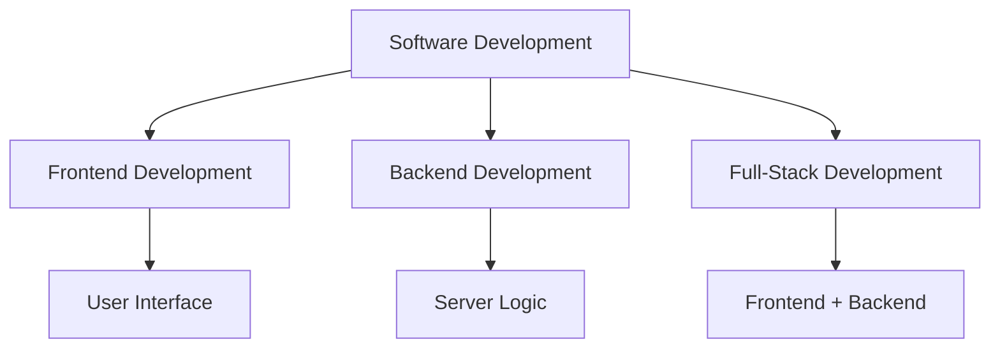
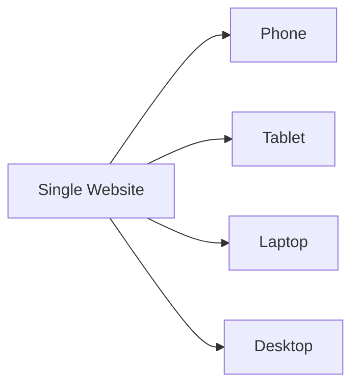
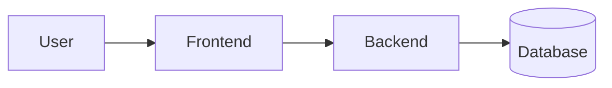
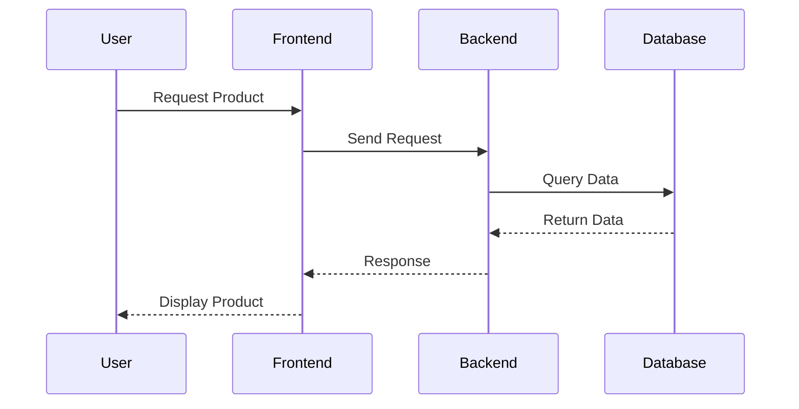
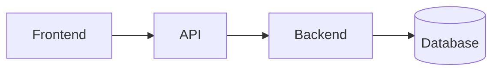
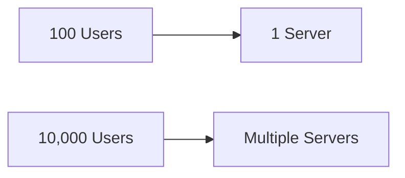
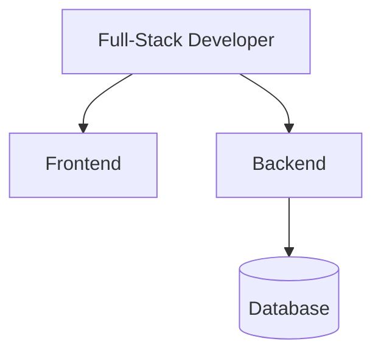
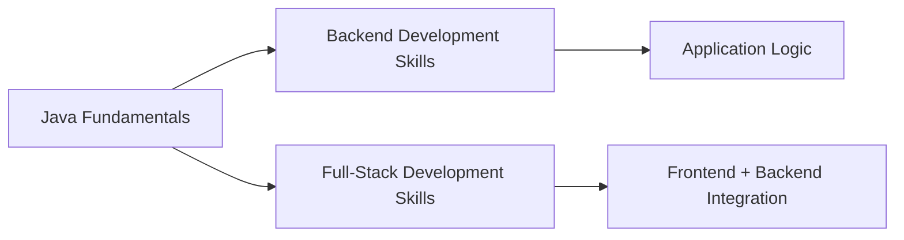

# Software Development Specializations: Frontend, Backend, and Full-Stack Development

## Introduction

Software development is a broad field with multiple specializations. Each specialization focuses on different aspects of building software systems and requires a unique set of skills.

### Examples from the Transcript

|Professional|Specialization|Focus Area|
|---|---|---|
|Ricardo|Frontend Development|User interfaces and user experience|
|Lisa|Data Science|Extracting insights from data|
|Mobile Developer|Mobile Applications|Smartphone and tablet applications|
|Backend Developer|Server Systems|Application logic and data processing|

### Importance of Understanding Specializations

Understanding different career paths helps developers:

- Choose areas of interest
    
- Focus learning efforts
    
- Understand job requirements
    
- Prepare for internships and employment opportunities

---

# Overview of Software Development Specializations



---

# Frontend Development

## Definition

Frontend development focuses on the parts of software that users directly see and interact with.

### Primary Goal

Create interfaces that are:

- Visually appealing
    
- Easy to use
    
- Interactive
    
- Responsive

### User Perspective

Everything a user sees in a web application is typically part of the frontend.

Examples:

- Buttons
    
- Menus
    
- Forms
    
- Images
    
- Layouts
    
- Animations

---

## Technologies Used

|Technology|Purpose|
|---|---|
|HTML|Structure content|
|CSS|Style and appearance|
|JavaScript|Interactivity and behavior|

---

# Key Responsibilities of a Frontend Developer

## 1. Building User Interfaces

### Definition

Creating visual layouts and interactive elements that users interact with.

### Example

Flight and hotel booking websites.

Good frontend design results in:

- Easy navigation
    
- Clear information
    
- Efficient booking processes

### Typical Structure

```html
<!DOCTYPE html>
<html>
<head>
    <title>Flight Booking</title>
</head>
<body>

<h1>Book a Flight</h1>

<button>Search Flights</button>

</body>
</html>
```

---

## 2. Cross-Browser Compatibility

### Definition

Ensuring websites function consistently across different browsers and devices.

### Common Browsers

- Chrome
    
- Firefox
    
- Edge
    
- Safari

### Why It Matters

Different browsers may render websites differently.

---

## 3. Responsive Design

### Definition

Designing interfaces that adapt to different screen sizes and devices.

### Devices Supported

|Device|Screen Size|
|---|---|
|Smartphone|Small|
|Tablet|Medium|
|Laptop|Large|
|Desktop Monitor|Extra Large|

### Example

A fast-food ordering application should work properly on:

- Mobile phones
    
- Tablets
    
- Desktop computers

---

### Responsive Design Diagram



---

## 4. Optimization

### Definition

Improving frontend performance and loading speed.

### Optimization Goals

- Faster page loading
    
- Smaller file sizes
    
- Efficient image handling
    
- Better user experience

### Benefits

|Optimization|Result|
|---|---|
|Image Compression|Faster loading|
|Smaller Files|Reduced bandwidth|
|Efficient Code|Better performance|

---

## 5. Collaboration

### Definition

Working closely with designers and other team members.

### Typical Collaboration


### Skills Required

- Communication
    
- Teamwork
    
- Problem solving

---

# Backend Development

## Definition

Backend development focuses on the server-side functionality that powers applications behind the scenes.

### Primary Goal

Manage:

- Business logic
    
- Databases
    
- APIs
    
- Security
    
- Scalability

### Analogy

The backend is the **engine of a car**.

Users see the exterior (frontend), but the engine powers everything.

---

# Backend Architecture Overview



---

# Key Responsibilities of a Backend Developer

## 1. Server-Side Programming

### Definition

Writing code that executes on servers.

### Responsibilities

- Process requests
    
- Execute business logic
    
- Generate dynamic content
    
- Communicate with databases

### Example Workflow



---

## 2. Database Management

### Definition

Storing, organizing, and retrieving information efficiently.

### Responsibilities

- Database design
    
- Schema creation
    
- SQL queries
    
- Performance optimization

### Analogy

A database is like a well-organized library.

---

### Example SQL Query

```sql
SELECT *
FROM Customers
WHERE CustomerID = 10;
```

### Explanation

1. Search the Customers table.
    
2. Find customer ID 10.
    
3. Return matching information.

---

## 3. API Development

### Definition

An API (Application Programming Interface) enables communication between systems.

### Restaurant Menu Analogy

An API functions like a restaurant menu:

|Restaurant|Software|
|---|---|
|Customer|Frontend|
|Menu|API|
|Kitchen|Backend|
|Food|Data/Results|

The customer does not need to know how the kitchen prepares the food.

Similarly, the frontend does not need to know how the backend processes requests.

---

### API Communication Diagram



---

## 4. Security

### Definition

Protecting software and data from unauthorized access and attacks.

### Security Tasks

- User authentication
    
- Data encryption
    
- Access control
    
- Penetration testing

---

### Common Security Threats

|Threat|Description|
|---|---|
|SQL Injection|Malicious database commands|
|XSS (Cross-Site Scripting)|Malicious scripts executed in browsers|
|Data Breaches|Unauthorized data access|

---

### Home Security Analogy

|Home Security|Software Security|
|---|---|
|Locking doors|Authentication|
|Visitor screening|Authorization|
|Security cameras|Monitoring systems|

---

## 5. Scalability

### Definition

The ability of a system to handle increasing numbers of users and requests.

### Analogy

Adding lanes to a highway as traffic increases.

### Goals

- Maintain performance
    
- Handle growth
    
- Avoid bottlenecks

---

### Scalability Diagram



---

# Full-Stack Development

## Definition

Full-stack development combines frontend and backend development skills.

### Full-Stack Developers Can

- Build user interfaces
    
- Develop server-side logic
    
- Manage databases
    
- Design APIs
    
- Deploy applications

---

## Full-Stack Architecture



---

# Key Responsibilities of a Full-Stack Developer

## 1. End-to-End Development

### Definition

Participating in every stage of software development.

### Responsibilities

- Design interfaces
    
- Write backend logic
    
- Integrate databases
    
- Deploy applications
    
- Maintain systems

### Analogy

A movie director overseeing an entire production.

---

## 2. Versatility

### Definition

Ability to work across multiple technologies and project areas.

### Benefits

- Flexible problem-solving
    
- Greater project understanding
    
- Increased employability

---

## 3. Problem Solving

### Definition

Resolving issues that span both frontend and backend systems.

### Example

A login failure could involve:

- Frontend form validation
    
- API communication
    
- Backend authentication
    
- Database queries

A full-stack developer understands all layers.

---

## 4. Continuous Learning

### Definition

Ongoing development of technical knowledge and skills.

### Why It Matters

Technology evolves rapidly.

Developers must stay current with:

- Languages
    
- Frameworks
    
- Libraries
    
- Cloud technologies
    
- Security practices

---

# Frontend Vs Backend Vs Full-Stack

|Feature|Frontend|Backend|Full-Stack|
|---|---|---|---|
|User Interface|Yes|No|Yes|
|Server Logic|No|Yes|Yes|
|Database Work|Limited|Yes|Yes|
|APIs|Limited|Yes|Yes|
|User Experience Focus|High|Medium|High|
|Infrastructure Focus|Low|High|Medium|
|End-to-End Ownership|No|No|Yes|

---

# Career Preparation and Internships

## Importance of Internships

Internships provide:

- Hands-on experience
    
- Industry exposure
    
- Professional networking
    
- Practical skill development

### Benefits

|Benefit|Description|
|---|---|
|Real Projects|Work on actual software|
|Industry Standards|Learn professional practices|
|Mentorship|Learn from experienced developers|
|Career Exploration|Discover preferred specialization|

---

# Learning Path in This Certificate

The program introduces skills across multiple specializations.



## Skills Covered

- Java programming
    
- Backend logic
    
- Web development
    
- Frontend fundamentals
    
- Full-stack concepts

---

# Key Terms Reference

|Term|Definition|
|---|---|
|Frontend Development|Development of user-facing interfaces|
|Backend Development|Development of server-side systems|
|Full-Stack Development|Combination of frontend and backend development|
|Responsive Design|Interfaces adapting to different screen sizes|
|API|Interface allowing systems to communicate|
|Database|Organized storage of data|
|SQL|Language for interacting with databases|
|Authentication|Verifying user identity|
|Scalability|Ability to handle increased demand|
|Cross-Browser Compatibility|Consistent behavior across browsers|
|Optimization|Improving performance and efficiency|

# Summary

Software development offers multiple specialization paths. Frontend developers focus on user interfaces, responsive design, optimization, and user experience. Backend developers manage server-side logic, databases, APIs, security, and scalability. Full-stack developers work across both frontend and backend systems, building complete end-to-end solutions. Understanding these specializations helps aspiring developers choose career paths that align with their interests while building the skills required for modern software development.