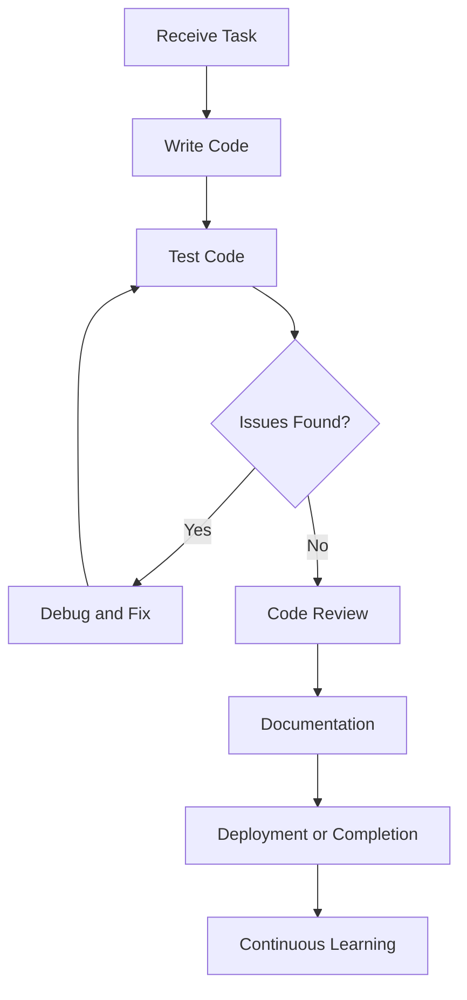
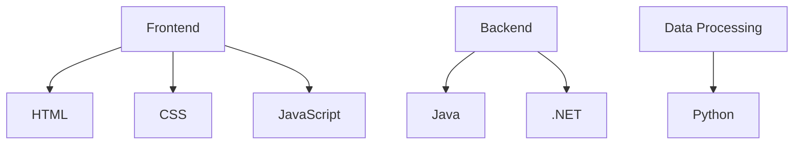
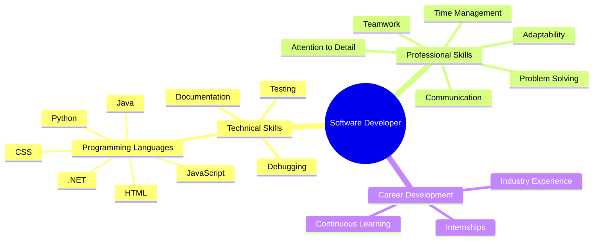

# Software Developer Roles, Responsibilities, Skills, and Internship Opportunities

## Overview

A software developer's role extends beyond writing code. It involves collaboration, problem-solving, testing, continuous learning, documentation, and time management. Success in software development requires both technical and professional skills.

---

# A Typical Day in the Life of a Software Developer

## Core Responsibilities

|Responsibility|Description|
|---|---|
|Writing Code|Creating new features and functionality.|
|Debugging|Finding and fixing software bugs.|
|Optimization|Improving performance and efficiency of existing code.|
|Team Collaboration|Working with teammates to discuss tasks and solve problems.|
|Code Reviews|Reviewing others' code and receiving feedback on your own code.|
|Testing|Verifying that software works correctly before release.|
|Documentation|Creating guides, notes, and comments for future maintenance.|
|Continuous Learning|Keeping up with new technologies and industry trends.|

---

## Software Development Workflow



---

# Collaboration in Software Development

Software development is rarely a solo activity.

## Team Activities

### Team Meetings

Developers regularly:

- Discuss project progress
    
- Share updates
    
- Coordinate work
    
- Solve difficult technical challenges together

### Code Reviews

Code reviews help ensure:

- Code quality
    
- Consistency
    
- Compliance with standards
    
- Knowledge sharing among team members

### Benefits of Code Reviews

|Benefit|Explanation|
|---|---|
|Better Quality|More eyes catch more issues.|
|Knowledge Sharing|Team members learn from each other.|
|Consistency|Coding standards are maintained.|
|Collaboration|Encourages teamwork and communication.|

---

# Problem Solving in Software Development

## Definition

**Problem-solving** is the ability to break down complex issues into smaller, manageable pieces and systematically find solutions.

## Example: Web Page Display Issue

### Problem

A webpage is not displaying correctly.

### Step-by-Step Approach

1. Inspect HTML structure.
    
2. Verify CSS styling.
    
3. Check JavaScript functionality.
    
4. Review browser console errors.
    
5. Identify the faulty component.
    
6. Apply the fix.
    
7. Retest the webpage.

### Problem-Solving Process


---

# Testing and Quality Assurance

## Definition

**Testing** is the process of verifying that software behaves as expected.

## Why Testing Matters

- Prevents defects from reaching users.
    
- Improves reliability.
    
- Ensures functionality works correctly.
    
- Reduces future troubleshooting time.

### Example

After implementing a new feature:

1. Run the application.
    
2. Test expected functionality.
    
3. Test edge cases.
    
4. Identify failures.
    
5. Fix defects.
    
6. Retest until successful.

---

# Documentation

## Definition

Documentation consists of written materials that explain how software works.

## Types of Documentation

|Type|Purpose|
|---|---|
|Code Comments|Explain sections of code.|
|Technical Guides|Explain implementation details.|
|User Documentation|Explain software usage.|
|Project Notes|Record decisions and changes.|

## Why Documentation Matters

- Helps future maintenance.
    
- Assists new team members.
    
- Reduces onboarding time.
    
- Preserves project knowledge.

### Example

Good code comments help teammates understand how a function works.

```java
// Calculates the total price after tax
public double calculateTotal(double price, double taxRate) {
    return price + (price * taxRate);
}
```

---

# Essential Skills for a Junior Software Developer

## 1. Programming Knowledge

### Definition

A strong understanding of programming languages and development technologies.

### Common Languages and Their Uses

|Language/Technology|Primary Use|
|---|---|
|HTML|Structure web pages|
|CSS|Style web pages|
|JavaScript|Interactive web functionality|
|Java|Backend systems and applications|
|.NET|Enterprise backend development|
|Python|Scripting and large-scale data processing|

---

## Web Development Technology Stack



---

## 2. Problem-Solving Skills

### Definition

The ability to analyze challenges and create effective solutions.

### Importance

Developers constantly encounter:

- Bugs
    
- Performance issues
    
- Design challenges
    
- Unexpected system behavior

### How to Improve

- Practice coding regularly.
    
- Work on projects.
    
- Solve coding challenges.
    
- Debug existing applications.

---

## 3. Attention to Detail

### Definition

The ability to notice and address small mistakes that can cause significant problems.

### Example

A missing semicolon or typo may cause software to fail.

```java
// Correct
System.out.println("Hello World");

// Potential issue if syntax is incorrect
System.out.println("Hello World")
```

### Benefits

- Fewer bugs
    
- Higher-quality code
    
- Easier maintenance
    
- Better reliability

---

## 4. Communication Skills

### Definition

The ability to clearly share information with both technical and non-technical audiences.

### Communication Scenarios

|Situation|Example|
|---|---|
|Team Collaboration|Discussing implementation details|
|Stakeholder Communication|Explaining technical concepts simply|
|Documentation|Writing clear code comments|
|Code Reviews|Giving constructive feedback|

### Example

Well-written comments improve collaboration.

```java
/**
 * Returns the user's full name.
 * Combines first and last name.
 */
public String getFullName(String firstName, String lastName) {
    return firstName + " " + lastName;
}
```

---

## 5. Adaptability and Continuous Learning

### Definition

The willingness and ability to learn new technologies and methodologies.

### Why It Matters

Technology evolves rapidly.

Developers may need to learn:

- New programming languages
    
- Frameworks
    
- Libraries
    
- Development practices

### Learning Sources

- Blogs
    
- Videos
    
- Online courses
    
- Workshops
    
- Technical documentation

---

## 6. Teamwork

### Definition

The ability to work effectively with others toward a common goal.

### Teamwork Includes

- Code reviews
    
- Pair programming
    
- Team discussions
    
- Collaborative problem-solving

### Benefits

- Faster issue resolution
    
- Better software quality
    
- Knowledge sharing
    
- Stronger project outcomes

---

## 7. Time Management

### Definition

The ability to organize work efficiently and meet deadlines.

### Key Practices

- Prioritize tasks
    
- Break projects into milestones
    
- Track progress
    
- Stay organized

### Example

Instead of treating a project as one large task:

```text
Project
├── Design
├── Backend Development
├── Frontend Development
├── Testing
└── Deployment
```

This makes progress easier to track and deadlines easier to meet.

---

# Internship Opportunities for Junior Software Developers

Internships provide hands-on experience and exposure to real-world software development practices.

---

## Amazon Internship

### Requirements

- Current undergraduate student
    
- Preferably studying:
    
    - Mathematics
        
    - Computer Science
        
    - Technology-related fields

### Opportunities

- Work on innovative projects
    
- Collaborate with experienced engineers
    
- Learn software development best practices
    
- Gain industry experience

### Benefits

|Benefit|Description|
|---|---|
|Real Projects|Work on production-level systems|
|Mentorship|Learn from experienced professionals|
|Industry Exposure|Experience large-scale software development|
|Skill Development|Improve technical and professional skills|

---

## Java Development Intern

### Responsibilities

- Write code
    
- Fix bugs
    
- Assist with feature development
    
- Collaborate with senior developers

### Skills Developed

- Java programming
    
- Software development lifecycle
    
- Team collaboration
    
- Debugging

---

## Backend Development Intern (Healthcare Startup)

### Responsibilities

- Optimize database queries
    
- Work with server-side systems
    
- Support healthcare applications

### Skills Developed

|Skill|Description|
|---|---|
|Database Management|Managing and optimizing data storage|
|Query Optimization|Improving database performance|
|Backend Development|Building server-side applications|
|Reliability Engineering|Supporting critical systems|

---

## Frontend Development Intern

### Responsibilities

- Create interactive web applications
    
- Develop user interfaces
    
- Support marketing campaigns

### Technologies

- HTML
    
- CSS
    
- JavaScript

### Skills Developed

- User Interface Design
    
- Frontend Architecture
    
- User Experience Enhancement

---

## Full-Stack Development Intern

### Responsibilities

- Work on both frontend and backend systems
    
- Build complete web solutions
    
- Integrate multiple technologies

### Skills Developed

|Frontend Skills|Backend Skills|
|---|---|
|HTML|Java|
|CSS|Databases|
|JavaScript|APIs|
|UI Development|Server Logic|

### Advantage

Full-stack developers understand the entire web application lifecycle and are highly versatile.

---

# Software Developer Skill Map



---

# Key Terms

|Term|Definition|
|---|---|
|Debugging|Finding and fixing software errors.|
|Code Review|Examination of code by other developers to improve quality.|
|Backend Development|Server-side application development.|
|Frontend Development|User-facing application development.|
|Full-Stack Development|Working on both frontend and backend systems.|
|Documentation|Written explanations of software functionality.|
|Testing|Verification that software behaves as expected.|
|Optimization|Improving performance and efficiency.|
|Adaptability|Ability to learn and adjust to new technologies.|

---

# Summary

- Software development involves coding, debugging, testing, documentation, collaboration, and continuous learning.
    
- Strong technical skills must be paired with professional skills such as communication, teamwork, and time management.
    
- Key technical areas include frontend development (HTML, CSS, JavaScript), backend development (Java, .NET), and data processing (Python).
    
- Problem-solving and attention to detail are critical for identifying and fixing issues efficiently.
    
- Documentation and code reviews improve maintainability and team collaboration.
    
- Internships provide valuable real-world experience and help develop both technical and professional competencies.
    
- Successful software developers continuously learn, adapt to new technologies, and work effectively within teams.