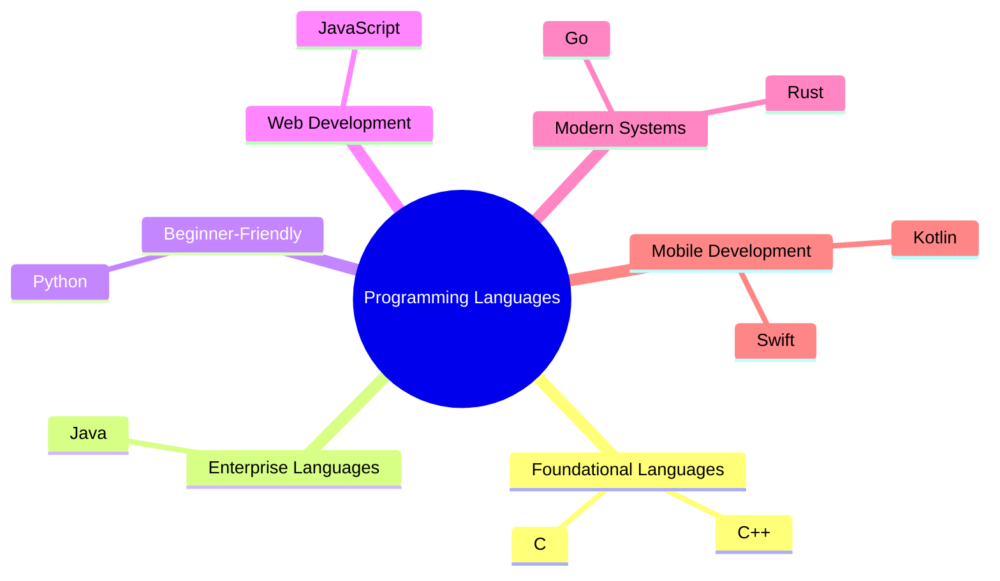
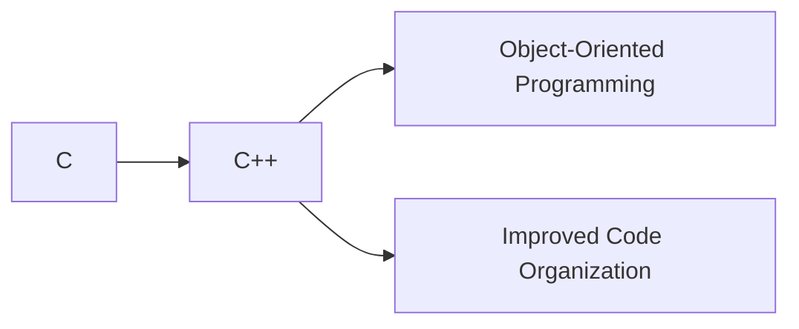
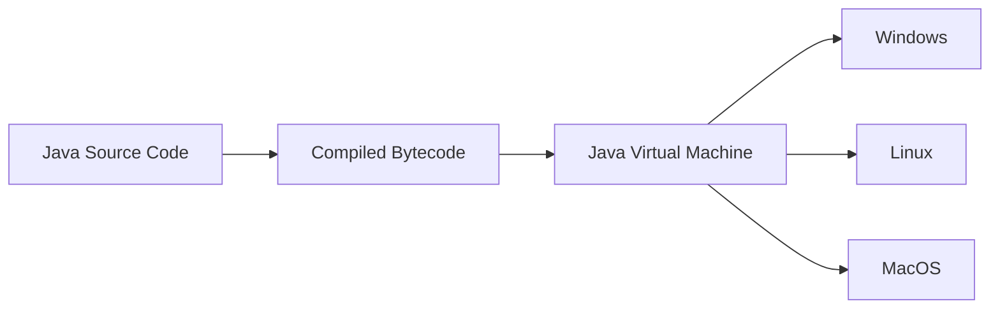
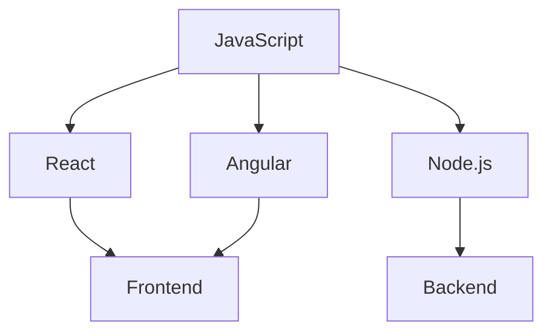
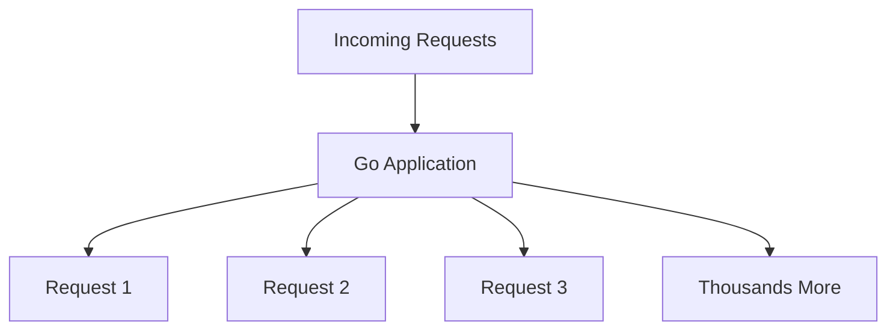
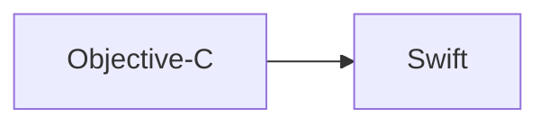
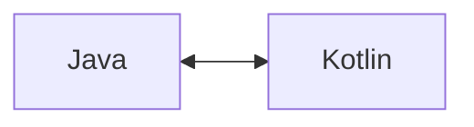
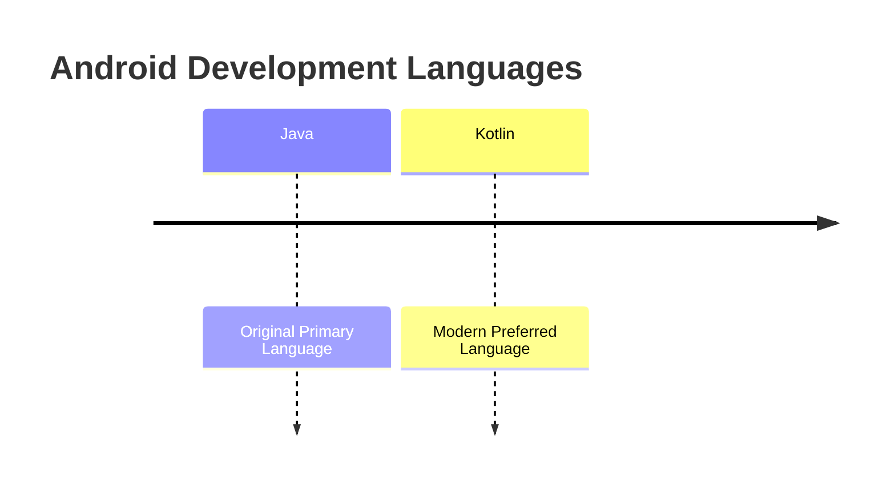
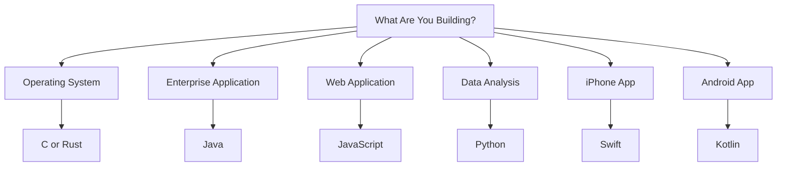

# Programming Languages Landscape

## Overview

Programming languages serve different purposes, much like different areas of a city are designed for specific activities. Some languages focus on performance and system-level control, while others prioritize ease of use, portability, web development, or application development.

Understanding the strengths and use cases of major programming languages helps developers choose the right tool for a given problem.

---

# Programming Language Ecosystem



---

# Foundational Languages

## C

### Definition

C is a low-level programming language that provides direct access to hardware and memory, making it highly efficient and powerful.

### Key Characteristics

|Characteristic|Description|
|---|---|
|Performance|Very fast execution|
|Hardware Access|Direct interaction with memory and system resources|
|Efficiency|Minimal overhead|
|Control|Precise management of program behavior|

### Common Uses

- Operating systems
    
- Device drivers
    
- Embedded systems
    
- System programming

### Why It Matters

Unlike higher-level languages, C allows developers to directly manipulate hardware and memory, making it ideal for performance-critical software.

---

## C++

### Definition

C++ extends C by introducing Object-Oriented Programming (OOP) concepts.

### Key Characteristics

|Feature|Benefit|
|---|---|
|Object-Oriented Programming|Better organization of large projects|
|High Performance|Maintains much of C's speed|
|Scalability|Suitable for complex software systems|
|Flexibility|Supports multiple programming paradigms|

### Common Uses

- Game engines
    
- Desktop applications
    
- High-performance systems
    
- Financial software

### Relationship to C



---

# Object-Oriented Programming (OOP)

## Definition

Object-Oriented Programming is a programming paradigm that organizes software around objects (data and behavior) rather than only functions and procedures.

### Benefits

- Better code organization
    
- Easier maintenance
    
- Improved scalability
    
- Reusable components

### Conceptual Example

```java
class Car {
    String brand;

    void drive() {
        System.out.println("Driving...");
    }
}
```

In OOP:

- `Car` is an object blueprint (class).
    
- `brand` represents data.
    
- `drive()` represents behavior.

---

# Java

## Definition

Java is a high-level, object-oriented programming language known for portability, scalability, and reliability.

### Core Philosophy

> Write Once, Run Anywhere

Java applications can run on any platform that has a Java Virtual Machine (JVM).

---

## Java Virtual Machine (JVM)

### Definition

The JVM is software that executes Java programs and allows them to run across different operating systems.

### How Java Works



---

## Java Strengths

|Strength|Description|
|---|---|
|Portability|Runs on multiple platforms|
|Scalability|Supports large applications|
|Robustness|Reliable and stable|
|Memory Management|Simplifies memory handling|
|Multithreading|Supports concurrent execution|

### Common Uses

- Enterprise applications
    
- Web applications
    
- Android development
    
- Backend systems

---

## Java in Web Applications

Java commonly handles:

- Database interactions
    
- User authentication
    
- Business logic
    
- Server-side processing

### Example Architecture


---

# Python

## Definition

Python is a high-level programming language known for simplicity, readability, and versatility.

### Key Characteristics

|Feature|Benefit|
|---|---|
|Simple Syntax|Easy to learn|
|Readability|Easier code maintenance|
|Versatility|Applicable to many domains|
|Large Ecosystem|Extensive libraries and frameworks|

### Common Uses

- Web development
    
- Data analysis
    
- Artificial intelligence
    
- Scientific computing
    
- Automation scripts

---

## Example: Python Simplicity

### Python

```python
name = "Miguel"
print("Hello", name)
```

### Equivalent Java Code

```java
public class Main {
    public static void main(String[] args) {
        String name = "Miguel";
        System.out.println("Hello " + name);
    }
}
```

### Observation

Python often requires less code to accomplish the same task, making it popular among beginners.

---

# JavaScript

## Definition

JavaScript is the primary programming language used to create interactive web pages.

### Key Characteristics

|Feature|Description|
|---|---|
|Browser Execution|Runs directly in web browsers|
|Interactivity|Responds to user actions|
|Dynamic UI|Updates page content without reloading|
|Full-Stack Capability|Can run on frontend and backend|

---

## User Interactions Managed by JavaScript

- Mouse clicks
    
- Keyboard input
    
- Form validation
    
- Dynamic content updates
    
- Animations

### Example

```javascript
button.addEventListener("click", () => {
    alert("Button clicked!");
});
```

When a user clicks the button:

1. JavaScript detects the event.
    
2. The function executes.
    
3. A message appears.

---

## Modern JavaScript Ecosystem

|Technology|Purpose|
|---|---|
|React|Frontend user interfaces|
|Angular|Frontend application framework|
|Node.js|Server-side JavaScript|

### JavaScript Ecosystem



---

# Go (Golang)

## Definition

Go is a modern programming language developed by Google, designed for simplicity, performance, and concurrency.

---

## Key Characteristics

|Feature|Benefit|
|---|---|
|Fast Execution|High performance|
|Simple Syntax|Easy to learn and maintain|
|Concurrency Support|Handles many tasks simultaneously|
|Efficient Resource Usage|Scales well|

### Common Uses

- Cloud infrastructure
    
- APIs
    
- Microservices
    
- High-traffic systems

---

## Example Use Case

Handling thousands of user requests simultaneously:



Go excels in highly concurrent environments.

---

# Rust

## Definition

Rust is a systems programming language focused on safety, performance, and memory reliability.

---

## Key Characteristics

|Feature|Benefit|
|---|---|
|Memory Safety|Prevents many common bugs|
|High Performance|Comparable to C/C++|
|Reliability|Reduces crashes|
|Modern Design|Safer development experience|

### Common Uses

- Operating systems
    
- Embedded systems
    
- Performance-critical applications
    
- Security-focused software

---

## Why Rust Is Popular

Rust aims to provide:

- C/C++ level speed
    
- Strong memory safety
    
- Fewer runtime errors

### Comparison

|Feature|C/C++|Rust|
|---|---|---|
|Performance|High|High|
|Memory Safety|Manual|Built-in|
|Risk of Memory Errors|Higher|Lower|

---

# Swift

## Definition

Swift is Apple's modern programming language for developing applications across Apple platforms.

### Supported Platforms

- iOS
    
- macOS
    
- watchOS
    
- tvOS

---

## Advantages

|Feature|Benefit|
|---|---|
|Performance|Fast execution|
|Safety|Fewer common programming errors|
|Simplicity|Easier than Objective-C|
|Modern Design|Improved developer experience|

### Swift Evolution



---

# Kotlin

## Definition

Kotlin is a modern programming language that interoperates seamlessly with Java and has become the preferred language for Android development.

---

## Advantages

|Feature|Benefit|
|---|---|
|Java Compatibility|Works with existing Java code|
|Cleaner Syntax|Less boilerplate code|
|Safety Features|Reduces common errors|
|Modern Language Design|Improved productivity|

---

## Kotlin and Java Relationship



Kotlin can interact directly with Java code, making migration easier for organizations.

---

# Android Development Evolution



---

# Comparison of Major Programming Languages

|Language|Primary Purpose|Key Strength|Common Applications|
|---|---|---|---|
|C|Systems Programming|Hardware Control|Operating Systems, Embedded Systems|
|C++|High-Performance Software|OOP + Performance|Games, Desktop Software|
|Java|Enterprise Development|Portability|Backend Systems, Android|
|Python|General Purpose|Simplicity|AI, Data Science, Automation|
|JavaScript|Web Development|Interactivity|Websites, Web Apps|
|Go|Scalable Services|Concurrency|APIs, Cloud Systems|
|Rust|Systems Programming|Safety + Speed|Operating Systems|
|Swift|Apple Development|Apple Ecosystem|iOS/macOS Apps|
|Kotlin|Android Development|Modern Java Alternative|Android Apps|

---

# Choosing the Right Language



---

# Why Java Is the Focus

## Reasons Mentioned

1. Portability through the JVM.
    
2. Strong enterprise adoption.
    
3. Backend development capabilities.
    
4. Android development history.
    
5. Scalability for large systems.
    
6. Long-term industry relevance.
    
7. Strong foundation for software engineering concepts.

### Areas Where Java Is Commonly Used

- Enterprise software
    
- Web application backends
    
- Banking systems
    
- E-commerce platforms
    
- Android development
    
- Distributed systems

---

# Key Terms

|Term|Definition|
|---|---|
|Systems Programming|Software that interacts closely with hardware and operating systems.|
|Object-Oriented Programming (OOP)|Organizing code around objects containing data and behavior.|
|JVM (Java Virtual Machine)|Software that runs Java bytecode on multiple platforms.|
|Portability|Ability to run software across different environments.|
|Concurrency|Executing multiple tasks simultaneously.|
|Memory Safety|Preventing invalid memory access and related bugs.|
|Backend Development|Server-side application logic and processing.|
|Frontend Development|User-facing portion of an application.|
|Framework|A collection of tools and libraries used to build applications more efficiently.|

---

# Summary

- Programming languages are designed for different purposes and strengths.
    
- C and C++ provide foundational, high-performance system programming capabilities.
    
- Java emphasizes portability, scalability, and enterprise development through the JVM.
    
- Python is beginner-friendly and highly versatile across many domains.
    
- JavaScript powers interactive web experiences and modern web applications.
    
- Go focuses on simplicity, efficiency, and handling large numbers of concurrent tasks.
    
- Rust delivers high performance while emphasizing memory safety.
    
- Swift is Apple's preferred language for application development.
    
- Kotlin is the modern preferred language for Android development and integrates seamlessly with Java.
    
- Learning Java provides a strong foundation for software development and opens opportunities across many areas of the technology industry.