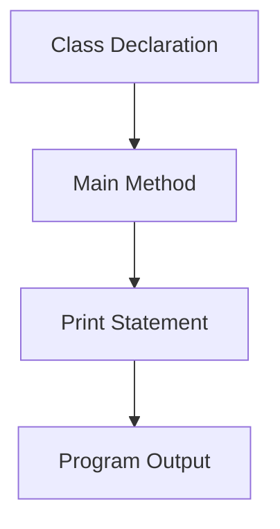
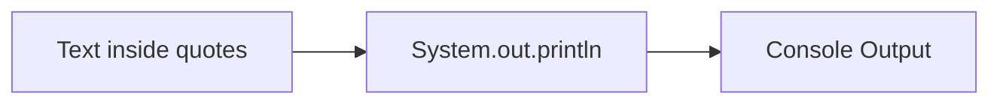
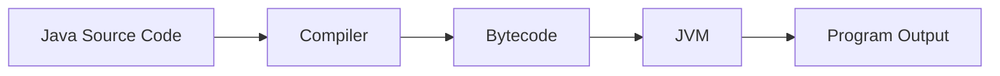
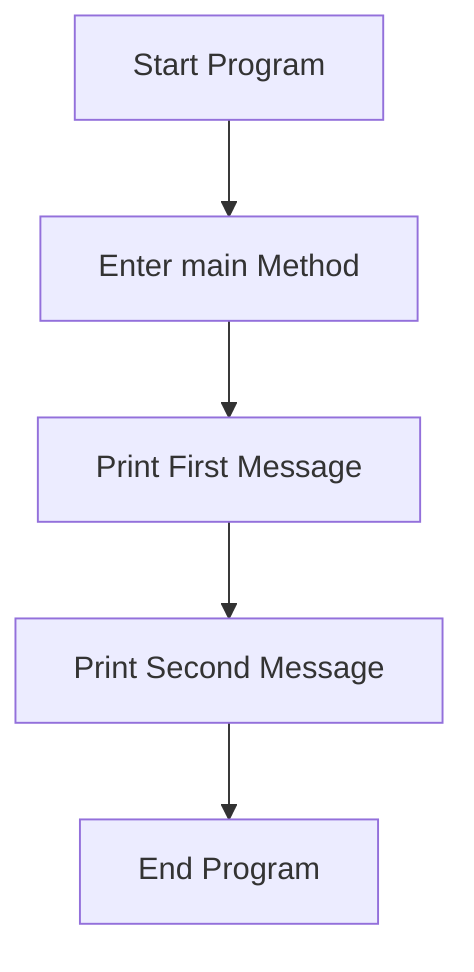

# Writing Your First Java Program

## Overview

This lab introduces the basic structure of a Java program and demonstrates how to create, compile, run, and modify a simple Java application using IntelliJ IDEA.

The program's purpose is to display messages on the console using Java's built-in output functionality.

---

# Learning Objectives

After completing this lab, you should be able to:

- Create a Java project in IntelliJ IDEA.
    
- Create a Java class.
    
- Understand the structure of a Java program.
    
- Write a `main()` method.
    
- Use `System.out.println()` to display output.
    
- Compile and run a Java application.
    
- Modify and re-run code.

---

# Setting Up the Project

## Project Configuration

|Setting|Value|
|---|---|
|Project Name|Java_Project|
|Build System|IntelliJ|
|JDK Version|21|
|Sample Code|Disabled|

---

# Creating a Java Class

## What is a Class?

### Definition

A **class** is a blueprint that defines the structure and behavior of objects in Java.

For now, think of a class as a container that holds your program's code.

### Class Creation

Create a new Java Class named:

```text
MyFirstProgram
```

---

# Basic Structure of a Java Program

## Initial Class Structure

```java
public class MyFirstProgram {

}
```

---

## Structure Breakdown

|Code|Purpose|
|---|---|
|`public`|Allows the class to be accessed from anywhere|
|`class`|Declares a Java class|
|`MyFirstProgram`|Name of the class|
|`{ }`|Defines the beginning and end of the class|

---

# The Main Method

## Definition

The **main method** is the entry point of every Java application.

When a Java program starts, execution begins inside the `main()` method.

---

## Main Method Syntax

```java
public static void main(String[] args) {

}
```

---

## Main Method Breakdown

|Component|Meaning|
|---|---|
|`public`|Accessible from anywhere|
|`static`|Belongs to the class itself|
|`void`|Does not return a value|
|`main`|Special method where execution begins|
|`String[] args`|Stores command-line arguments|

---

## Why Is It Important?

Every standalone Java application requires a main method because the Java Virtual Machine (JVM) looks for this method when starting the program.

---

# Printing Output

## Definition

Printing output means displaying information to the user through the console.

Java uses:

```java
System.out.println()
```

to print text.

---

## First Print Statement

```java
System.out.println("I'm a Programmer");
```

---

## Output

```text
I'm a Programmer
```

---

# Complete First Program

```java
public class MyFirstProgram {

    public static void main(String[] args) {

        System.out.println("I'm a Programmer");

    }
}
```

---

# Program Structure Visualization



---

# Understanding System.out.println()

## Syntax

```java
System.out.println("Text to display");
```

---

## Component Breakdown

|Component|Purpose|
|---|---|
|`System`|Java's built-in system class|
|`out`|Standard output stream|
|`println`|Print a line and move to the next line|
|`" "`|Defines a text string|

---

## How It Works



---

## Example

### Code

```java
System.out.println("Hello World");
```

### Output

```text
Hello World
```

---

# Strings

## Definition

A **String** is a sequence of characters enclosed in double quotation marks.

### Examples

```java
"Hello"
"Java"
"I'm a Programmer"
```

---

## Rules

Correct:

```java
System.out.println("Java is fun");
```

Incorrect:

```java
System.out.println(Java is fun);
```

The text must be enclosed within quotation marks.

---

# Compiling and Running a Program

## What is Compilation?

### Definition

Compilation is the process of translating human-readable Java code into bytecode that the JVM can execute.

---

## Execution Process



---

## Running the Program

### Steps

1. Click the green Run button.
    
2. IntelliJ compiles the code.
    
3. The JVM executes the program.
    
4. Output appears in the Console window.

---

# The Console

## Definition

The **Console** is the output window where program results are displayed.

### Example

Code:

```java
System.out.println("I'm a Programmer");
```

Console Output:

```text
I'm a Programmer
```

---

# Modifying Program Output

One of the easiest ways to experiment with programming is by changing the text being printed.

---

## Example 1

### Code

```java
System.out.println("Let's change the code now...");
```

### Output

```text
Let's change the code now...
```

---

# Printing Multiple Lines

You can add multiple print statements inside the main method.

---

## Example

### Code

```java
public class MyFirstProgram {

    public static void main(String[] args) {

        System.out.println("Let's change the code now...");
        System.out.println("it's what I do!");

    }
}
```

---

## Output

```text
Let's change the code now...
it's what I do!
```

---

# Step-by-Step Execution Example

Consider:

```java
public class MyFirstProgram {

    public static void main(String[] args) {

        System.out.println("Let's change the code now...");
        System.out.println("it's what I do!");

    }
}
```

## Execution Steps

1. JVM starts the program.
    
2. JVM finds the `main()` method.
    
3. First `println()` executes.
    
4. Text is displayed.
    
5. Second `println()` executes.
    
6. Second line is displayed.
    
7. Program finishes.

---

# Execution Flow



---

# Key Concepts

|Concept|Definition|
|---|---|
|Class|A blueprint that contains Java code and objects.|
|Method|A block of code that performs a specific task.|
|Main Method|Starting point of a Java application.|
|String|Text enclosed in double quotes.|
|Console|Window that displays program output.|
|Compilation|Translation of Java code into executable bytecode.|
|JVM|Java Virtual Machine that executes Java programs.|
|System.out.println()|Command used to print text to the console.|

---

# Common Beginner Mistakes

|Mistake|Example|Fix|
|---|---|---|
|Missing Semicolon|`System.out.println("Hello")`|Add `;`|
|Missing Quotes|`System.out.println(Hello)`|Use `"Hello"`|
|Misspelling println|`System.out.printlin()`|Use `println()`|
|Missing Curly Braces|`{ }` not balanced|Ensure matching braces|
|Missing Main Method|No entry point|Add `main()` method|

---

# Complete Final Program

```java
public class MyFirstProgram {

    public static void main(String[] args) {

        System.out.println("Let's change the code now...");
        System.out.println("it's what I do!");

    }
}
```

---

# Summary

- A Java program is organized inside a class.
    
- Every Java application starts execution in the `main()` method.
    
- `System.out.println()` is used to display text in the console.
    
- Strings are enclosed in double quotation marks.
    
- Java code must be compiled before it can run.
    
- The JVM executes compiled Java programs.
    
- Multiple `println()` statements can be used to display multiple lines of output.
    
- Experimenting with output statements is an effective way to learn Java fundamentals.