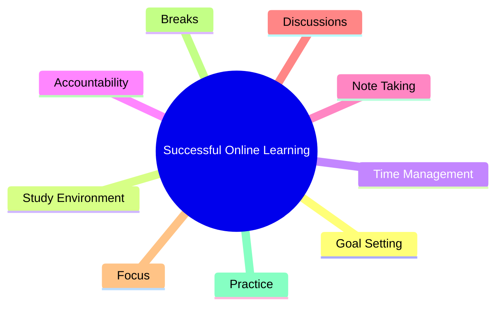
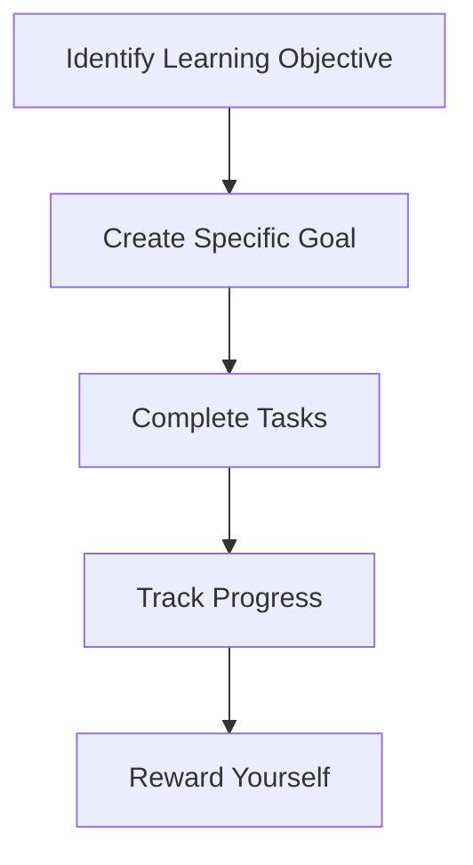
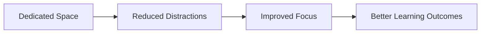
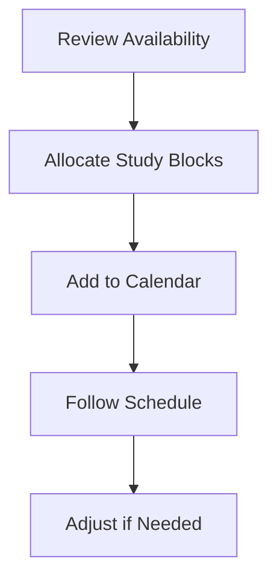
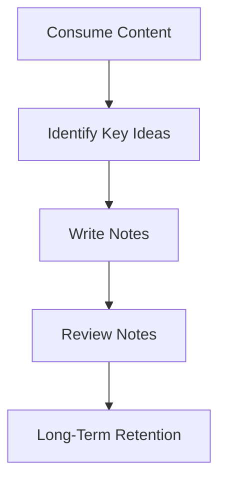
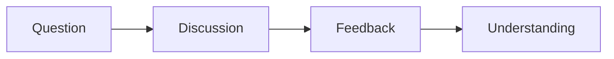
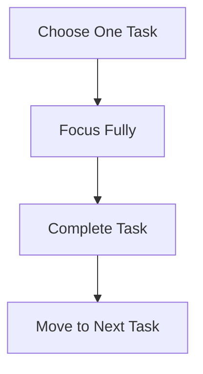
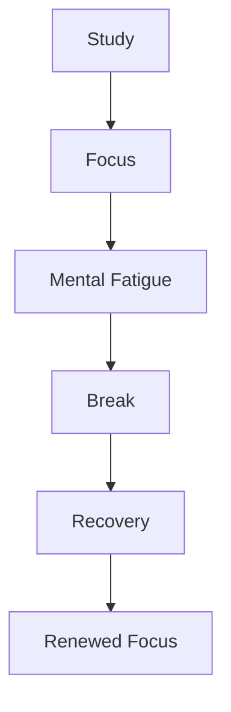
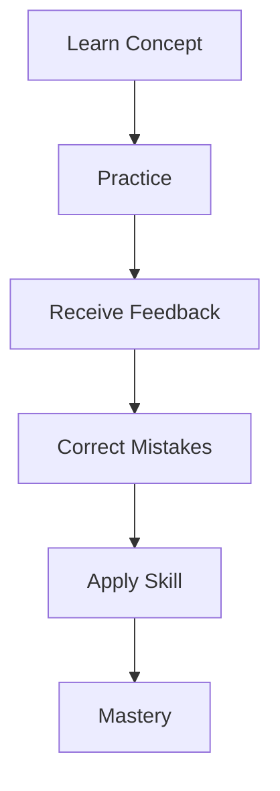
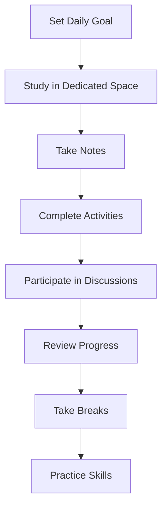

# Effective Online Learning Strategies

## Overview

Successfully completing an online course requires more than simply watching videos or reading lessons. Effective learners develop study habits, maintain accountability, manage their time, and actively engage with learning materials.

These strategies help improve focus, retention, productivity, and long-term success.

---

# Key Principles of Effective Learning



---

# 1. Set Daily Study Goals

## Definition

A **study goal** is a specific, measurable objective that you plan to accomplish during a study session or day.

### Why It Matters

- Provides direction.
    
- Increases motivation.
    
- Prevents procrastination.
    
- Makes progress measurable.
    

---

## Characteristics of Effective Goals

|Characteristic|Description|
|---|---|
|Specific|Clearly defines what will be accomplished|
|Measurable|Progress can be tracked|
|Realistic|Achievable within available time|
|Time-Bound|Has a clear deadline|

---

## Example

### Weak Goal

```text
Study Java today.
```

### Strong Goal

```text
Watch all Week 2 videos and complete Assignment 1.
```

---

## Goal-Setting Process



---

# 2. Create a Dedicated Study Space

## Definition

A dedicated study space is a consistent location used exclusively for learning activities.

---

## Benefits

|Benefit|Explanation|
|---|---|
|Better Focus|Fewer distractions|
|Improved Recall|Environment reinforces learning|
|Stronger Habits|Creates a study routine|
|Better Work-Life Separation|Distinguishes study from leisure|

---

## Best Practices

### Do

- Choose a quiet location.
    
- Keep materials organized.
    
- Minimize distractions.
    
- Use comfortable seating.
    

### Avoid

- Studying in bed.
    
- Excessive background noise.
    
- Frequent interruptions.
    
- Cluttered workspaces.
    

---

## Study Environment Model



---

# 3. Schedule Study Time

## Definition

Scheduling study time involves reserving specific blocks of time for learning activities.

---

## Why Scheduling Works

Without scheduling:

- Study sessions get postponed.
    
- Other tasks take priority.
    

With scheduling:

- Learning becomes part of your routine.
    
- Deadlines become easier to manage.
    
- Consistency improves.
    

---

## Example Weekly Schedule

|Day|Activity|Duration|
|---|---|---|
|Monday|Watch Videos|1 Hour|
|Tuesday|Read Course Material|1 Hour|
|Wednesday|Complete Exercises|1.5 Hours|
|Thursday|Review Notes|1 Hour|
|Friday|Complete Quiz|1 Hour|

---

## Scheduling Workflow



---

# 4. Keep Yourself Accountable

## Definition

Accountability is creating external or internal mechanisms that encourage consistent progress.

---

## Methods of Accountability

|Method|Example|
|---|---|
|Friends|Share goals and progress|
|Family|Ask for encouragement|
|Social Media|Post achievements|
|Blogs|Document learning journey|
|Study Groups|Learn alongside others|

---

## Benefits

- Increased motivation
    
- Greater consistency
    
- Higher completion rates
    
- Stronger commitment
    

---

# 5. Take Notes

## Definition

Note-taking is the process of recording important information during learning.

---

## Why Notes Improve Learning

Notes encourage:

- Active thinking
    
- Better comprehension
    
- Information retention
    
- Review efficiency
    

---

## Effective Notes Should Include

|Include|Example|
|---|---|
|Definitions|Key concepts|
|Examples|Code examples|
|Important Terms|Vocabulary|
|Questions|Areas needing clarification|
|Summaries|Main ideas|

---

## Note-Taking Process



---

# 6. Participate in Discussions

## Definition

Discussion forums are collaborative spaces where learners ask questions, share ideas, and solve problems together.

---

## Benefits

|Benefit|Description|
|---|---|
|Clarification|Resolve confusion|
|Knowledge Sharing|Learn from others|
|Networking|Meet fellow learners|
|Increased Engagement|Stay involved in the course|

---

## Types of Contributions

- Ask questions.
    
- Answer questions.
    
- Share resources.
    
- Discuss concepts.
    
- Provide feedback.
    

---

## Discussion Cycle



---

# 7. Focus on One Task at a Time

## Definition

Single-tasking is focusing entirely on one activity before moving to another.

---

## Why Multitasking Is Ineffective

Research shows multitasking can:

- Reduce focus.
    
- Increase mistakes.
    
- Lower productivity.
    
- Reduce information retention.
    

---

## Comparison

|Single Tasking|Multitasking|
|---|---|
|Higher focus|Divided attention|
|Better retention|Reduced retention|
|Fewer errors|More errors|
|Greater efficiency|Lower efficiency|

---

## Recommended Workflow



---

# 8. Take Breaks

## Definition

A break is a period of rest that allows the brain to recover after focused learning.

---

## Why Breaks Matter

Breaks help:

- Reduce mental fatigue.
    
- Improve concentration.
    
- Increase creativity.
    
- Enhance problem-solving.
    

---

## Signs You Need a Break

- Difficulty concentrating
    
- Re-reading the same content repeatedly
    
- Frustration with a problem
    
- Mental exhaustion
    

---

## Effective Break Activities

|Activity|Benefit|
|---|---|
|Walking|Refreshes attention|
|Exercise|Increases energy|
|Talking with a Friend|Mental reset|
|Shower|Encourages creative thinking|
|Stretching|Reduces physical tension|

---

## Learning Cycle



---

# 9. Prepare Thoroughly for Assessments

## Definition

Preparation involves systematically reviewing and practicing all required course material before an exam or evaluation.

---

## Recommended Process

### Step 1: Review Requirements

Understand:

- Exam guidelines
    
- Learning objectives
    
- Skills being assessed
    

---

### Step 2: Complete All Lessons

Avoid skipping content unless you already have mastery of the topic.

---

### Step 3: Revisit Difficult Material

If something is unclear:

- Rewatch videos
    
- Re-read lessons
    
- Review examples
    

---

### Step 4: Complete All Practice Activities

Include:

- Quizzes
    
- Exercises
    
- Practice exams
    
- Hands-on labs
    

---

### Step 5: Review Feedback

Feedback helps identify:

- Knowledge gaps
    
- Misconceptions
    
- Areas requiring additional practice
    

---

### Step 6: Apply Skills Practically

Practical application strengthens understanding and long-term retention.

---

## Learning Reinforcement Model



---

# Comprehensive Success Framework

|Strategy|Primary Benefit|
|---|---|
|Goal Setting|Motivation and direction|
|Dedicated Study Space|Improved concentration|
|Scheduling|Consistency|
|Accountability|Increased commitment|
|Note-Taking|Better retention|
|Discussions|Deeper understanding|
|Single-Task Focus|Improved productivity|
|Breaks|Mental recovery|
|Practice and Feedback|Long-term mastery|

---

# Key Terms

|Term|Definition|
|---|---|
|Accountability|Responsibility for completing learning goals.|
|Active Learning|Engaging directly with material through thinking, writing, or discussion.|
|Retention|Ability to remember information over time.|
|Multitasking|Attempting multiple tasks simultaneously.|
|Single-Tasking|Focusing on one task at a time.|
|Feedback|Information about performance used to improve learning.|
|Learning Environment|Physical or digital space where studying occurs.|
|Practical Application|Using knowledge in real-world exercises or projects.|

---

# Recommended Study Routine



---

# Summary

- Successful online learning depends on consistent study habits rather than motivation alone.
    
- Clear daily goals help maintain direction and reduce procrastination.
    
- A dedicated study environment improves focus and information recall.
    
- Scheduling study sessions increases consistency and accountability.
    
- Active note-taking strengthens comprehension and memory.
    
- Participation in discussions enhances understanding and course completion rates.
    
- Focusing on one task at a time is more effective than multitasking.
    
- Regular breaks improve concentration and problem-solving ability.
    
- Completing lessons, quizzes, exercises, and practical activities reinforces learning and prepares learners for assessments.
    
- Consistent application of these strategies leads to better retention, stronger skills, and higher success rates in online learning.