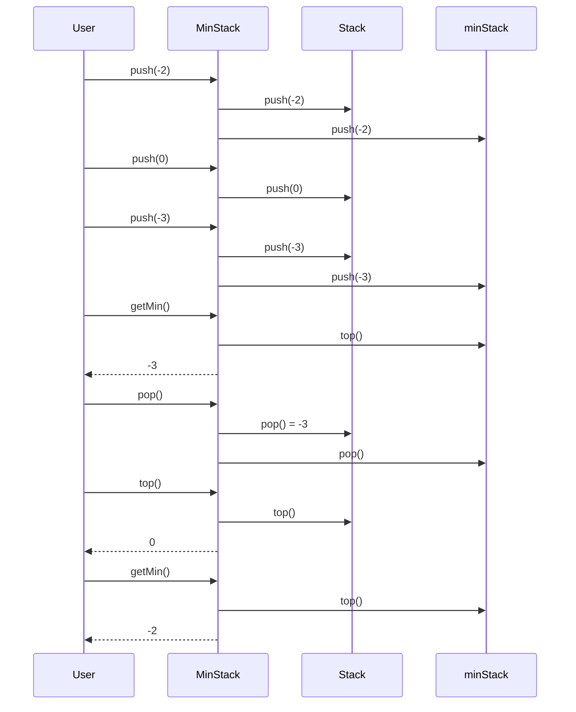

# 155. Min Stack (Medium)

## 🧩 Problem Description

Design a stack data structure that supports the following operations **in constant time O(1)**:

- `push(val)` → Add an element to the stack
- `pop()` → Remove the top element
- `top()` → Get the top element
- `getMin()` → Retrieve the **minimum element** in the stack

You must ensure **every operation runs in O(1) time**, even `getMin`.

---

## 📥 Example

### Input
```text
["MinStack","push","push","push","getMin","pop","top","getMin"]
[[],[-2],[0],[-3],[],[],[],[]]
```

### Output
```text
[null,null,null,null,-3,null,0,-2]
```

### Explanation
```
push(-2) → stack = [-2]
push(0)  → stack = [-2, 0]
push(-3) → stack = [-2, 0, -3]
getMin() → -3
pop()    → stack = [-2, 0]
top()    → 0
getMin() → -2
```

---

## 💡 Key Idea (Junior-Friendly)

A normal stack can easily give you the **top**, but finding the **minimum** would normally require scanning the entire stack (O(n)).

To fix this, we use **two stacks**:

1. **Main stack** → stores all values
2. **Min stack** → stores the minimum value **at each level**

> [!note]
> The top of the min stack always represents the minimum value up to that point.

---

## 🛠️ Solution (TypeScript)

```ts
class MinStack {
  private stack: number[];
  private minStack: number[];

  constructor() {
    this.stack = [];
    this.minStack = [];
  }

  push(val: number): void {
    this.stack.push(val);

    if (
      this.minStack.length === 0 ||
      val <= this.minStack[this.minStack.length - 1]
    ) {
      this.minStack.push(val);
    }
  }

  pop(): void {
    const removed = this.stack.pop();

    if (removed === this.minStack[this.minStack.length - 1]) {
      this.minStack.pop();
    }
  }

  top(): number {
    return this.stack[this.stack.length - 1];
  }

  getMin(): number {
    return this.minStack[this.minStack.length - 1];
  }
}
```

---

## 🧠 Step-by-Step Logic

1. **push**
   - Always push value to main stack
   - Push to min stack only if:
     - min stack is empty, or
     - value is smaller or equal to current minimum

2. **pop**
   - Remove top element from main stack
   - If it equals the top of min stack, pop min stack too

3. **top**
   - Return last element of main stack

4. **getMin**
   - Return last element of min stack

---

## 🧪 Example Walkthrough

Pushing values:
```
push(-2) → stack: [-2], minStack: [-2]
push(0)  → stack: [-2, 0], minStack: [-2]
push(-3) → stack: [-2, 0, -3], minStack: [-2, -3]
```

After popping `-3`:
```
stack: [-2, 0]
minStack: [-2]
```

Minimum is always on top of `minStack`.

---

## ⏱️ Complexity Analysis

| Operation | Time | Space |
|--------|------|-------|
| push | O(1) | O(1) |
| pop | O(1) | O(1) |
| top | O(1) | O(1) |
| getMin | O(1) | O(1) |
| Overall | O(1) | O(n) |

---

## 📋 Summary / Takeaways

| Concept | Notes |
|------|------|
| Data Structure | Two stacks |
| Pattern | Auxiliary stack |
| Key Trick | Track minimum at each level |
| Common Mistake | Recomputing min each time |
| Interview Frequency | Very high |

---

## 🎤 How to Explain This in an Interview

> "I use two stacks: one for storing values and another for tracking the minimum value at each level.  
> When pushing, I update the min stack only if the new value is smaller or equal to the current minimum.  
> When popping, I remove from the min stack only if the popped value equals the current minimum.  
> This guarantees all operations, including getMin, run in constant time."

---

## ✅ Final Notes

This problem tests:
- Stack fundamentals
- Space vs time tradeoffs
- Clean state tracking

If you understand this solution, you’re well-prepared for advanced stack problems.


