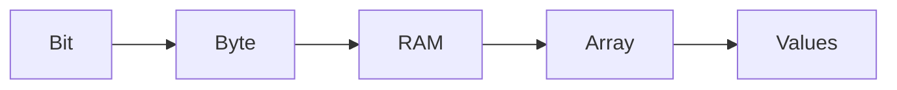

# 1. Data Structures and Memory (RAM)

## 1.1 What Is a Data Structure?

**Definition:**  
A **data structure** is a method of organizing and storing data so it can be accessed and modified efficiently.

**Context:**  
In computers, data structures exist **inside RAM**, where programs store variables and manage data during execution.

---

# 2. Understanding RAM

## 2.1 What Is RAM?

**Definition:**  
**RAM (Random Access Memory)** is the main memory where variables and data structures are stored while a program runs.

**Key properties:**

- RAM is a large, continuous block of memory.
    
- Each stored value has a unique **address**.
    
- Access time is constant (random access).

---

## 2.2 Bytes and Bits

|Term|Definition|Details|
|---|---|---|
|Bit|Smallest unit of data|Can be `0` or `1`|
|Byte|Group of 8 bits|Basic unit of memory|
|Gigabyte (GB)|~10⁹ bytes|Typical RAM size (e.g., 8 GB)|

**Relationship:**

- Bits → Bytes → RAM → Data Structures

---

## 2.3 Addresses in RAM

- Each memory location has an **address**.
    
- Addresses uniquely identify where data is stored.
    
- Addresses are often visualized as increasing numeric values.

---

# 3. Arrays as a Data Structure

## 3.1 What Is an Array?

**Definition:**  
An **array** is a data structure that stores multiple values of the same type in **contiguous (continuous) memory locations**.

**Key idea:**  
Arrays are stored in memory exactly as they are conceptually used: a sequence of values placed next to each other.

---

# 4. Storing Integers in an Array

## 4.1 Integer Representation

- Integers are typically stored using **4 bytes (32 bits)**.
    
- Example: integer `1`
    
    - Binary representation: `31 zeros + 1 one`

---

## 4.2 Integer Array in Memory

Example array:

```Python
[1, 3, 5]
```

**Memory layout:**

|Address|Value|Bytes Used|
|---|---|---|
|$0|1|4 bytes|
|$4|3|4 bytes|
|$8|5|4 bytes|

**Why addresses increment by 4:**  
Each integer occupies **4 bytes**, so the next value starts 4 bytes later.

---

## 4.3 Contiguous Storage

**Definition:**  
Contiguous storage means:

- No unused memory exists between elements.
    
- Elements are stored back-to-back.

**Importance:**  
This property enables fast access and predictable memory layout.

---

# 5. Storing Characters in an Array

## 5.1 Character Representation

- Characters (e.g., ASCII) typically use **1 byte**.
    
- Example characters: `A`, `B`, `C`

---

## 5.2 Character Array in Memory

|Address|Value|Bytes Used|
|---|---|---|
|$0|'A'|1 byte|
|$1|'B'|1 byte|
|$2|'C'|1 byte|

**Key difference from integers:**  
Addresses increment by **1** because each character uses 1 byte.

---

# 6. General Rule for Arrays in Memory

> Arrays store values **continuously**, and memory addresses increase by the **size of the data type**.

|Data Type|Size|Address Increment|
|---|---|---|
|Integer|4 bytes|+4|
|Character|1 byte|+1|

---

# 7. Memory Model Overview



---

# 8. Key Properties of Arrays

- Stored in contiguous memory
    
- Fixed-size elements
    
- Simple and predictable layout
    
- Memory representation matches conceptual representation

---

# 9. Summary of Key Points

- Data structures organize data stored in RAM.
    
- RAM consists of bytes, each with a unique address.
    
- Arrays store elements in contiguous memory locations.
    
- Address increments depend on element size.
    
- Integers typically use 4 bytes; characters typically use 1 byte.
    
- Arrays are the simplest data structure and form the foundation for more advanced ones.