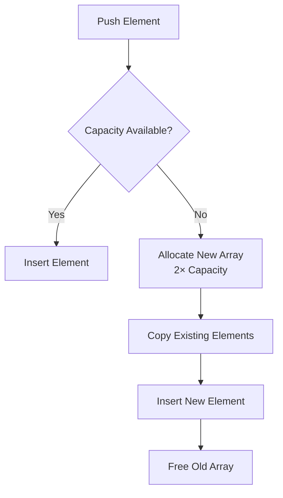

# 4. Dynamic Arrays

## 4.1 Definition and Motivation

**Dynamic Array**  
A dynamic array is a contiguous block of memory that can grow or shrink in size at runtime. Unlike static arrays, its capacity is not fixed at creation.

**Why Dynamic Arrays Exist**

- Static arrays require a fixed size at initialization.
    
- Real programs often do not know in advance how many elements will be stored.
    
- Dynamic arrays solve the _fixed-size limitation_ by resizing as needed.

**Common Implementations**

|Language|Dynamic Array Type|
|---|---|
|Python|`list`|
|JavaScript|`Array`|
|Java|`ArrayList`|
|C++|`vector`|

---

## 4.2 Capacity Vs Length

**Capacity**

- Total allocated space in memory.
    
- May be larger than the number of elements stored.

**Length**

- Number of actual elements currently in the array.

**Key Insight**

- A dynamic array can have unused space.
    
- Example: capacity = 3, length = 0 (empty array).

---

## 4.3 Core Operations

### Push (Append)

**Definition**  
Adding an element to the end of the array.

**Behavior**

- Insert at the next available index.
    
- Update a pointer/index tracking the last element.

**Time Complexity**

- O(1) amortized

### Pop

**Definition**  
Removing the last element of the array.

**Behavior**

- Remove element at the end.
    
- Move the end pointer left by one.

**Time Complexity**

- O(1)

---

## 4.4 Internal Pointer Mechanism

Dynamic arrays maintain an internal pointer:

- Points to the index of the last element.
    
- Helps determine:
    
    - Where to insert next
        
    - Current length of the array

**Example**

- Last element at index 1 → length = 2 (indices start at 0)

---

## 4.5 Resizing the Array

### When Resizing Happens

- Occurs when a push is attempted and capacity is full.

### Resizing Strategy

1. Allocate a new array with **double** the current capacity.
    
2. Copy all existing elements into the new array.
    
3. Insert the new element.
    
4. Deallocate (free) the old array.

**Why Doubling Instead of +1?**

- Avoids resizing on every insertion.
    
- Balances memory usage and performance.

---

## 4.6 Resizing Flow (Conceptual)

---

## 4.7 Cost of Resizing

Resizing involves:

- Allocating new memory → O(n)
    
- Copying n elements → O(n)

So a resize operation costs **O(n)** time.

However:

- Resizing is **infrequent**
    
- Most pushes do not trigger resizing

---

## 4.8 Amortized Time Complexity

**Amortized Time Complexity**

- The average cost per operation over a sequence of operations.

**Key Result**

- Push operation is **O(1) amortized**

**Reason**

- Expensive resize operations are spread across many cheap insertions.

---

## 4.9 Amortized Analysis Example (Simplified)

Goal: Insert 8 elements  
Resizing pattern (doubling capacity):

|Resize Stage|Operations|
|---|---|
|Capacity 1 → 2|1|
|Capacity 2 → 4|2|
|Capacity 4 → 8|4|
|Insertions|8|
|**Total**|15 operations|

Total work ≤ 2n → **O(n)** overall  
Average per insertion → **O(1)**

---

## 4.10 Why Constants Don’t Matter in Big-O

**Big-O Focus**

- Growth rate, not exact runtime.
    
- Constants (e.g., 2n vs n) are ignored.

**Key Comparisons**

- O(n) vs O(n²): powers matter
    
- O(n + c) or O(cn): constants do not matter

**Reason**

- For large inputs, faster-growing functions dominate.
    
- Linear growth will always outperform quadratic growth at scale.

---

## 4.11 Time Complexity Summary

|Operation|Time Complexity|
|---|---|
|Access element (by index)|O(1)|
|Push (append)|O(1) amortized|
|Pop (remove last)|O(1)|
|Insert in middle|O(n)|
|Remove from middle|O(n)|

**Note**

- No amortization benefit for middle insertions/removals due to required shifting.

---

## 4.12 Advantages and Disadvantages

**Advantages**

- Flexible size
    
- Efficient append and access
    
- Same asymptotic performance as static arrays

**Disadvantages**

- Occasional costly resize operations
    
- Inefficient middle insertions/removals
    
- Extra unused memory due to over-allocation

---

# Key Takeaways

- Dynamic arrays grow by reallocating memory, usually doubling capacity.
    
- Push and pop at the end are O(1) amortized.
    
- Resizing is expensive but infrequent.
    
- Constants are ignored in Big-O; growth rate matters.
    
- Dynamic arrays retain fast access but remain inefficient for middle modifications.