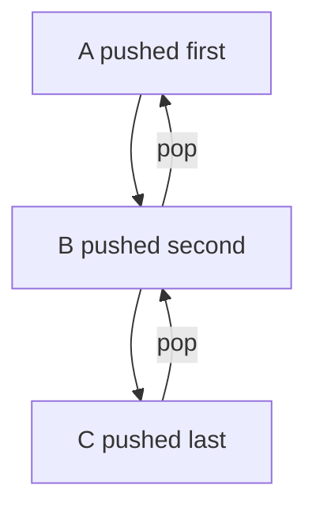

# Stack Data Structure (LIFO Principle)

## 1. Definition

**Stack**  
A stack is a linear data structure that follows the **Last In, First Out (LIFO)** principle.  
The most recently added element is the first one to be removed.

**Relevance**

- Models real-world scenarios like plates stacked on top of each other.
    
- Commonly used in function calls, undo/redo operations, and expression evaluation.

| Operation | Desc                                     | Big-O Time |
| --------- | ---------------------------------------- | ---------- |
| Push      | Push element to end of stack             | `O(1)`     |
| Pop       | Remove element from the end of the stack | `O(1)`     |
| Peek/Top  | Look at the last element from the stack  | `O(1)`     |

A Stack is nothing but a Dinamic array

---

## 2. Core Concept: LIFO (Last In, First Out)

**LIFO Rule**

- The **last element added** to the stack is the **first element removed**.

**Transcript Insight**

> “We added elements like A, B, C. But the order that we added them in was the reverse of the order that we removed them.”

This directly describes the LIFO behavior.

---

## 3. Stack Operations

|Operation|Description|
|---|---|
|Push|Add an element to the top of the stack|
|Pop|Remove the top element from the stack|
|Peek / Top|View the top element without removing it|
|IsEmpty|Check if the stack is empty|

---

## 4. Step-by-Step Example

**Push Order**

1. Push **A**
    
2. Push **B**
    
3. Push **C**

Stack (top at the right):

```Python
[A, B, C]
```

**Pop Order**

1. Pop → **C**
    
2. Pop → **B**
    
3. Pop → **A**

**Observation**

- The removal order (**C, B, A**) is the **reverse** of the insertion order (**A, B, C**).

---

## 5. Visual Representation



---

## 6. Key Characteristics

- Access is restricted to the **top element only**
    
- No direct access to middle or bottom elements
    
- Efficient for nested or reversible processes

---

## 7. Common Use Cases

- Function call stack
    
- Undo / redo functionality
    
- Backtracking algorithms
    
- Syntax parsing and expression evaluation

---

# Summary of Key Points

- A stack follows the **Last In, First Out (LIFO)** principle.
    
- Elements are removed in the **reverse order** of insertion.
    
- Core operations are push and pop, both performed at the top.
    
- Stacks are fundamental for managing temporary and reversible data.