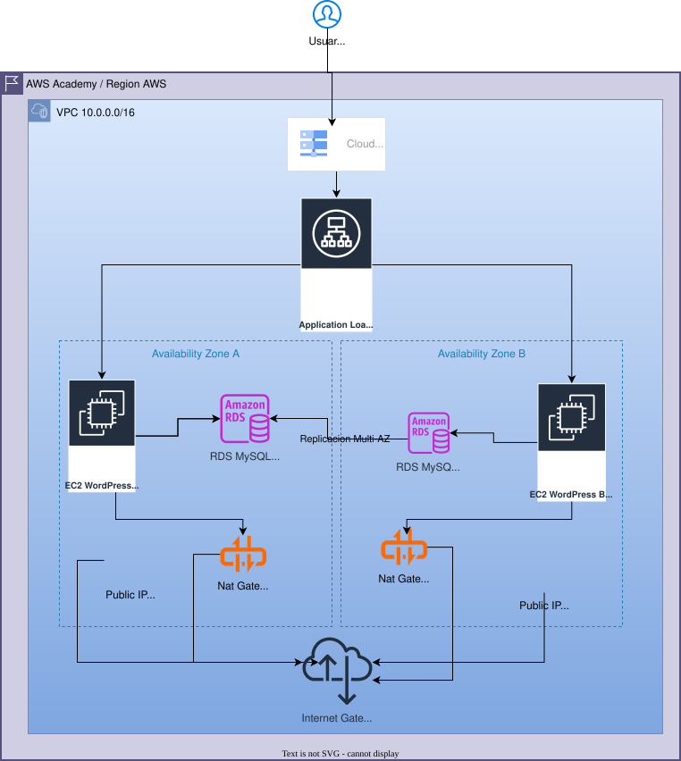
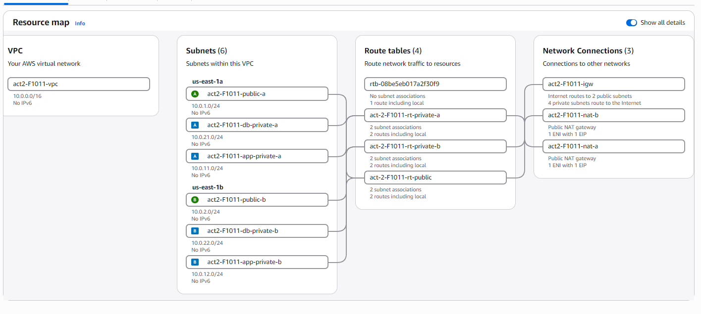
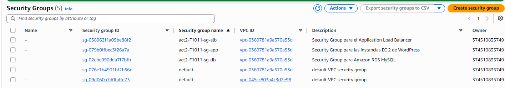
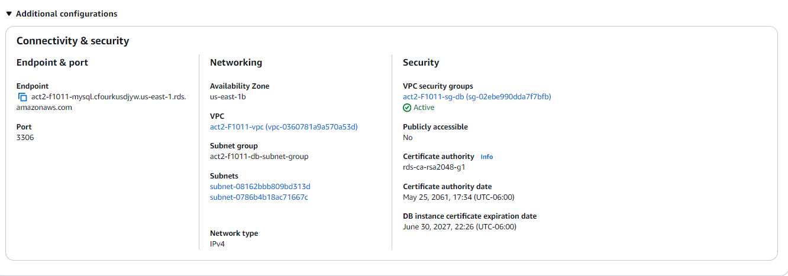
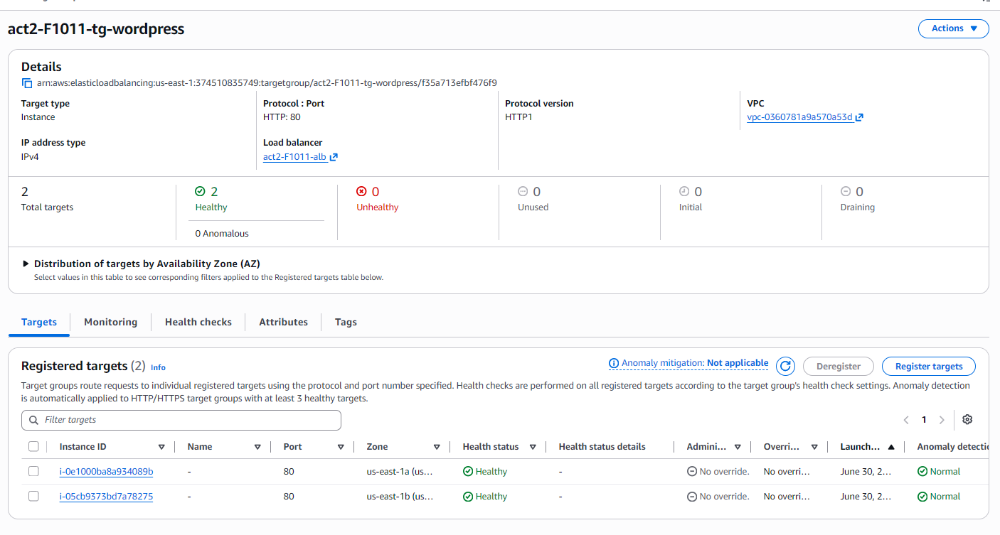
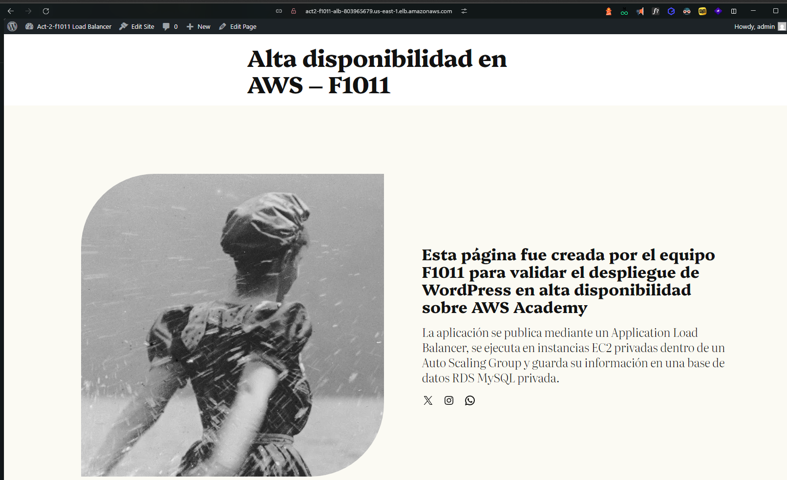
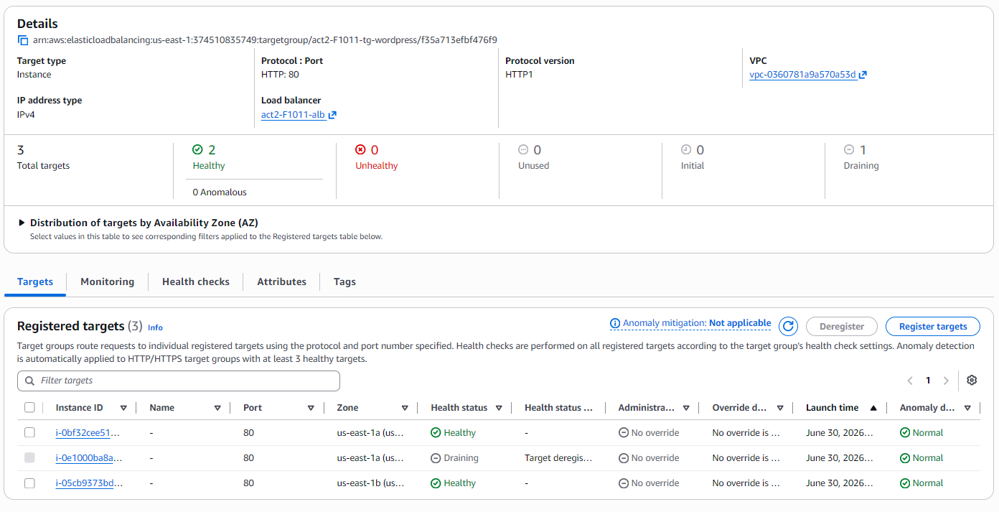

# How I deployed WordPress on AWS Academy with private EC2, an ALB, Auto Scaling, and RDS

**Project:** WordPress high-availability lab on AWS Academy  
**Type:** Cloud / DevOps / university group project  
**Stack:** AWS VPC, EC2, Application Load Balancer, Auto Scaling Group, RDS MySQL, NAT Gateway, WordPress, Amazon Linux 2023  
**Scope:** Architecture design, deployment guide, validation, and evidence collection

The hard part of this lab was not installing WordPress. The hard part was proving that the public entry point, private compute layer, private database, and recovery behavior all matched the architecture.

So I rewrote the deployment guide around evidence instead of clicks: users reach the site through an Application Load Balancer, WordPress runs on EC2 instances without public IPs, the database stays private, and the Auto Scaling Group replaces a failed node.

*The target architecture: public ALB, private app subnets, private DB subnets, NAT gateways for outbound traffic, and two availability zones.*

## The problem was proving the architecture, not making WordPress load

AWS labs can make a weak design look finished. A single EC2 instance with a public IP would have made WordPress appear in the browser faster, but it would miss the point of the activity.

The assignment required a VPC with six subnets, public and private routing, a private frontend exposed through a load balancer, auto scaling, and a database in private subnets. That meant every resource needed to answer a specific question.

- Can the user reach the app without reaching the EC2 instances directly?
- Can private EC2 instances download packages without public IPs?
- Can WordPress write to a database that is not reachable from the internet?
- Can the app tier recover when one instance is stopped?
- Can the team explain what changed if AWS Academy blocks one of the ideal options?

That last question mattered more than expected.

## The network split was the foundation

I used a dedicated VPC with CIDR `10.0.0.0/16` and split it into six subnets across two availability zones.

| Layer | Subnet | CIDR | Purpose |
|---|---|---:|---|
| Public | `public-a` | `10.0.1.0/24` | ALB and NAT Gateway A |
| Public | `public-b` | `10.0.2.0/24` | ALB and NAT Gateway B |
| Private app | `app-private-a` | `10.0.11.0/24` | WordPress EC2 in AZ A |
| Private app | `app-private-b` | `10.0.12.0/24` | WordPress EC2 in AZ B |
| Private DB | `db-private-a` | `10.0.21.0/24` | RDS subnet group |
| Private DB | `db-private-b` | `10.0.22.0/24` | RDS subnet group |

The public subnets route internet traffic through an Internet Gateway. The private subnets route outbound traffic through NAT Gateways, one per availability zone.

That gives the private EC2 instances enough outbound access to install Apache, PHP, and WordPress during boot, without giving them public IP addresses.

*The VPC resource map after the public and private route tables were associated.*

This is the part of the lab that is easy to rush and hard to debug later. If the NAT route is wrong, the instances fail during `user data`. If the public route is wrong, the ALB never becomes a useful public entry point. If the database subnets are mixed with the app subnets, the architecture becomes harder to explain and easier to misconfigure.

## The security model used Security Group references, not public access

I created three Security Groups and kept the traffic path narrow.

| Security Group | Resource | Inbound rule |
|---|---|---|
| `sg-alb` | Application Load Balancer | HTTP `80` from `0.0.0.0/0` |
| `sg-app` | WordPress EC2 instances | HTTP `80` from `sg-alb` only |
| `sg-db` | RDS MySQL | MySQL `3306` from `sg-app` only |

No SSH rule was opened to the internet. The EC2 instances were designed to configure themselves from the Launch Template.

*The three custom Security Groups used to separate public entry, app traffic, and database access.*

This is one of the cleanest parts of the design. The database does not trust the VPC, a subnet, or a broad CIDR range. It trusts the application Security Group. That is easier to reason about when instances are replaced by Auto Scaling, because the new instances inherit the same access path.

## RDS stayed private, but the lab shaped the database decision

The ideal version of this architecture uses RDS MySQL with Multi-AZ enabled. In the AWS Academy environment, that option was limited by the lab account, so I documented the limitation and used a private RDS MySQL instance inside a DB subnet group that spans two private database subnets.

This lab demonstrates application-tier high availability: two WordPress instances in private subnets, registered behind an ALB, maintained by an Auto Scaling Group. The database was private and managed, but the final lab setup was not full database high availability.

For a production version, I would use RDS Multi-AZ or Aurora, store secrets in AWS Secrets Manager or SSM Parameter Store, and avoid publishing credentials in `user data`.

*RDS was placed in the VPC, associated with the database subnet group, and marked as not publicly accessible.*

The important proof for the lab was that WordPress could write to RDS while RDS remained unreachable from the public internet.

## The WordPress instances were disposable by design

The Launch Template used Amazon Linux 2023, a small EC2 instance type available in the lab, the app Security Group, and no key pair.

The `user data` handled the setup:

- update packages
- install Apache, PHP, and WordPress dependencies
- download WordPress
- create `wp-config.php`
- point WordPress to the RDS endpoint
- create `/health.html` for the load balancer health check
- restart Apache

The Auto Scaling Group used the Launch Template and placed instances only in the private app subnets. Desired capacity was `2`, minimum was `2`, and maximum was `4`.

That made the instances disposable. If one disappeared, the ASG could create another one from the same template.

## Health checks were separated from WordPress

The Target Group used HTTP port `80` and health check path `/health.html`.

That path was intentional. Checking `/` can be noisy during a WordPress install because the app may redirect, wait for setup, or behave differently before the initial configuration is complete. A tiny static health file gives the load balancer a cleaner signal.

*The Target Group after the ASG registered two private EC2 instances and both passed health checks.*

Once both targets were healthy, the ALB DNS became the public entry point for the site.

## The validation had to prove writes, not just reads

Loading the WordPress installer proved that the ALB could reach the EC2 instances. That was useful, but incomplete.

The better test was creating content in WordPress and opening the published page through the ALB DNS. If the page saved and loaded again, then WordPress was talking to RDS and reading the stored content back through the public endpoint.

*The published WordPress page loaded from the ALB DNS, not from an EC2 public IP.*

This caught the actual purpose of the deployment: the app was not just responding. It was persisting data through a private database.

## The failure test showed Auto Scaling doing real work

To test recovery, I stopped one EC2 instance created by the ASG.

The expected behavior was:

1. One target starts draining or becomes unhealthy.
2. The ASG notices the difference between desired and actual capacity.
3. AWS launches a replacement instance from the Launch Template.
4. The Target Group returns to two healthy targets.
5. The site continues to respond through the ALB DNS.

*During the recovery test, one target was draining while two healthy targets continued serving traffic.*

That is the moment where the design stopped being theoretical. The ASG was not just present in the diagram. It was replacing capacity while the load balancer kept routing to healthy instances.

## The trade-offs I would change outside AWS Academy

This lab was good for learning and evidence, but I would not ship it as-is for production.

The first issue is storage. WordPress stores uploaded files under `wp-content/uploads`, which lives on each instance's local disk. With two EC2 instances behind a load balancer, an uploaded image may exist on one instance and not the other. For production, I would move uploads to S3 or use EFS for shared file storage.

The second issue is the database. A private single-AZ RDS instance is better than installing MySQL on the same public server as WordPress, but it is still a single database dependency. Production would need Multi-AZ RDS or Aurora.

The third issue is HTTP. The lab used port `80` because it was enough for the assignment. A real site should terminate TLS at the ALB with an ACM certificate and redirect HTTP to HTTPS.

The fourth issue is secrets. A temporary lab password in `user data` is acceptable for a short-lived exercise, but it should not be used in a real environment. Secrets belong in a managed store with IAM-controlled access.

Those limitations do not make the lab useless. They make the boundary clear: this was a controlled AWS Academy deployment meant to prove the architecture and recovery path.

## What I learned

High availability is mostly dependency mapping. Two EC2 instances do not help much if they both depend on a public database, a missing NAT route, or a health check that lies.

Security Group references are cleaner than IP-based rules in this setup. The app layer can change instances without changing database access, because the identity is the Security Group, not a specific machine.

Health checks deserve their own path. A static `/health.html` file is boring, which is exactly why it works well for this kind of lab.

The biggest lesson was about evidence. A cloud diagram is easy to draw. A useful deployment guide needs proof: subnets, routes, Security Groups, target health, a working app, a successful write to the database, and a recovery test.

## Final result

The final deployment exposed WordPress through an Application Load Balancer, kept EC2 instances private, used an Auto Scaling Group with desired capacity `2`, connected WordPress to private RDS MySQL, and proved recovery by stopping one instance.

It was not a perfect production architecture, and it should not pretend to be. It was a defensible AWS Academy build that showed how the pieces fit together and where the lab environment forced compromises.

---

## Meta title

Deploying WordPress on AWS Academy with ALB, private EC2, Auto Scaling, and RDS

## Meta description

A portfolio case study on deploying WordPress in AWS Academy using a custom VPC, public and private subnets, NAT Gateways, an Application Load Balancer, private EC2 instances, Auto Scaling, and private RDS MySQL.
