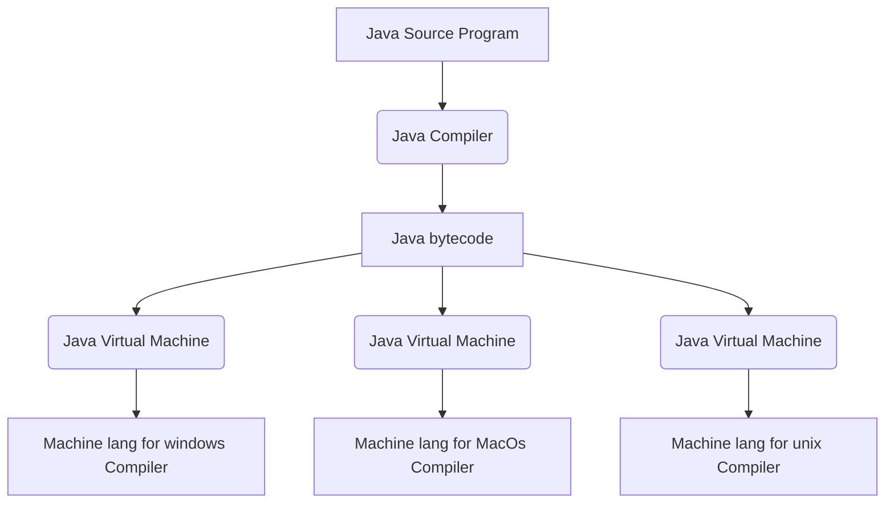

# The Programming Language Java

In this lesson, we will introduce you to Java, and its advantages.

## Advantages

Created by James Gosling of Sun Microsystems, Java was presented to the public in 1995. In 2010, Oracle Corporation acquired Sun Microsystems. Compared to other programming languages, Java isn’t as old. Although it was originally created for the computers in home appliances, Java has become an important general-purpose language with a widespread appeal. Java programs have an advantage because they:

- Are object-oriented
- Are **platform-independent**, meaning they can run on all kinds of computers
- Can run locally and remotely

Let’s talk briefly about each one of these points.

### Object-oriented Programming

Within an **object-oriented program (OOP)**, we define basic elements called **objects** by writing Java code. An object stores certain values, or **attributes**, that give it a particular **state**. An object also has **behaviors**, some of which could change its state.

#### Java Objects Represent Actual Things

For example, Java objects often represent actual things, such as people, books, or cell phones. We can see that each of these real-life objects has characteristics or attributes, and some have behaviors. While not all things have behaviors, the Java objects that represent them almost certainly will. For instance, an object representing a rock should be able to give us its weight. The weight is an attribute of the object, and the act of providing the weight is a behavior.

#### Java Objects Represent Abstractions

Java objects also can represent abstractions, such as names, songs, numbers, or bank accounts. While these items have attributes in real life, their behaviors likely exist only in the realm of a Java program. For example, a song object should be able to give you its title and composer.

#### Classes

An object has **data fields** to represent its attributes as well as **methods** to perform its behaviors. These data fields and methods are defined within a **class** that describes like objects. A class is like a blueprint or a plan for creating objects. We can write our own classes and thereby create objects of our own design, and can use classes that others have written. Java comes with a collection of useful classes, called the **Java Class Library**. This chapter and the Debugging Interlude chapter will show us how to use some of the classes in this library. The chapter, Class Definitions, will begin to show us how to write our own classes.

Frequently, a new class is based upon an existing class. By using a feature of object-oriented programming called **inheritance**, we can have a class inherit the fields and methods of another class, adding to or revising them as necessary. Inheritance provides a way to create new classes without repeating earlier work.

### Platform Independence

A **platform** is basically a kind of computer, that is, a computer’s architecture and often its operating system. For example, two popular platforms might be described as a Windows machine and a Macintosh running MacOS X. For many programming languages, a compiler must be written for each platform. The compiler for a given platform translates a program written in a particular language into the appropriate machine language for that platform. The disadvantage to this approach is the need for several compilers for the same language.

Java, on the other hand, is **platform-independent**. A Java compiler does not produce machine language instructions for a particular platform directly from a Java program. Instead, it generates an intermediate form of the program called the Java **bytecode**. This bytecode will run on any computer that has the **Java Virtual Machine**, or **JVM**, installed. The JVM is actually another program that converts Java bytecode into the machine language of its host platform. Any platform that has its own version of a Java Virtual Machine will be able to run a Java program.

The steps a Java program takes to achieve platform independence

Although this strategy replaces the need for multiple compilers with a need for multiple JVMs, writing the code for a Java Virtual Machine is far easier than writing a compiler. This is because translating bytecode into a particular machine language is easier than translating Java statements directly into machine language. Depending on the way it is written, a particular JVM can act either as interpreter, alternating between the translation of bytecode and execution of machine language, or like a compiler that translates all of the bytecode into machine language before it is executed.

### Local and Remote Execution

One type of Java program is an application designed to reside and execute on our computer. The software that supports the execution of an application, including the JVM and the Java Class Library, is called the **Java runtime system**. Applications whose output is entirely textual are called **console applications**. We will show you how to write this kind of application. Applications, however, can have graphical output.

Another form of Java program—called an **applet**—runs inside another program. Typically the other program is a web browser. An applet’s bytecode can be placed on the Internet, where it can be run at a distant location within a browser to produce its output. Note that the browser uses a JVM to execute an applet. Although our focus is on console applications, once we learn to write them, writing an applet will not be difficult.

---

## Questions

 - Which of the following terms does NOT describe a Java application program?
	 - Executes only under certain operating systems
		 - Java is platform independent, and so can run under various operating systems, such as Windows, MacOS, or Unix.
 - Which of the following software components enables a Java program to be platform-independent?
	 - The Java Virtual Machine (JVM)
		 - Correct! The JVM is a program that runs the Java bytecode that a compiler generates.