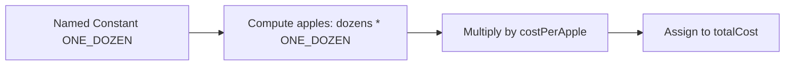

# Constants — Study Notes

---

## What Constants Are

**Summary:** Constants are values in a program that never change during execution. They may appear as literals or as named constants.  
**Takeaways:**

- Constants remain fixed while the program runs.
    
- Can be named or unnamed.
    
- Useful for clarity and reducing errors.

---

## Unnamed Constants (literals)

**Summary:** Literals are fixed values written directly in code. They follow specific syntax rules depending on their data type.  
**Takeaways:**

- Integer literals: digits only, optional sign.
    
- Floating-point literals: may include decimal or exponent (`e`).
    
- Character, string, and Boolean literals each have specific formats.

### Literal Formats Table

|Type|Example format|
|---|---|
|Integer literal|`10`, `-52`|
|Floating literal|`3.14`, `-50.0`, `12.34e-6`|
|Character literal|`'a'`, `'*'`|
|String literal|`"Hello"`|
|Boolean literal|`true`, `false`|

---

## Floating-point Literals with Exponent

**Summary:** Java allows scientific notation using `e` to represent exponent form. The number before the `e` is multiplied by 10 raised to the exponent.  
**Takeaways:**

- `e` indicates scientific notation.
    
- Sign after `e` optional for positive exponents.
    
- Decimal before the `e` may be omitted if exponent adjusts value.

---

## Character, String, and Boolean Literals

**Summary:** Java provides literal forms for characters, strings, and Boolean values. Each has a fixed meaning and syntax.  
**Takeaways:**

- Char uses single quotes.
    
- String uses double quotes.
    
- Boolean literals are only `true` or `false`.

---

## Named Constants

**Summary:** Named constants provide descriptive names for fixed values using the keyword `final`. They prevent accidental modification.  
**Takeaways:**

- Declared using `final` + type + name + value.
    
- Names use ALL_CAPS with underscores.
    
- Improve readability and reduce repeated typing of literals.

### Example

```java
final int INCHES_PER_FOOT = 12;
final double MILES_PER_KILOMETER = 0.62137;
final char STAR = '*';
```

---

## Naming Convention for Constants

**Summary:** Constants follow a specific naming style: full capitalization and underscores.  
**Takeaways:**

- ALL_CAPS names.
    
- Underscores separate words.
    
- Communicates fixed, meaningful values.

---

## Example Program Using a Named Constant

**Summary:** A program calculates the cost of apples measured in dozens, using a named constant instead of the literal 12.  
**Takeaways:**

- Use constants instead of repeating literals.
    
- Helps describe meaning (e.g., ONE_DOZEN).
    
- Reduces risk of errors in multiple locations.

### Original Code (Example.java)

```java
/** Example.java by F. M. Carrano
    Computes the cost of several dozen apples.
    Demonstrates the use of a named constant.
*/
public class Example
{
   public static void main(String[] args)
   {
      final int ONE_DOZEN = 12;
      int dozensOfApples = 3;
      double costPerApple = 0.29;
      double totalCost = dozensOfApples * ONE_DOZEN * costPerApple;
      System.out.println(dozensOfApples + " dozen apples at $" +
                         costPerApple + " apiece cost $" + totalCost);
   } // End main
} // End Example
```

### Annotated Version

```java
public class Example {
    public static void main(String[] args) {

        // Named constant: number of items in one dozen
        final int ONE_DOZEN = 12;

        // Variable declarations with initial values
        int dozensOfApples = 3;
        double costPerApple = 0.29;

        // Calculate total cost using the named constant
        double totalCost = dozensOfApples * ONE_DOZEN * costPerApple;

        // Output the result with string concatenation
        System.out.println(dozensOfApples + " dozen apples at $" +
                           costPerApple + " apiece cost $" + totalCost);
    }
}
```

### Step-by-step Explanation

1. `ONE_DOZEN` is declared as a named constant.
    
2. Variables for apple quantity and price are initialized.
    
3. The number of apples is computed using `dozensOfApples * ONE_DOZEN`.
    
4. This value is multiplied by cost per apple to get `totalCost`.
    
5. The final cost is printed using concatenated strings.

### Optional Mermaid Diagram — Constant Usage Flow



_Diagram: How the named constant participates in the calculation._

---

## Why Named Constants Matter

**Summary:** Named constants improve clarity, reduce errors, and centralize corrections if a value is wrong.  
**Takeaways:**

- More descriptive than numeric literals.
    
- Avoid repeated typing of same number.
    
- Easier to fix mistakes by changing one place.

---

# Key Points

- Constants are values that do not change during execution.
    
- Literals are unnamed constants; named constants use `final`.
    
- Constant names use ALL_CAPS with underscores.
    
- Named constants improve readability and reduce errors.
    
- Use constants for meaningful fixed quantities (e.g., ONE_DOZEN).