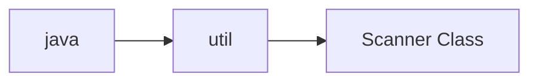

# Study Notes: Simple Input from the Keyboard

---

## **Simple Input Overview**

**Summary:** Java can read user input—such as integers and real numbers—using the `Scanner` class. Input typed at the keyboard is processed and stored in variables.  
**Takeaways:**

- Input comes from `System.in`.
    
- `Scanner` converts keyboard text into typed values.
    
- Useful for interactive programs.

---

## **The Scanner Class**

**Summary:** The `Scanner` class allows programs to read keyboard data and store it in memory. It is part of the Java Class Library.  
**Takeaways:**

- Reads input from keyboard or other sources.
    
- Converts text tokens to typed values.
    
- Must be imported from `java.util`.

---

## **Packages And Importing Scanner**

**Summary:** Java organizes classes into packages. `Scanner` is in `java.util`, so we use an `import` statement to access it without writing the full package name each time.  
**Takeaways:**

- Use `import java.util.Scanner;`.
    
- Allows use of `Scanner` directly instead of `java.util.Scanner`.
    
- Import statements appear before the class definition.

---

### Mermaid Diagram — Package to Class Path



_Scanner within the `java.util` package._

---

## **Syntax: Import Statement**

**Summary:** Import statements simplify code by allowing short class names instead of full package paths.  
**Takeaways:**

- Format: `import package-name.class-name;`
    
- Eliminates the need for fully qualified names.
    
- Used by almost all Java programmers for readability.

---

## **Scanner Objects**

**Summary:** Before using Scanner methods, you must create a Scanner object linked to the keyboard.  
**Takeaways:**

- Creation: `Scanner keyboard = new Scanner(System.in);`
    
- `System.in` represents keyboard input.
    
- `keyboard` is the variable name for the Scanner object.

---

## **Scanner Methods**

**Summary:** Reading input involves calling Scanner methods such as `nextInt()` and `nextDouble()`. Each method reads a token and converts it to the expected data type.  
**Takeaways:**

- Format: `variable = keyboard.method();`
    
- Methods return typed values.
    
- Tokens are groups of non-whitespace characters.

---

### Table: Common Scanner Methods

|Method|Returns|Notes|
|---|---|---|
|`nextInt()`|Integer (`int`)|Token must be an integer.|
|`nextDouble()`|Real number (`double`)|Token must be a valid floating-point number.|

---

## **Note: Reading Numbers**

**Summary:** `nextInt()` and `nextDouble()` read numeric tokens, skipping surrounding whitespace.  
**Takeaways:**

- Whitespace does not affect reading.
    
- The token must match the expected type.
    
- Input is returned and stored in a variable.

---

## **The Dot Operator**

**Summary:** Java uses the dot operator to separate identifiers, such as object-method and package-class.  
**Takeaways:**

- Appears in `import java.util.Scanner`.
    
- Appears in `keyboard.nextInt()`.
    
- Connects objects to their methods.

---

## **Example 1 — Read an Integer**

**Summary:** Programs read integers using `nextInt()`. A prompt is normally displayed first.  
**Takeaways:**

- Declare variable: `int age;`
    
- Prompt user with `println`.
    
- Read with `keyboard.nextInt()`.

### **Original Code**

```java
System.out.println("What is your age?");
int age = keyboard.nextInt();
```

### **Annotated Version**

```java
System.out.println("What is your age?"); // Prompt user for input
int age = keyboard.nextInt();            // Reads an int typed by the user
```

### **Step-by-Step Explanation**

1. Print a prompt to the console.
    
2. Wait for the user to type a number.
    
3. `nextInt()` reads the token and converts it to `int`.
    
4. Value is assigned to `age`.

---

## **Example 2 — Read a Real Number**

**Summary:** Use `nextDouble()` to read a floating-point value after a prompt. Using `print` keeps the prompt on the same line.  
**Takeaways:**

- Real number stored in a `double`.
    
- User presses Enter to submit.
    
- Useful when reading decimal values.

### **Original Code**

```java
System.out.print("Enter the area of your room in square feet: ");
double area = keyboard.nextDouble();
```

### **Annotated Version**

```java
System.out.print("Enter the area of your room in square feet: "); // Prompt stays on same line
double area = keyboard.nextDouble();                              // Reads a double from input
```

### **Step-by-Step Explanation**

1. Prompt is displayed.
    
2. User enters a decimal number.
    
3. `nextDouble()` reads and converts it.
    
4. Value is assigned to `area`.

---

## **Example 3 — Read Multiple Values**

**Summary:** Multiple values can be read sequentially using multiple Scanner calls, even if entered on one line or multiple lines.  
**Takeaways:**

- Each `nextInt()` reads the next token.
    
- User can type values separated by spaces or new lines.
    
- Order of reading matters.

### **Original Code**

```java
System.out.println("Please enter your height in feet and inches:");
int feet = keyboard.nextInt();
int inches = keyboard.nextInt();
```

### **Annotated Version**

```java
System.out.println("Please enter your height in feet and inches:");
// Reads first integer token
int feet = keyboard.nextInt();    
// Reads second integer token
int inches = keyboard.nextInt();  
```

### **Step-by-Step Explanation**

1. Program prompts user for two numbers.
    
2. First `nextInt()` reads feet.
    
3. Second `nextInt()` reads inches.
    
4. Input may be on one or two lines—Scaner still processes tokens in order.

---

## **Full Example Program**

### Original Code

```java
// Example.java by F. M. Carrano
import java.util.Scanner;
public class Example
{
   public static void main(String[] args)
   {
      Scanner keyboard = new Scanner(System.in);
      System.out.println("Please enter your height in feet and inches:");
      int feet = keyboard.nextInt();
      int inches = keyboard.nextInt();
      System.out.println("You entered " + feet + " feet and " + inches +
                         " inches.");
   } // End main
} // End Example
```

### Annotated Version

```java
import java.util.Scanner; // Import Scanner so we can read keyboard input

public class Example {
   public static void main(String[] args) {

      // Create Scanner object connected to keyboard input
      Scanner keyboard = new Scanner(System.in);

      System.out.println("Please enter your height in feet and inches:");

      int feet = keyboard.nextInt();   // First integer entered
      int inches = keyboard.nextInt(); // Second integer entered

      // Display the result
      System.out.println("You entered " + feet + " feet and " + inches +
                         " inches.");
   }
}
```

### Step-by-Step Explanation

1. Import Scanner so program can read input.
    
2. Create `keyboard` object linked to `System.in`.
    
3. Display prompt for two values.
    
4. Read first numeric token (`feet`).
    
5. Read second numeric token (`inches`).
    
6. Print results.

---

## **Note: The Variable `keyboard`**

**Summary:** Future examples assume `Scanner keyboard = new Scanner(System.in);` has already been declared.  
**Takeaways:**

- `keyboard` will always refer to a Scanner.
    
- Helps shorten future examples.
    
- Convention used throughout lessons.

---

## **Programming Tip: Consult Documentation**

**Summary:** Oracle maintains official documentation for classes like `String` and `Scanner`. Learning to navigate this documentation is essential.  
**Takeaways:**

- Read method descriptions like `nextInt()` and `nextDouble()`.
    
- Documentation supports independent learning.
    
- Later topics will require this skill.

---

## **Exercise**

**Task:** Write statements to prompt for and read the radius of a circle as a real number, then display it.

### Example Solution

```java
System.out.print("Enter the radius of the circle: ");
double radius = keyboard.nextDouble();
System.out.println("You entered radius = " + radius);
```

---

# **Key Points**

- `Scanner` reads keyboard input and converts tokens into typed values.
    
- Must import `java.util.Scanner` before use.
    
- Use `nextInt()` for integers and `nextDouble()` for real numbers.
    
- Prompts guide users on what to enter.
    
- Multiple tokens can be read from one or multiple lines.
    
- Dot operator connects objects with their methods.

---

## **MicroTest** (write Your Own Questions here)