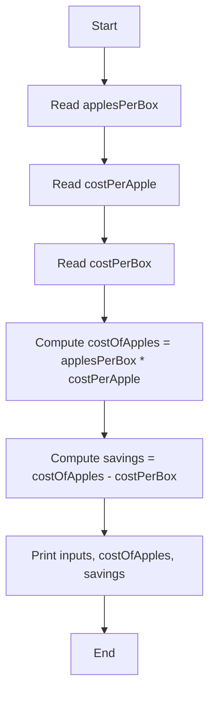

# Apples by the Box — Study Notes

---

## Problem statement

**Summary:** Compute how much the apples in a purchased box would have cost if bought individually, and how much (if anything) was saved by buying the box.  
**Takeaways:**

- Two outputs: individual cost for same quantity, and savings (individual cost − box cost).
    
- Inputs required: apples per box, price per apple, price per box.
    
- Program should ask the user for these inputs.
    

---

## Discussion — what we must know

**Summary:** To answer the first question (individual cost), we need three pieces of data: number of apples per box, price per apple, and price per box. The program should prompt the user for these values and compute results.  
**Takeaways:**

- Identify required inputs before coding.
    
- Program flow: read input → compute → display.
    
- Keep computations separate and clear.
    

---

## First question — solution outline

**Summary:** Steps to compute individual cost: get data from user, display inputs, multiply apples per box by price per apple, and show the product.  
**Takeaways:**

- Multiply quantity × unit price to get individual cost.
    
- Echo input back to user for verification.
    
- Keep output readable.
    

---

## Second question — compute savings

**Summary:** To compute savings, subtract the box price from the computed individual cost and display the difference.  
**Takeaways:**

- Savings = (applesPerBox × costPerApple) − costPerBox.
    
- Display both cost and savings for clarity.
    
- Negative savings means box is more expensive than individual cost.
    

---

## Algorithm and pseudocode

**Summary:** The sequence of steps (read input, compute, print) is an algorithm; writing it in plain English or pseudocode helps before coding.  
**Takeaways:**

- Algorithms clarify program logic prior to implementation.
    
- Pseudocode mixes plain language and code-like structure.
    
- Use it to catch errors early.
    

**Mermaid diagram — algorithm flow**



_Flowchart: high-level steps of the solution._

---

## The program — original code

**Summary:** Full Java program that reads inputs, computes individual cost and savings, then prints results.  
**Takeaways:**

- Uses `Scanner` for input.
    
- Declares and initializes variables close to their use.
    
- Prints formatted results (simple concatenation).
    

### Original code

```java
import java.util.Scanner;
/** ProblemSolved.java by F. M. Carrano
 
   Computes the money saved by buying a box of apples 
   at the box rate instead of the individual rate.
 
   Input:  Number of apples per box
           Cost of one apple
           Cost of box of apples
 
   Output: The input data
           The cost of apples if bought separately
           The savings if bought by the box
*/
public class ProblemSolved
{
   public static void main(String[] args)
   {
      Scanner keyboard = new Scanner(System.in);
      System.out.print("How many apples are in a box? ");
      int applesPerBox = keyboard.nextInt();

      System.out.print("How much does one apple cost? $");
      double costPerApple = keyboard.nextDouble();

      System.out.print("How much does a box of apples cost? $");
      double costPerBox = keyboard.nextDouble();

      double costOfApples = applesPerBox * costPerApple;
      double savings = costOfApples - costPerBox;

      System.out.println();
      System.out.println("Apples per box:                       " + 
                         applesPerBox);
      System.out.println("Cost per apple:                      $" + 
                         costPerApple);
      System.out.println("Cost per box:                        $" + 
                         costPerBox);
      System.out.println("Cost of apples if bought separately: $" + 
                         costOfApples);
      System.out.println("Savings if bought by the box:        $" + 
                         savings);
   } // End main
} // End ProblemSolved
```

---

## Program — annotated version

**Summary:** Same program with inline comments and small readability adjustments.  
**Takeaways:**

- Comments explain purpose of blocks and each calculation.
    
- Keep declarations close to use; name variables clearly.
    
- Consider formatting outputs (later chapters) for currency.
    

### Annotated code

```java
import java.util.Scanner;

public class ProblemSolved {
    public static void main(String[] args) {
        // Create Scanner for keyboard input
        Scanner keyboard = new Scanner(System.in);

        // Prompt and read number of apples in a box
        System.out.print("How many apples are in a box? ");
        int applesPerBox = keyboard.nextInt();

        // Prompt and read cost of one apple
        System.out.print("How much does one apple cost? $");
        double costPerApple = keyboard.nextDouble();

        // Prompt and read cost of entire box
        System.out.print("How much does a box of apples cost? $");
        double costPerBox = keyboard.nextDouble();

        // Compute the cost if apples bought individually
        double costOfApples = applesPerBox * costPerApple;

        // Compute savings (positive if box is cheaper)
        double savings = costOfApples - costPerBox;

        // Display input and results (simple concatenation)
        System.out.println();
        System.out.println("Apples per box:                       " + applesPerBox);
        System.out.println("Cost per apple:                      $" + costPerApple);
        System.out.println("Cost per box:                        $" + costPerBox);
        System.out.println("Cost of apples if bought separately: $" + costOfApples);
        System.out.println("Savings if bought by the box:        $" + savings);
    }
}
```

---

## Step-by-step explanation of the program

**Summary:** Execution flow from input to output, and how calculations are done.  
**Takeaways:**

- Understand data flow: input → compute → output.
    
- Watch numeric types (int × double → double).
    
- Floating-point rounding can affect displayed results.
    

1. Create `Scanner keyboard` to read from `System.in`.
    
2. Prompt and read `applesPerBox` (int), `costPerApple` (double), `costPerBox` (double).
    
3. Compute `costOfApples = applesPerBox * costPerApple` (double result).
    
4. Compute `savings = costOfApples - costPerBox`.
    
5. Print input values and computed `costOfApples` and `savings`.
    

---

## Try example input (given test)

**Summary:** Run program with `costPerApple = 0.32`, `applesPerBox = 24`, `costPerBox = 7.25`. Expected individual cost = 24 × 0.32 = 7.68; savings = 7.68 − 7.25 = 0.43.  
**Takeaways:**

- Arithmetic yields 7.68 and savings 0.43 conceptually.
    
- Due to binary floating-point, printed result may show rounding artifacts (e.g., 0.4299999999999997).
    
- Later lessons show formatting and decimal-accurate arithmetic.
    

### Numeric example table

|Input|Value|
|--:|--:|
|applesPerBox|24|
|costPerApple|0.32|
|costPerBox|7.25|
|costOfApples (exact)|7.68|
|savings (exact)|0.43|
|savings (float artifact)|0.4299999999999997|

---

## Programming tip — echo input

**Summary:** Echoing input back to the user lets them verify what they entered.  
**Takeaways:**

- Echo inputs immediately after reading.
    
- Helps detect mistyped values.
    
- Improves usability for interactive programs.
    

---

## Floating-point precision note

**Summary:** Binary floating-point representation can cause small rounding errors when representing decimal fractions; results printed directly may show artifacts. Formatting or using decimal types fixes this.  
**Takeaways:**

- Decimal fractions like 0.32 may not have exact binary representations.
    
- Arithmetic and back-conversion to decimal can produce visible small errors.
    
- Use output formatting or decimal classes (e.g., `BigDecimal`) to present user-friendly results.
    

---

# Key points

- Inputs: apples per box (int), cost per apple (double), cost per box (double).
    
- Compute `costOfApples = applesPerBox * costPerApple` and `savings = costOfApples - costPerBox`.
    
- Echo inputs and display computed results clearly.
    
- Floating-point arithmetic may show small precision artifacts; format or use decimal types when presenting currency.
    
- Writing the algorithm in plain language (pseudocode) helps ensure correctness before coding.