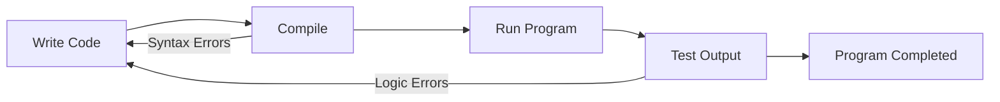

# Study Notes: Writing, Compiling, and Running a Java Program

## Writing, Compiling, and Running a Java Program

**Summary:** The lesson explains the typical workflow for creating, compiling, running, and debugging Java programs.  
**Takeaways:**

- Java development follows a repeatable cycle: write → compile → run → test.
    
- Errors occur frequently and must be fixed iteratively.
    
- Tools (like the RUN button in Educative) automate compilation and execution.

---

## Existing Programs

### _Heading: Running Provided Code_

**Summary:** Many example programs on the platform include a RUN button that compiles and executes the code automatically. Input is sometimes required and must be typed into the provided window.  
**Takeaways:**

- RUN button compiles and executes pre-written examples.
    
- Some programs require user input.
    
- Interactive execution helps learning.

---

## New Programs

### _Heading: Writing New Code_

**Summary:** When typing your own Java code, the editor stores it in memory and automatically adds line numbers. These numbers help discussion but are not part of the actual Java syntax.  
**Takeaways:**

- You may write full or partial Java programs directly in the editor.
    
- Line numbers are for reference only.
    
- Code exists temporarily in primary memory until compiled or saved.

---

## Fix Errors

### _Heading: Compilation and Syntax Errors_

**Summary:** After writing code, you compile it using the RUN button. The compiler reports syntax errors but does not fix them for you. You must correct the mistakes and try again, sometimes repeatedly.  
**Takeaways:**

- Syntax errors appear during compilation.
    
- The compiler gives hints, not fixes.
    
- Multiple compile–fix cycles are normal.

---

## Check Output

### _Heading: Testing Program Behavior_

**Summary:** When the program successfully runs, you must verify that its behavior matches expectations. Logical errors may appear even without syntax errors, requiring further testing and corrections.  
**Takeaways:**

- Successful compilation doesn’t guarantee correct logic.
    
- Testing is essential to ensure expected behavior.
    
- Debugging involves multiple rounds of corrections.

---

## Diagram: Java Development Cycle

**Caption:** The iterative cycle of writing, compiling, running, and debugging Java programs.

---

## Key Points

- Java development is an iterative process involving writing, compiling, running, and debugging.
    
- Syntax errors occur during compilation; logic errors occur during execution.
    
- Testing is essential to verify correct behavior.
    
- Tools like Educative's RUN button simplify the compile-and-run workflow.