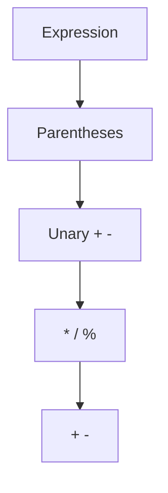

# **Study Notes: Arithmetic Operators in Java**

---

## **1. Introduction to Arithmetic Operators**

**Heading:** Overview of arithmetic operators  
**Summary:** Java supports five basic numeric operations: addition, subtraction, multiplication, division, and remainder. These operations use the operators `+`, `-`, `*`, `/`, and `%`, and they act on operands (variables or constants).  
**Takeaways:**

- Binary operators require two operands; unary `+` and `-` use one.
    
- Arithmetic expressions resemble algebraic expressions.
    
- Parentheses control evaluation order.

---

## **2. Addition and Subtraction Overview**

**Heading:** + and - operators  
**Summary:** The `+` and `-` operators work as expected in arithmetic and can operate as unary or binary operators. As binary operators, they evaluate left-to-right.  
**Takeaways:**

- `+` and `-` can be unary or binary.
    
- Binary operations follow left-to-right order.
    
- Parentheses can override default order.

---

## **3. Binary Addition Example**

**Heading:** Binary operator examples  
**Summary:** Using `+` and `-` with two operands gives standard arithmetic results.  
**Takeaways:**

- Example: `int sum = 2 + 3;` → `sum = 5`.
    
- Example: `int difference = 8 - 1;` → `7`.
    
- Left-to-right evaluation matters.

```java
int sum = 2 + 3;
int difference = 8 - 1;
int result = 6 - 9 + 2;
```

**Annotated version**

```java
int sum = 2 + 3;          // Adds 2 and 3 → 5
int difference = 8 - 1;   // Subtracts 1 from 8 → 7
int result = (6 - 9) + 2; // Left-to-right: -3 + 2 → -1
```

**Step-by-step:**

1. Java evaluates `6 - 9` first.
    
2. Then adds `2`.
    
3. Final value is `-1`.

---

## **4. Unary Operators**

**Heading:** Unary + and -  
**Summary:** Unary `+` has no effect on a value; unary `-` negates its operand. Unary operations behave like subtracting from zero.  
**Takeaways:**

- `-x` is equivalent to `0 - x`.
    
- Unary `+x` equals `x`.
    
- Used commonly to express positive or negative literals.

```java
int sum = 5;
int neg = -sum;     // -5
int pos = +sum;     // 5
```

**Annotated version**

```java
int sum = 5;            // Original value
int neg = -sum;         // Negates: 0 - 5 → -5
int pos = +sum;         // Unary plus: unchanged → 5
```

**Steps:**

1. `-sum` computes `0 - sum`.
    
2. Unary `+` leaves operand unchanged.

---

## **5. Multiplication Operator**

**Heading:** Multiplication `*`  
**Summary:** `*` multiplies two operands. Consecutive multiplications occur left-to-right.  
**Takeaways:**

- `*` is always binary.
    
- Operand values are not modified.
    
- Order matters with real numbers.

```java
int result = 2 * 3 * 4;
```

**Annotated version**

```java
int result = (2 * 3) * 4; // 6 * 4 → 24
```

**Steps:**

1. Multiply 2 and 3.
    
2. Multiply result by 4.
    
3. Final product is 24.

---

## **6. Division Operator**

**Heading:** Division `/`  
**Summary:** Division output depends on operand type. Integer division truncates; floating-point division produces decimals.  
**Takeaways:**

- `int / int` → truncated integer.
    
- Floating-point operand → floating-point result.
    
- No rounding occurs in integer division.

### Division Behavior Table

|Expression|Result|Reason|
|---|---|---|
|`11.0 / 4.0`|2.75|real ÷ real|
|`11 / 4.0`|2.75|int promoted to real|
|`11 / 4`|2|integer division truncates|

---

## **7. Average Exam Grade Example**

**Heading:** Integer division pitfall  
**Summary:** Calculating an average using integer division loses the fractional part due to truncation.  
**Takeaways:**

- `359 / 4 = 89` because both operands are `int`.
    
- Assigning result to `double` does not change division type.
    
- Fix: make at least one operand floating-point.

```java
double average = (exam1 + exam2 + exam3 + exam4) / 4;
```

**Annotated version**

```java
double average = (exam1 + exam2 + exam3 + exam4) / 4; 
// Still integer division → truncates before assignment.
```

---

## **8. Correcting the Average Calculation**

**Heading:** Fix division with float  
**Summary:** Changing divisor to `4.0` forces floating-point division, producing the correct decimal result.  
**Takeaways:**

- `4.0` triggers floating-point math.
    
- Correct average becomes `89.75`.
    
- One floating operand is enough.

```java
double average = (exam1 + exam2 + exam3 + exam4) / 4.0;
```

**Annotated version**

```java
double average = (exam1 + exam2 + exam3 + exam4) / 4.0;  
// One float operand → floating-point division → correct result.
```

**Steps:**

1. Sum exams.
    
2. Divide by 4.0.
    
3. Java performs floating-point division.
    
4. Result is 89.75.

---

## **9. Remainder Operator**

**Heading:** Remainder `%`  
**Summary:** `%` returns the remainder after division, not the decimal portion. Works with integers and doubles.  
**Takeaways:**

- Example: `11 % 4 = 3`.
    
- Useful for checking even/odd (`n % 2 == 0`).
    
- Remainder sign matches the first operand.

### Remainder Sign Table

|Expression|Result|
|---|---|
|`11 % 4`|3|
|`-11 % 4`|-3|
|`11 % -4`|3|
|`-11 % -4`|-3|

---

## **10. Order of Operations**

**Heading:** Precedence rules  
**Summary:** Java evaluates operators by precedence: parentheses → unary → `* / %` → `+ -`. Operators of equal precedence evaluate left-to-right.  
**Takeaways:**

- Parentheses override all.
    
- Unary before binary.
    
- `* / %` before `+ -`.



_Diagram: order of operations in Java._

---

## **11. Order of Operations Example**

**Heading:** Example without parentheses  
**Summary:** In `2 + 4 * 3 - 6`, multiplication occurs first, then addition, then subtraction → result 8.  
**Takeaways:**

- `4 * 3` → 12
    
- `2 + 12` → 14
    
- `14 - 6` → 8

---

## **12. Example Using Algebraic Translation**

**Heading:** Algebra vs Java  
**Summary:** Algebra often relies on visual notation; Java requires parentheses to force correct order.  
**Takeaways:**

- `2 * a / (b - c)` ensures subtraction first.
    
- `2 * a` does not need parentheses.
    
- Parentheses clarify programmer intent.

---

## **13. Complex Precedence Example**

**Heading:** Mixed operators example  
**Summary:** In `9 % -2 * 4 + 6`, unary `-` applies first, then `%` and `*` left-to-right, then `+`. Final value is 10.  
**Takeaways:**

- Unary `-` binds tightest.
    
- `9 % -2` → 1
    
- `1 * 4 + 6` → 10

```java
int test = 9 % -2 * 4 + 6;
```

**Annotated version**

```java
int test = 9 % -2 * 4 + 6; 
// -2 interpreted as unary negative
// 9 % -2 → 1
// 1 * 4 → 4
// 4 + 6 → 10
```

---

# **Key Points Summary**

- Java has five main arithmetic operators: `+`, `-`, `*`, `/`, `%`.
    
- Unary `+` does nothing; unary `-` negates.
    
- Integer division truncates—use a floating operand to get decimals.
    
- `%` gives remainder, not decimal part; sign comes from first operand.
    
- Precedence: parentheses → unary → `* / %` → `+ -` (left-to-right).

---

If you want, I can also:  
✅ Convert these notes into flashcards  
✅ Generate practice questions  
✅ Create a cheat sheet  
Just tell me!