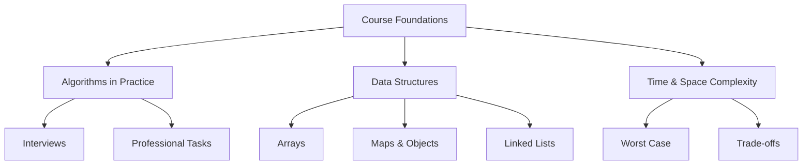

# Study Notes

## Introduction to the Course

---

## 1. Instructor Background and Motivation

### Early Experience in Computer Science

- The instructor initially disliked programming (Java) due to its mechanical nature.
    
- Switched temporarily to Mechanical Engineering but found integrals even less appealing.
    
- Returned to Computer Science and discovered linked lists, which sparked a strong interest in algorithms.

### Importance of the Topic

- Algorithms are described as a “cool topic” that left a lasting impact.
    
- Students should approach the course with excitement and openness.

---

## 2. Why This Course Matters

### “The Last Algorithms Course You’ll Need”

- Intended to be comprehensive enough to cover the essential algorithmic foundations used in interviews and professional work.
    
- However, continuous learning is still required because knowledge **atrophies quickly** without practice.

### Benefits of Formal Study

- Academic programs revisit core concepts across several years, helping retention.
    
- Repetition is crucial for long-term mastery.

---

## 3. Real-World Usefulness of Algorithms

### Professionally Encountered Algorithms

The instructor selected algorithms that have been personally necessary in:

- Technical interviews
    
- Professional software development
    
- Situations requiring choice between two algorithmic strategies

### Practical vs. Impractical Algorithms

Some algorithms are impressive but rarely used in typical jobs, such as:

- **Merkle trees**
    
- Certain hashing-based crypto structures

These may be fascinating academically but impractical for most professionals.  
However, many foundational algorithms appear frequently in day-to-day work.

---

## 4. Why Care About Algorithms?

### Interview Relevance

- Despite criticism, algorithm interviews remain a **“secret handshake”** for accessing high-paying jobs.
    
- Even if not constantly used on the job, they serve as a filter in hiring processes.
    
- The instructor argues it is more practical to learn them than resist the system.

---

## 5. Fundamental Concepts Introduced

### 5.1 Arrays and Data Structures

A TypeScript example is used to pose the question: **Is this really an array?**  
This introduces the need to deeply understand what data structures truly represent rather than relying on surface-level syntax.

#### Definition: Array

A contiguous block of memory storing elements at known indices.  
Key properties:

- Constant-time access (O(1)).
    
- Fixed size in many low-level languages.  
    JavaScript/TypeScript do **not** provide traditional arrays; they offer dynamic, object-backed structures.

### 5.2 Time and Space Complexity

- The course will present complexity analysis without formal mathematical proofs.
    
- In industry, developers typically only provide:
    
    - The **worst-case time complexity**
        
    - A general sense of algorithmic cost
        
- Best and average cases are rarely evaluated outside interviews.

### 5.3 Why TypeScript Is Used

Chosen for accessibility, but it has limitations:

- Pure TypeScript cannot create real maps because objects cannot be uniquely identified.
    
- Two objects with identical properties cannot be distinguished.
    
- JavaScript arrays differ from classical arrays due to dynamic and object-based implementation.

#### Table: TypeScript Limitations for Data Structures

|Feature|Limitation|Consequence|
|---|---|---|
|Object identity|Cannot uniquely identify plain objects|Cannot implement real hash maps|
|Arrays|Not contiguous memory|Behave differently from low-level arrays|
|Language design|High abstraction|Poor for algorithmic teaching compared to C++ or Rust|

---

## 6. Additional Language Context

### Languages Compared

The instructor references building the same application in:

- TypeScript
    
- Go
    
- Rust

Each language provides unique perspectives on data structures and algorithms.

---

## 7. Course Logistics and Expectations

### Condensed Timeline

The instructor compares a traditional university structure:

- 15 weeks
    
- 3 classes per week
    
- Study expectation: 3–4 hours per class hour
    
- Weekly lab

This totals approximately **225 hours** of learning.

This course attempts to compress that into:

- **16 hours**, including breaks
    
- Requires significant personal study outside sessions

---

## 8. Recommended Books

### Book 1: _Introduction to Algorithms_ (CLRS)

- Highly academic and formal.
    
- Contains mathematical proofs.
    
- Extremely comprehensive; considered the standard reference.
    
- Known informally as **“the tree book.”**

### Book 2: A More Beginner-Friendly Algorithms Book

- Lighter in tone and scope.
    
- Minimal or no formal proofs.
    
- Less coverage of trees; small introduction to graphs.
    
- This course aligns with approximately 75% of its content.

---

## 9. Concept Relationships (Visual Summary)

---

## 10. Summary of Key Points

- The course aims to provide a deep, practical understanding of algorithms.
    
- Knowledge decays quickly without practice; repetition is key.
    
- Not all algorithms are used in real jobs, but many fundamental ones appear constantly.
    
- Algorithms remain crucial in interviews, functioning as a gatekeeping mechanism.
    
- TypeScript is accessible but imperfect for teaching low-level data structures.
    
- Students must supplement this accelerated course with personal study.
    
- Recommended books provide both academic depth and beginner-friendly guidance.

---

## MicroTest