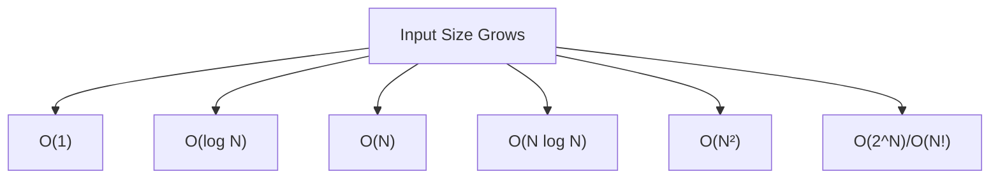

# Big O Time Complexity — Study Notes

## Introduction to Big O

Big O notation categorizes an algorithm based on **how its time or space requirements grow with respect to the input size**.  
It is **not an exact measurement** but a way to generalize performance as inputs become larger.

### Purpose of Big O

- Allows comparison between algorithms and data structures.
    
- Helps predict performance as input size grows.
    
- Guides decisions during system and software design.

---

## Core Concepts of Big O

### 1. Growth With Respect to Input

Big O describes **how quickly runtime or memory grows** based on **N**, the size of the input.

### 2. Drop Constants

Big O is written without constants (e.g., `2N` → `N`) because constants do not affect **growth trends** at large scale.

### 3. Worst-Case by Default

When asked for time complexity (e.g., interviews), assume **worst-case scenario**, unless explicitly asked for best or average case.

---

## Why Big O Matters

- Some data structures optimize certain operations but degrade performance if misused.
    
- Understanding growth rates helps avoid designs that become unmanageable at scale.
    
- Real-world tradeoffs (memory vs time) are not always free: creating memory also takes time.

---

## Identifying Time Complexity

### Loops

The simplest rule:

- **Count how many times you iterate over the input.**
    
- One loop → `O(N)`
    
- Nested loop over same input → `O(N²)`
    
- Triple nested → `O(N³)`

### Example: Single Loop

```typescript
for (let i = 0; i < n.length; i++) { ... }
```

- Loop depends on the string length.
    
- If the input grows 50%, runtime grows 50%.
    
- **Time complexity: O(N)**

### Example: Two Consecutive Loops

```typescript
sum(n);
sum(n);
```

- Two separate linear passes.
    
- Technically `2N`, but constants are dropped.
    
- **Time complexity: O(N)**

---

## Early Return and Worst Case

### Example: Searching for Capital 'E'

```typescript
for (let i = 0; i < n.length; i++) {
    if (n[i] === 'E') return i;
}
```

Worst-case:

- No capital E in the string → full traversal.
    
- Or the E is near the end.
    
- Therefore: **O(N)**.

Even if the E is in the middle, dropping constants still yields N.

---

## Common Time Complexities

|Complexity|Description|Example|
|---|---|---|
|**O(1)**|Constant time; input size doesn't matter|Access array index|
|**O(log N)**|Each step halves the input|Binary search|
|**O(N)**|Linear scan|Loop through array|
|**O(N log N)**|Divide and process|Quicksort (average case)|
|**O(N²)**|Nested loops|Simple comparison sort|
|**O(N³)**|Triple nested loop|Matrix multiplication|
|**O(2^N), O(N!)**|Explosive growth; impractical|Traveling salesman, brute force|

---

## Visual Overview of Growth Rates



Fastest on top, slowest at bottom.

![[Pasted image 20251118104558.png]]

---

## Examples of Common Patterns

### O(N²) — Nested Loops

```typescript
for (let i = 0; i < n.length; i++) {
    for (let j = 0; j < n.length; j++) {
        ...
    }
}
```

- For each element, full scan again.
    
- Equivalent to computing area (N × N).

### O(N³) — Three Nested Loops

Typical in matrix multiplication.

### O(N Log N)

Occurs when:

- You operate on **all elements**.
    
- At each step, you **halve** the remaining search space.

Examples:

- Quicksort
    
- Mergesort
    
- Balanced tree operations

### O(log N)

Occurs when:

- You only inspect **one part** of the input at each step.
    
- Halving behavior dominates.

Example:

- Binary search

### √N (O(sqrt(N)))

Rare, but does appear:

- Often linked to mathematical optimizations (e.g., certain prime algorithms).

---

## Practical vs. Theoretical Tradeoffs

- An algorithm with worse theoretical Big O may still be faster for **small N** due to smaller constant factors.
    
- Example: Insertion sort (O(N²)) can outperform quicksort (O(N log N)) for tiny datasets.
    
- Real-world factors such as memory allocation, garbage collection, or cache behavior affect actual performance.

---

## Space Complexity (Brief Notes)

- Measures **memory usage growth** relative to input size.
    
- Less commonly emphasized in interviews but still appears.
    
- Example:
    
    - Creating a new array based on input → O(N) space.
        
    - Reusing existing structures → O(1) space.

---

## Additional Concepts

### Big Omega (Ω)

- Lower bound (best-case performance).

### Big Theta (Θ)

- Tight bound (algorithm behaves consistently at that rate).

### Big O

- Upper bound (worst case).
    
- Most commonly used.

---

# Summary of Key Points

- Big O measures **growth**, not exact speed.
    
- Always consider **input size**, **drop constants**, and assume **worst case**.
    
- Identify complexity by analyzing **loops**, **recursion patterns**, and **halving behavior**.
    
- Common complexities include O(1), O(log N), O(N), O(N log N), O(N²).
    
- Real-world performance may differ from theoretical expectations due to constants and system constraints.

---

## MicroTest

1. What does Big O primarily help categorize in algorithms?
	1. Algorithm performance based on input size
2. When analyzing algorithm complexity, which principle suggests dropping constant values?
	1. Drop constants because they don't significantly impact growth rate
3. What is the typical scenario considered when describing algorithm complexity in interviews?
	1. Worst case scenario
4. When determining Big O complexity, what is the simplest way to identify an algorithm's time complexity?
	1. Look for loops over the input
5. What is the key concept to remember about Big O complexity?
	1. Growth is with respect to the input