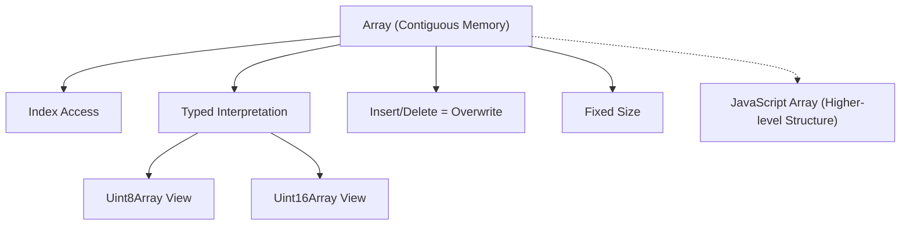

# **Study Notes: Arrays and Contiguous Memory**

## **1. Introduction to Arrays**

Arrays are the first foundational data structure introduced.  
Despite their familiar appearance in languages like JavaScript, **true arrays** refer to a very specific low-level structure: **contiguous blocks of memory**.

JavaScript arrays imitate many array-like operations but are _not_ true arrays at the memory level.  
This section clarifies what an array actually is and how it behaves under the hood.

---

## **2. Definition of an Array (Low-Level Perspective)**

### **Array (Formal Definition)**

A **contiguous memory space** containing a fixed number of elements of the **same type**, each occupying a fixed number of bytes.

Key elements:

- **Contiguous**: unbroken block of memory.
    
- **Typed**: the compiler/interpreter knows how many bytes each element occupies.
    
- **Fixed size**: cannot grow without allocating a new block.
    

### **Memory and Interpretation**

- Memory is just zeros and ones.
    
- Meaning is assigned only when the program interprets those bits as a specific type (e.g., 32-bit int, unsigned 8-bit int).
    
- Without this interpretation, raw memory is meaningless.
    

---

## **3. How Arrays Work in Memory**

### **Example (Traditional Language)**

```c
int a[3];
```

- Allocates 3 integers contiguously.
    
- If integers are 4 bytes each → 12 bytes total.
    

### **Index Access: The Actual Operation**

To compute `a[i]`:

```
address_of_a + (i * size_of_type)
```

For a 32-bit integer (4 bytes):

- `a[0]` → address of `a + 0`
    
- `a[1]` → address of `a + 4`
    
- `a[2]` → address of `a + 8`
    

This formula is fundamental to understanding arrays.

---

## **4. JavaScript Example Using ArrayBuffer**

JavaScript does not expose real arrays, but `ArrayBuffer` and typed arrays allow memory-level manipulation.

### **Creating a raw buffer**

```js
const a = new ArrayBuffer(6);
```

This allocates 6 bytes of contiguous memory.

### **Creating Views**

Views allow interpreting the same memory differently:

```js
const a8 = new Uint8Array(a);     // 8-bit view
const a16 = new Uint16Array(a);   // 16-bit view
```

#### Example writes:

```js
a8[0] = 45;
a8[2] = 45;
a16[2] = 0x4545;
```

### **Key Insight**

Different views → different interpretations of the _same_ bytes.

#### Table: Effect of Using Different Typed Views

|View Type|Width (bytes)|Interpretation granularity|Example representable values|
|---|---|---|---|
|`Uint8Array`|1|Byte-by-byte|0–255|
|`Uint16Array`|2|Two bytes at a time|0–65535|

---

## **5. Endianness (Brief Mention)**

Endianness determines **byte ordering** when multi-byte values are stored:

- Little endian: least significant byte first.
    
- Big endian: most significant byte first.
    

The transcript mentions this only to note:

- Interpreting the same bytes as 16-bit values can produce surprising results.
    

---

## **6. Array Operations**

### **6.1 Getting a Value**

Accessing an index:

- Does not walk the array.
    
- Uses the formula: `address + offset * width`.
    

**Time complexity: O(1)**.

### **6.2 Insertion (Overwriting)**

Arrays cannot grow.  
Inserting at index `i` **overwrites** the value at that exact memory location.

You cannot:

- Insert "between" existing elements.
    
- Expand the memory block without reallocation.
    

### **6.3 Deletion**

Deletion simply overwrites the slot, commonly with:

- Zero
    
- Null (if at the language level)
    
- Any sentinel value
    

Memory cannot be “removed”; it’s still part of the contiguous block.

---

## **7. Why Arrays Cannot Grow**

Because memory beyond the array may be occupied:

```
[ array data ][ user's name ][ stack frame ][ ... ]
```

Growing into adjacent memory would overwrite other data.

### Real-world solution in higher-level languages

Dynamic arrays (e.g., JavaScript arrays, Python lists, vectors in C++) internally:

- Allocate extra capacity.
    
- Reallocate and copy when needed.
    

But **true arrays do not grow**.

---

## **8. Big O for Array Operations**

|Operation|Explanation|Big O|
|---|---|---|
|Access|Compute offset, read bytes|O(1)|
|Insert (overwrite)|Same as access|O(1)|
|Delete (overwrite sentinel)|Same as access|O(1)|

**Constant time** means runtime does not grow with input size.

### Clarification

Constant time ≠ literally one instruction.  
It means a _constant number_ of steps independent of input size.

---

## **9. Summary of Key Behaviors**

### Arrays:

- Are **fixed-size contiguous memory blocks**.
    
- Are typed at the memory level.
    
- Support constant-time random access.
    
- Cannot grow or shrink.
    
- Operations like insert/delete simply overwrite.
    

### JavaScript Arrays:

- Are not true low-level arrays.
    
- Use complex underlying mechanisms.
    
- Can behave like arrays but do not guarantee contiguous memory storage.
    

---

## **10. Concept Relationship Diagram**



---

## **Summary of Key Points**

- Arrays are contiguous, fixed-size memory blocks.
    
- Interpretation of memory gives meaning to bytes (8-bit, 16-bit, etc.).
    
- JavaScript provides array-like structures but not true arrays.
    
- Typed arrays (`Uint8Array`, `Uint16Array`) let you view the same buffer differently.
    
- Array operations (access, insert, delete) run in constant time.
    
- Deletion is simply overwriting with a sentinel value.
    
- Arrays cannot grow; dynamic arrays require reallocation.
    

---

## **## MicroTest**

What is the fundamental definition of an array in terms of
computer memory?