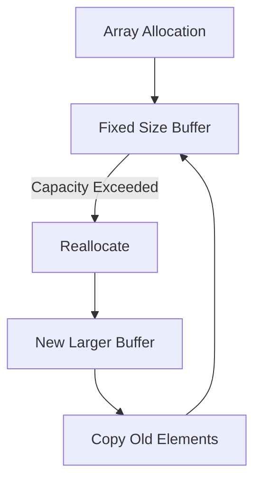

# Arrays: Static Nature, Memory Allocation, and Dynamic Abstractions

## 1. What Is an Array?

**Definition**  
An array is a **contiguous block of memory** that stores elements of the same type. Each element can be accessed using an index.

**Key Characteristics**

- Fixed size at allocation time
    
- Elements stored sequentially in memory
    
- No built-in methods in low-level or traditional arrays

---

## 2. Do Arrays Have `push`, `pop`, or `insert`?

**Short Answer:** No — not in _static_ or _traditional_ arrays.

**Explanation**

- Traditional arrays do **not** have methods like `push`, `pop`, or `insert`.
    
- These operations exist only in **higher-level abstractions** (e.g., JavaScript arrays, Java `ArrayList`, Rust `Vec`).
    
- In older or low-level languages, arrays are purely memory structures with no attached methods.

**Implication**

- Any operation that appears to “grow” an array is actually handled by a different data structure or runtime logic.

---

## 3. Arrays in Low-Level Languages (C, Rust)

### 3.1 Explicit Size and Memory

In languages like **C**:

- Arrays do not store their own length.
    
- You must pass:
    
    - A pointer to the first element
        
    - The number of elements (length)

This is why:

- Program entry points receive:
    
    - An array of strings
        
    - A separate count of how many strings exist

### 3.2 Size Must Be Known

In languages like **Rust**:

- You must specify the array size at creation.
    
- Example conceptually:
    
    - “This array has size 3”
        
    - That size never changes

There are two common cases:

- **Compile-time arrays**: size is constant and fixed
    
- **Runtime-sized arrays**: size comes from a variable, but is still fixed once allocated

---

## 4. Can Arrays Grow?

**Answer:** No — not directly.

**What Actually Happens**

- Arrays cannot grow in place.
    
- To “grow” an array:
    
    1. Allocate a new, larger array
        
    2. Copy elements from the old array into the new one
        
    3. Discard the old array

This process is called **reallocation**.

---

## 5. Arrays in High-Level Languages (JavaScript, Java)

### 5.1 The Illusion of Dynamic Arrays

In **JavaScript** and **Java**:

- Arrays _appear_ to grow and shrink.
    
- Internally, there is still:
    
    - A memory buffer
        
    - A fixed capacity at any given moment

The runtime hides:

- Memory allocation
    
- Reallocation
    
- Copying

From the developer’s perspective, the array “just works.”

### 5.2 Under-the-Hood Complexity

When arrays become:

- Very large
    
- Very sparse (many empty indexes)

The runtime may:

- Change internal representations
    
- Use different data structures (e.g., hash maps)

This makes real implementations far more complex than a simple array model.

---

## 6. Buffer Size and Optimization Trade-offs

### 6.1 Initial Buffer Size

Dynamic array implementations (e.g., Rust `Vec`):

- Allocate an initial buffer (often small, e.g., size 5)
    
- Allow operations like `push` and `pop` until capacity is reached

### 6.2 The Core Trade-off

|Strategy|Benefit|Cost|
|---|---|---|
|Small initial buffer|Saves memory|Frequent reallocations|
|Large initial buffer|Fewer reallocations|Wasted memory|

Choosing the buffer size is an **optimization problem**:

- Too small → performance cost
    
- Too large → memory waste

This balance is central to data structure design.

---

## 7. Conceptual Model (Mermaid Diagram)

---

## 8. Key Takeaways

- Arrays are **fixed-size memory structures**
    
- Traditional arrays have:
    
    - No built-in methods
        
    - No automatic resizing
        
- Dynamic behavior comes from **abstractions**, not arrays themselves
    
- Growing an array always involves **reallocation**
    
- Buffer sizing is a critical performance and memory trade-off
    
- High-level languages hide complexity, but the underlying principles remain the same