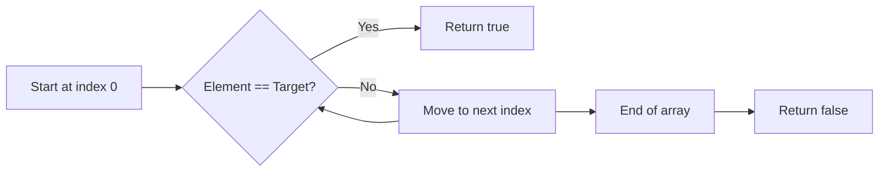

# Algorithms (A): Introduction and Linear Search

## 1. Transition from Data Structures to Algorithms

**Algorithms**  
A finite, well-defined sequence of steps used to solve a problem or perform a computation.

**Context**

- After defining a basic data type (arrays), the focus shifts to **algorithms**.
    
- Algorithms operate _on_ data structures to retrieve, transform, or analyze data.

---

## 2. Arrays as the Working Model

### 2.1 Arrays in JavaScript (Conceptual Model)

**Definition**

- JavaScript arrays are treated as array-like structures with a `.length` property.
    
- For learning purposes, arrays are treated as **fixed-size collections**, even though JavaScript allows resizing.

**Reason for This Approach**

- Avoids low-level details (e.g., passing pointers and lengths explicitly).
    
- Encourages correct algorithmic thinking about size constraints.
    
- Makes it easier to practice classical algorithms.

---

## 3. Visualization as a Core Skill

**Key Skill**

- Visualizing problems before coding.

**Techniques**

- Circles and arrows
    
- Boxes and arrows
    
- Whiteboard-style diagrams

**Relevance**

- Helps translate abstractions into concrete implementations.
    
- Improves long-term problem-solving ability.
    
- Enables mental simulation of algorithms without writing code.

---

## 4. Search as a Fundamental Algorithmic Problem

**Search**

- The task of finding a value within a data structure.

**Why Search Matters**

- One of the most common operations in computing.
    
- Appears frequently in real-world applications and interviews.

---

## 5. Linear Search

### 5.1 Definition

**Linear Search**

- An algorithm that checks each element in a collection sequentially until the target value is found or the collection ends.

---

### 5.2 Problem Setup

- Input:
    
    - An array (often called the _haystack_)
        
    - A value to find (often called the _needle_)
        
- Output:
    
    - Boolean indicating whether the value exists

---

### 5.3 Conceptual Process

1. Start at index `0`
    
2. Compare the current element with the target value
    
3. If equal → return `true`
    
4. Otherwise, move to the next index
    
5. Repeat until the end of the array
    
6. If not found → return `false`

---

### 5.4 Visualization (Mermaid Diagram)



---

## 6. Relation to Built-in Methods

**Index-Based Search**

- Methods like `indexOf` perform a **linear search** internally.
    
- They iterate through elements until a match is found.

---

## 7. Time Complexity Analysis

### 7.1 Worst-Case Scenario

- The value does **not exist** in the array.
    
- Every element must be checked.

### 7.2 Big-O Notation

|Aspect|Value|
|---|---|
|Time Complexity|O(N)|
|Space Complexity|O(1)|

**Explanation**

- Time grows linearly with input size.
    
- No additional memory required beyond loop variables.
    
- Constants are ignored in Big-O analysis.

---

## 8. Linear Search Implementation (JavaScript)

```js
function linear_search(haystack, needle) {
  for (let i = 0; i < haystack.length; i++) {
    if (haystack[i] === needle) {
      return true;
    }
  }
  return false;
}
```

**Notes**

- Early return improves performance when the value is found early.
    
- Returning from inside the loop is acceptable in algorithmic code.

---

## 9. Testing and Execution Workflow

**Testing Approach**

- Use a test runner to validate correctness.
    
- Filter tests by algorithm name for focused execution.

**Purpose**

- Ensures algorithm correctness.
    
- Confirms development environment is set up properly.

---

## 10. Key Takeaways

- Algorithms operate on data structures to solve problems.
    
- Arrays are treated as fixed-size for algorithmic practice.
    
- Visualization is essential for understanding and designing algorithms.
    
- Linear search is the simplest search algorithm.
    
- Linear search has O(N) time complexity in the worst case.
    
- Many built-in search methods rely on linear search internally.