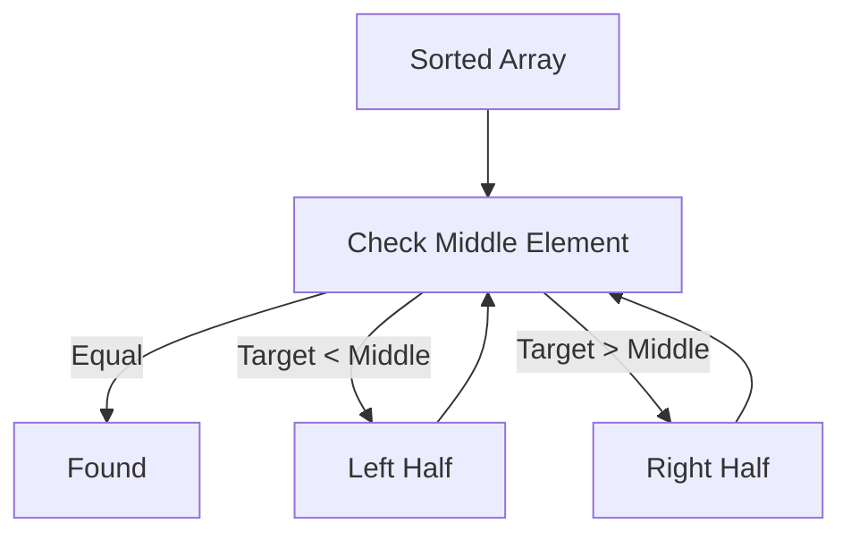

# Binary Search: Leveraging Ordered Data

## 1. Motivation: Why Ordering Matters

**Key Question**  
Before designing an algorithm, always ask: **Is the data ordered?**

**Relevance**

- Ordered data enables optimizations that are impossible with unordered data.
    
- Searching can be dramatically faster when order is guaranteed.

---

## 2. From Linear Search to Smarter Searching

### 2.1 Limitation of Linear Search

- Checks elements one by one.
    
- Worst-case examines every element.
    
- Time complexity: **O(N)**.

---

## 3. Naive Optimization Attempt: Fixed-Size Jumps

### 3.1 Idea

- Jump ahead by a fixed percentage (e.g., 10% of `N`) instead of checking every element.
    
- If the current value exceeds the target, walk backward and linearly scan.

### 3.2 Why This Fails (Asymptotically)

**Worst Case**

- The value does not exist or is larger than all elements.
    
- All jumps are made plus a linear scan of the last segment.

**Time Analysis**

- Jumping: constant number of jumps
    
- Scanning: proportional to `N`

|Component|Cost|
|---|---|
|Jumping|Constant|
|Scanning|O(N)|
|**Total**|**O(N)**|

**Conclusion**

- Practical improvement, but **no theoretical improvement**.
    
- Constants are ignored in Big-O notation.

---

## 4. Core Insight: Halving the Search Space

### 4.1 Key Strategy

- Instead of jumping fixed distances, **split the array in half**.
    
- Compare the middle element to the target.

### 4.2 Decision Rule

- If middle value equals target → done.
    
- If target is smaller → search left half.
    
- If target is larger → search right half.

**Critical Rule**

- Never linearly scan after splitting.
    
- Always continue halving.

---

## 5. Binary Search Algorithm

**Definition**  
Binary search is an algorithm that repeatedly divides a **sorted array** in half to locate a target value.

---

## 6. Step-by-Step Process

1. Start with the full array of size `N`.
    
2. Check the middle element.
    
3. Discard half of the array based on comparison.
    
4. Repeat until:
    
    - The value is found, or
        
    - The search space is empty.

---

## 7. Visualization (Mermaid Diagram)

---

## 8. Mathematical Basis of Binary Search

### 8.1 Halving Model

At each step:

- Search space size becomes `N / 2`

After `k` steps:

- Remaining size = `N / 2^k`

Stop condition:

- `N / 2^k = 1`

Rearranging:

- `N = 2^k`
    
- `k = log₂(N)`

---

## 9. Example: Array of Size 4096

|Step|Remaining Size|
|---|---|
|Start|4096|
|1|2048|
|2|1024|
|3|512|
|4|256|
|5|128|
|6|64|
|7|32|
|8|16|
|9|8|
|10|4|
|11|2|
|12|1|

- Number of steps: **12**
    
- `log₂(4096) = 12`

---

## 10. Time Complexity Analysis

|Aspect|Value|
|---|---|
|Worst Case|Target not found|
|Time Complexity|**O(log N)**|
|Space Complexity|**O(1)** (iterative)|

**Key Observation**

- No scanning occurs.
    
- Each step only compares one value and halves the input.

---

## 11. Why It’s Called Binary Search

- At every step, there are **two possible paths**:
    
    - Left half
        
    - Right half
        
- The algorithm always chooses exactly one path.

---

## 12. Big-O Pattern Recognition Tip

**Rule of Thumb**

- If input size is **halved each step** → `O(log N)`
    
- If input is **scanned at each step** → `O(N log N)`

Binary search:

- No scanning
    
- Only halving
    
- Therefore **O(log N)**

---

## 13. Summary of Key Points

- Ordered data enables faster search algorithms.
    
- Fixed-percentage jumping does not improve Big-O complexity.
    
- Binary search repeatedly halves the search space.
    
- Worst-case time complexity is **O(log N)**.
    
- Binary search is foundational for many advanced algorithms.