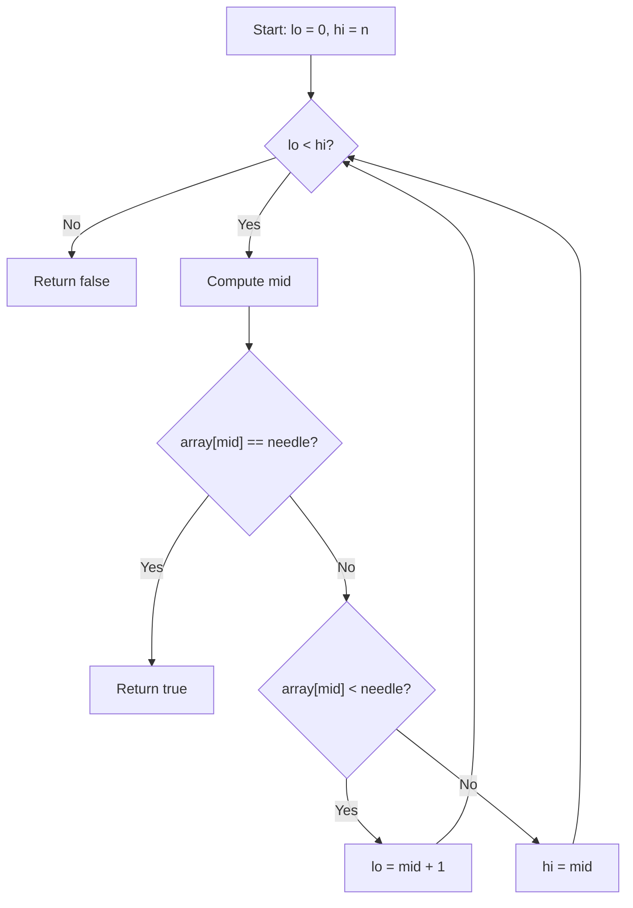

# Binary Search Algorithm

## 1. Overview

**Binary search** is an efficient searching algorithm used to find a target value in a **sorted array** by repeatedly dividing the search interval in half.

- **Core idea:** Compare the target with the middle element to eliminate half of the remaining elements each step.
    
- **Time complexity:**
    
    - Best case: O(1)
        
    - Worst / average case: O(log n)
        
- **Key requirement:** The array **must be sorted**.

---

## 2. Preconditions and Assumptions

- The input array is sorted in ascending order.
    
- Index boundaries are handled consistently:
    
    - **Low (`lo`) is inclusive**
        
    - **High (`hi`) is exclusive**

This convention avoids common _off-by-one_ errors.

---

## 3. Key Concepts and Definitions

### Search Space

The range of indices currently being considered, defined as:

```Python
[lo, hi)
```

This range shrinks on each iteration.

### Needle

The value being searched for in the array.

### Midpoint Calculation

To avoid overflow and ensure correctness:

```Python
mid = lo + (hi - lo) / 2
```

---

## 4. Algorithm Logic (High-Level)

1. Start with `lo = 0` and `hi = array.length`
    
2. While `lo < hi`:
    
    - Compute `mid`
        
    - Compare `array[mid]` with the needle
        
    - Narrow the search space accordingly
        
3. If the loop ends without a match, the value does not exist

---

## 5. Three Core Conditions

|Condition|Meaning|Action|
|---|---|---|
|`array[mid] == needle`|Target found|Return `true` (or index `mid`)|
|`array[mid] < needle`|Target is larger|Set `lo = mid + 1`|
|`array[mid] > needle`|Target is smaller|Set `hi = mid`|

---

## 6. Pseudocode Representation

```Python
function binarySearch(array, needle):
    lo = 0
    hi = array.length

    do:
        if lo >= hi:
            break

        mid = lo + (hi - lo) / 2
        value = array[mid]

        if value == needle:
            return true
        else if value < needle:
            lo = mid + 1
        else:
            hi = mid
    while lo < hi

    return false
```

- Returning an index instead of `true` is also common.
    
- If returning an index, a **sentinel value** such as `-1` is used to indicate “not found”.

---

## 7. Loop Exit Condition

### Why `lo < hi` (not `<=`)?

- `hi` is **exclusive**
    
- When `lo == hi`, the search space is empty
    
- Using `<=` would cause an invalid or redundant lookup

This is a classic source of off-by-one bugs.

---

## 8. Visual Flow of Binary Search



---

## 9. Why Sorting Is Required

Binary search relies on this assumption:

> If the target is greater than the middle element, all elements to the left are also smaller.

Without sorting:

- You cannot safely discard half the array
    
- The algorithm breaks and becomes incorrect

---

## 10. Common Pitfalls

- Using `<=` instead of `<` in loop condition
    
- Inconsistent inclusive/exclusive bounds
    
- Forgetting the array must be sorted
    
- Incorrect midpoint calculation leading to overflow or infinite loops

---

## 11. Key Takeaways

- Binary search reduces the search space by **half each iteration**
    
- Requires a **sorted array**
    
- Careful boundary management (`lo` inclusive, `hi` exclusive) is critical
    
- Correct midpoint calculation prevents errors
    
- Sentinel values (e.g., `-1`) are commonly used when returning indices

---

## Summary

Binary search is a foundational algorithm that efficiently locates elements in sorted arrays using divide-and-conquer. Its correctness depends on strict ordering assumptions and careful handling of index boundaries. Mastery of off-by-one rules and loop conditions is essential for reliable implementations.