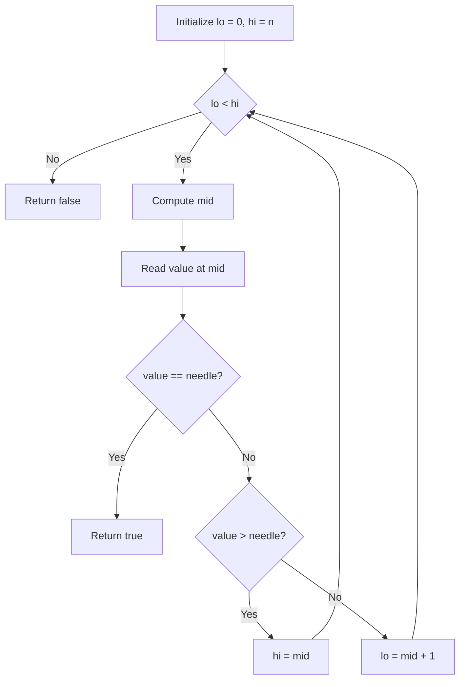

# Implementing Binary Search (Code-Level Study Notes)

## 1. Purpose of This Lesson

This lesson focuses on **translating binary search pseudocode into a concrete implementation**, reinforcing:

- Correct boundary handling
    
- Proper midpoint calculation
    
- Avoidance of off-by-one errors
    
- Direct mapping from algorithm logic to code

---

# 2. Key Concepts and Definitions

## Binary Search

A **divide-and-conquer search algorithm** that finds a target value in a **sorted array** by repeatedly halving the search space.

- Requires sorted input
    
- Reduces search space by 50% each iteration
    
- Time complexity: **O(log n)**

---

## Haystack and Needle

- **Haystack**: The sorted array being searched
    
- **Needle**: The target value

These names are commonly used in search algorithms to distinguish data from query.

---

## Inclusive / Exclusive Bounds

A consistent boundary strategy is used:

|Variable|Meaning|Inclusion|
|---|---|---|
|`lo`|Lower bound|Inclusive|
|`hi`|Upper bound|Exclusive|

This convention:

- Prevents overlapping pointers
    
- Simplifies loop termination
    
- Avoids `+1 / -1` errors

---

## Midpoint Calculation

To safely compute the middle index:

```Python
mid = lo + Math.floor((hi - lo) / 2)
```

**Why this matters:**

- Prevents overflow
    
- Correctly offsets from `lo`
    
- Forgetting to divide by 2 causes incorrect behavior

---

# 3. Algorithm Structure

## Initialization

1. Set `lo = 0`
    
2. Set `hi = haystack.length`

This defines the full search space: `[0, length)`

---

## Loop Structure

A `do-while` loop is used (though other loops are valid):

```Python
do while (lo < hi)
```

**Exit condition:**  
When `lo >= hi`, the search space is empty.

---

# 4. Core Decision Logic

At each iteration:

1. Compute midpoint
    
2. Read value at midpoint
    
3. Compare against needle
    
4. Shrink search space

---

## Three Comparison Cases

|Condition|Interpretation|Action|
|---|---|---|
|`value === needle`|Found target|`return true`|
|`value > needle`|Target is smaller|`hi = mid`|
|`value < needle`|Target is larger|`lo = mid + 1`|

**Important:**  
The midpoint is always excluded after comparison to avoid infinite loops.

---

# 5. Step-by-Step Execution Example

**Input**

```Python
haystack = [1, 3, 5, 7, 9]
needle = 7
```

**Steps**

1. `lo = 0`, `hi = 5`
    
2. `mid = 2`, value = 5 → needle is larger → `lo = 3`
    
3. `mid = 4`, value = 9 → needle is smaller → `hi = 4`
    
4. `mid = 3`, value = 7 → match → return `true`

---

# 6. Control Flow Diagram



---

# 7. Code Characteristics

## Variable Naming

- Single-letter variables (`lo`, `hi`, `m`) mirror pseudocode
    
- Common in algorithm implementations
    
- Improves translation accuracy from theory to code

---

## Sentinel Values

If returning an index instead of a boolean:

- Return `-1` when not found
    
- `-1` is called a **sentinel value**
    
- Indicates invalid or missing result

---

# 8. Common Implementation Pitfalls

|Mistake|Consequence|
|---|---|
|Using `<=` instead of `<`|Infinite loop or invalid access|
|Forgetting `/ 2` in midpoint|Incorrect index|
|Including midpoint again|Infinite loop|
|Inconsistent bounds|Off-by-one errors|

---

# 9. Practical Insight

- Binary search is conceptually simple but **boundary precision is critical**
    
- Most bugs come from index handling, not logic
    
- Consistent mental model (inclusive vs exclusive) is essential

---

# 10. Summary of Key Points

- Binary search requires a sorted array
    
- Use inclusive `lo` and exclusive `hi`
    
- Midpoint must be calculated carefully
    
- Always shrink the search space
    
- Correct boundary logic prevents off-by-one errors
    
- The final implementation is short, but precision matters