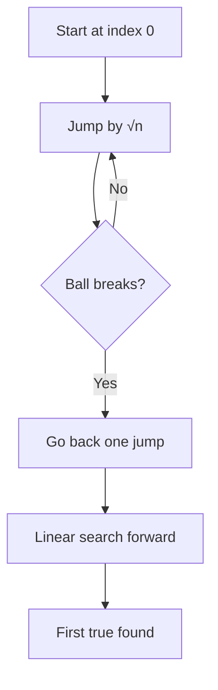

# Two Crystal Balls Problem (Optimized Search Strategy)

---

## 1. Problem Overview

**Problem Statement**  
Given **two crystal balls** that break when dropped from or above a certain height, determine the **exact point** at which they begin to break using the **most optimized strategy**.

**Generalized Interpretation**

- Represented as an array of boolean values:
    
    - `false` → ball does not break
        
    - `true` → ball breaks
        
- The array is **monotonic**:
    
    - All `false` values come before all `true` values
        
- Goal: find the **first index where the value becomes `true`**

---

# 2. Key Concepts and Definitions

## Monotonic Boolean Array

An array where values change **only once** from `false` to `true` and never revert.

**Relevance:**  
This ordering enables optimized search strategies beyond linear search.

---

## Constraints

- Only **two crystal balls**
    
- A broken ball cannot be reused
    
- Each drop corresponds to a single array access

---

## Time Complexity

A measure of how algorithm runtime grows with input size `n`.

---

# 3. Naive Approaches and Their Limitations

## Linear Search

**Strategy**

- Start at index `0`
    
- Check every element until `true` is found

**Time Complexity**

- `O(n)`

**Limitation**

- Ignores the fact that the array is ordered
    
- Does not leverage the two-ball constraint

---

## Binary Search

**Strategy**

- Jump to the middle
    
- If it breaks, search left
    
- If it does not break, search right

**Issue**

- If the ball breaks at midpoint:
    
    - One ball is lost
        
    - Remaining search becomes linear

**Worst-Case Time**

- Binary jump: `O(log n)`
    
- Linear fallback: `O(n)`
    
- Overall: `O(n)`

---

## Comparison Table

|Strategy|Uses Ordering|Uses 2 Balls Well|Worst-Case Time|
|---|---|---|---|
|Linear Search|No|No|O(n)|
|Binary Search|Yes|No|O(n)|

---

# 4. Optimized Strategy: Square Root Jump Search

## Core Insight

To minimize worst-case time:

- Avoid jumps that force large linear scans after a break
    
- Balance jump size with recovery cost

---

## Strategy Description

1. Jump forward in increments of **√n**
    
2. Drop the first ball at each jump
    
3. When the ball breaks:
    
    - Go back to the last safe position
        
    - Linearly search forward using the second ball

---

## Why √n Works

- Maximum jumps before breaking: √n
    
- Maximum linear walk afterward: √n
    
- Worst-case total checks: √n + √n

**After dropping constants:**

- **Time Complexity: `O(√n)`**

---

# 5. Step-by-Step Example

**Given**

```Python
Array length = 100
Breaking point = 73
Jump size = √100 = 10
```

## Phase 1: Jumping

- Index 10 → safe
    
- Index 20 → safe
    
- Index 30 → safe
    
- Index 40 → safe
    
- Index 50 → safe
    
- Index 60 → safe
    
- Index 70 → safe
    
- Index 80 → breaks

## Phase 2: Linear Search

- Go back to index 70
    
- Check 71 → safe
    
- Check 72 → safe
    
- Check 73 → breaks

**Result:** Breaking point found at index 73

---

# 6. Algorithm Flow Diagram



---

# 7. Why This Is Optimal

- Avoids full linear scans
    
- Avoids binary search failure mode
    
- Fully leverages the two-ball constraint
    
- Introduces a **non-standard but powerful time complexity**

---

# 8. Broader Insight

This problem demonstrates:

- How constraints shape algorithm design
    
- That optimal solutions may fall outside common patterns
    
- The value of balancing risk and recovery cost in algorithms

---

# 9. Summary of Key Points

- The problem maps to finding the first `true` in a monotonic boolean array
    
- Linear and binary search both degrade to `O(n)` under constraints
    
- Jumping by √n balances jump cost and recovery cost
    
- The optimal solution runs in **O(√n)** time
    
- This technique expands problem-solving strategies beyond standard searches

Q: If we only have one crystal ball wouldn't same algorithm work?  

A: The only way you could use one crystal ball is if you performed a Linear search and went up floor-by-floor until it broke, which would be less efficient since a Linear search is 0(n). By using the square-root(n) you are jumping (skipping) a certain number of floors until one of your crystal balls break. Once one is broken, you know the target floor is somewhere between your last "safe" floor and the current floor. So you then do a linear search from that safe floor until you find the target floor.