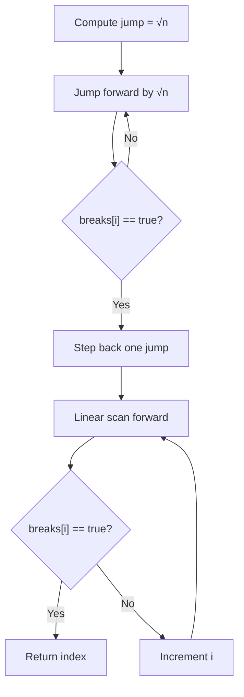

# Implementing the Two Crystal Balls Algorithm (√n Search)

---

## 1. Problem Recap

**Goal**  
Given a boolean array `breaks` that transitions from `false` to `true`, return the **index of the first `true`** using an optimized strategy that reflects the **two crystal balls constraint**.

**Key Assumptions**

- The array is ordered (all `false` values precede all `true` values).
    
- Only two failures (ball breaks) are allowed.
    
- If no `true` exists, return a sentinel value (e.g., `-1`).

---

# 2. Core Concepts and Definitions

## Square Root Jump Strategy

A search technique that:

- Jumps forward in fixed steps of size √n
    
- Uses the first failure to bound the search
    
- Linearly scans a limited range afterward

**Relevance**  
This balances jump size and recovery cost to achieve **sub-linear time**.

---

## Sub-Linear Time Complexity

An algorithm that runs faster than O(n) but slower than O(log n).

**In This Algorithm**

- Worst-case time complexity: **O(√n)**

---

## Sentinel Value

A special return value indicating failure or absence.

**Example**

- `-1` indicates the breaking point does not exist.

---

# 3. Algorithm Overview

## High-Level Steps

1. Compute jump size = ⌊√n⌋
    
2. Jump forward by this amount until a break occurs
    
3. Step back one jump
    
4. Linearly scan forward to find the exact breaking index

---

## Why Not Binary Search?

- If the ball breaks at the midpoint:
    
    - One ball is lost
        
    - Remaining search becomes linear
        
- Worst-case runtime degrades to O(n)

---

# 4. Implementation Walkthrough

## Step 1: Calculate Jump Amount

```js
jump = floor(sqrt(breaks.length))
```

**Reason**

- √n ensures the maximum distance walked after a break is also √n

---

## Step 2: Jump Forward to Find First Break

```js
i = jump
while i < n:
    if breaks[i] == true:
        break
    i += jump
```

- Uses the **first crystal ball**
    
- Stops when the ball breaks or array ends

---

## Step 3: Step Back to Last Known Safe Point

```js
i -= jump
```

- Ensures the breaking point lies in the next √n range

---

## Step 4: Linear Scan Forward

```js
for j from 0 to jump:
    if i >= n:
        return -1
    if breaks[i] == true:
        return i
    i++
```

- Uses the **second crystal ball**
    
- Walks at most √n steps

---

# 5. Algorithm Flow Diagram



---

# 6. Time Complexity Analysis

|Phase|Max Steps|Complexity|
|---|---|---|
|Jumping phase|√n|O(√n)|
|Linear scan phase|√n|O(√n)|
|**Total (worst-case)**|—|**O(√n)**|

**Constants are dropped**, so 2√n → √n.

---

# 7. Why Square Root Is Optimal Here

## Key Insight

- Jump size = recovery cost
    
- Minimizes worst-case total operations

## Why Not Other Roots?

|Jump Size|Effect|
|---|---|
|n / 2|Linear recovery → O(n)|
|cbrt(n)|More jumps, unclear benefit|
|√n|Maximum distance with sub-linear recovery|
|Higher roots|Approaches linear behavior|

**Conclusion:** √n is the best balance between jump distance and recovery cost.

---

# 8. Practical Takeaway

- This algorithm introduces a **non-standard but powerful runtime**
    
- Demonstrates how constraints (limited failures) shape algorithm design
    
- Expands problem-solving strategies beyond linear and binary search

---

# 9. Summary of Key Points

- The problem reduces to finding the first `true` in a monotonic boolean array
    
- Linear and binary search both fail to optimize under the two-ball constraint
    
- Jumping by √n limits worst-case recovery cost
    
- The algorithm runs in **O(√n)** time
    
- Square root jumps provide the optimal balance for this constraint-driven problem