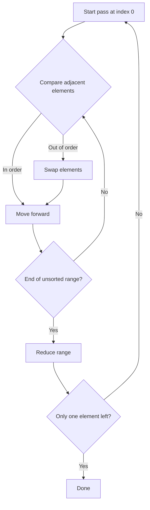

# Bubble Sort Algorithm

---

## 1. Introduction to Sorting

Sorting is the process of rearranging elements in a collection into a defined order (typically ascending or descending).

- Sorting is a foundational topic in algorithms.
    
- While many courses begin with sorting, it is often more intuitive to start with searching.
    
- Bubble sort is introduced first because it is **easy to visualize**, **simple to implement**, and **useful for understanding algorithmic analysis**.

---

# 2. Definition of a Sorted Array

## Formal Definition

An array is considered **sorted (ascending)** if:

> For every index `i`,  
> `array[i] ≤ array[i + 1]`

This condition must hold **for all valid indices** in the array.

---

# 3. Bubble Sort: Core Idea

## Definition

**Bubble Sort** is a comparison-based sorting algorithm that repeatedly steps through the array, compares adjacent elements, and swaps them if they are in the wrong order.

## Key Insight

- During each full pass through the array, the **largest unsorted element “bubbles up” to the end**.
    
- After each pass, the sorted portion of the array grows from the end.

---

# 4. Bubble Sort Algorithm Description

## High-Level Steps

1. Start at the beginning of the array.
    
2. Compare the current element with the next element.
    
3. If the current element is larger, swap them.
    
4. Move one position forward.
    
5. Repeat until the end of the unsorted portion.
    
6. Reduce the unsorted range by one.
    
7. Continue until only one element remains.

---

# 5. Step-by-Step Example

## Initial Array

```Python
[1, 3, 7, 4, 2]
```

---

## First Pass

- Compare 1 and 3 → no swap
    
- Compare 3 and 7 → no swap
    
- Compare 7 and 4 → swap → `[1, 3, 4, 7, 2]`
    
- Compare 7 and 2 → swap → `[1, 3, 4, 2, 7]`

**Result:** Largest element (7) is now in the final position.

---

## Second Pass (exclude Last element)

- Compare 1 and 3 → no swap
    
- Compare 3 and 4 → no swap
    
- Compare 4 and 2 → swap → `[1, 3, 2, 4, 7]`

**Result:** Second-largest element (4) is now fixed.

---

## Subsequent Passes

- Continue reducing the range.
    
- Stop when only one element remains.

**Final Sorted Array**

```Python
[1, 2, 3, 4, 7]
```

---

# 6. Why Bubble Sort Works

## Key Property

Each complete pass guarantees:

- The **largest remaining element** moves to its correct position.
    
- The unsorted section shrinks by one.

An array with **one element is always sorted**, which defines the stopping condition.

---

# 7. Visual Algorithm Flow



---

# 8. Time Complexity Analysis

## Comparisons per Pass

- First pass: `n`
    
- Second pass: `n - 1`
    
- Third pass: `n - 2`
    
- …
    
- Last pass: `1`

This forms the series:

```Python
n + (n - 1) + (n - 2) + ... + 1
```

---

## Mathematical Simplification

Using the well-known summation formula:

$$
\frac{n(n + 1)}{2}
$$

---

## Big O Analysis

|Step|Explanation|
|---|---|
|Drop constants|Big O ignores constant factors|
|Drop lower-order terms|`n` is insignificant compared to `n²`|

**Final Time Complexity:**  
$$
\boxed{O(n^2)}
$$

---

# 9. Characteristics of Bubble Sort

|Property|Value|
|---|---|
|Time Complexity (Worst)|O(n²)|
|Time Complexity (Best)|O(n²)|
|Space Complexity|O(1)|
|Stable|Yes|
|In-place|Yes|
|Practical Use|Educational|

---

# 10. Conceptual Takeaways

- Bubble sort demonstrates how nested iteration leads to quadratic time.
    
- The algorithm is inefficient for large datasets.
    
- It is valuable as a **teaching tool** for:
    
    - Sorting fundamentals
        
    - Loop analysis
        
    - Big O reasoning

---

# 11. Summary of Key Points

- Bubble sort repeatedly swaps adjacent out-of-order elements.
    
- Each pass places the largest remaining element at the end.
    
- The unsorted portion shrinks after every pass.
    
- Total runtime grows quadratically with input size.
    
- Bubble sort is simple, visual, and ideal for learning—but inefficient in practice. C