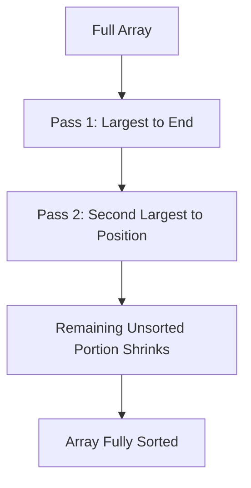

# Bubble Sort: Implementation and Detailed Explanation

## 1. Bubble Sort Overview

**Bubble Sort** is a simple, comparison-based sorting algorithm that repeatedly steps through an array, compares adjacent elements, and swaps them if they are in the wrong order.

**Key Characteristics**

- Comparison-based
    
- In-place sorting algorithm
    
- Stable (relative order of equal elements is preserved)
    
- Time complexity: **O(n²)**

---

## 2. Core Invariant (Why Bubble Sort Works)

After each full pass through the array:

- The **largest unsorted element “bubbles up”** to its correct position at the end.
    
- The sorted portion of the array grows from **right to left**.

This invariant guarantees correctness.

---

## 3. Code Implementation (TypeScript)

```ts
export default function bubble_sort(arr: number[]): void {
    for (let i = 0; i < arr.length; i++) {
        for (let j = 0; j < arr.length - 1 - i; j++) {
            if (arr[j] > arr[j + 1]) {
                const temp = arr[j]
                arr[j] = arr[j + 1]
                arr[j + 1] = temp
            }
        }
    }
}
```

---

## 4. High-Level Structure

|Component|Purpose|
|---|---|
|Outer loop (`i`)|Controls how many passes occur|
|Inner loop (`j`)|Compares adjacent elements|
|Comparison|Detects incorrect ordering|
|Swap|Corrects the local ordering|
|In-place mutation|Avoids extra memory usage|

---

## 5. Line-by-Line Explanation

### Function Signature

```ts
export default function bubble_sort(arr: number[]): void
```

- Accepts an array of numbers.
    
- Returns `void` because the array is sorted **in place**.

---

### Outer Loop

```ts
for (let i = 0; i < arr.length; i++)
```

**Purpose**

- Controls the number of passes.
    
- After each pass, one element is guaranteed to be in its final position.

**Why it works**

- After `i` passes, the last `i` elements are already sorted.
    
- The algorithm progressively shrinks the unsorted region.

---

### Inner Loop

```ts
for (let j = 0; j < arr.length - 1 - i; j++)
```

**Purpose**

- Iterates through the unsorted portion of the array.
    
- Compares each element with its neighbor to the right.

**Why `arr.length - 1 - i`?**

- `-1` prevents accessing `arr[j + 1]` out of bounds.
    
- `-i` skips the already-sorted elements at the end.

---

### Comparison

```ts
if (arr[j] > arr[j + 1])
```

**Meaning**

- Checks if two adjacent elements are out of order.

**Why this is sufficient**

- Bubble sort relies only on **local comparisons**.
    
- Repeated local corrections lead to global order.

---

### Swap Logic

```ts
const temp = arr[j]
arr[j] = arr[j + 1]
arr[j + 1] = temp
```

**Purpose**

- Exchanges two adjacent elements safely.

**Why a temporary variable is required**

- Prevents overwriting one value before it is reassigned.

**Cost**

- Constant time: **O(1)**

---

## 6. Step-by-Step Example

**Input**

```Python
[5, 3, 4, 1]
```

### Pass 1

- Compare 5 & 3 → swap → `[3, 5, 4, 1]`
    
- Compare 5 & 4 → swap → `[3, 4, 5, 1]`
    
- Compare 5 & 1 → swap → `[3, 4, 1, 5]`

Largest element (`5`) is now fixed.

### Pass 2

- Compare 3 & 4 → no swap
    
- Compare 4 & 1 → swap → `[3, 1, 4, 5]`

### Pass 3

- Compare 3 & 1 → swap → `[1, 3, 4, 5]`

Array is sorted.

---

## 7. Visualization of Progress



## 8. Time Complexity Analysis

### Number of Comparisons

- First pass: `n - 1`
    
- Second pass: `n - 2`
    
- …
    
- Last pass: `1`

Total comparisons:


$$\frac{n(n - 1)}{2}  $$

### Big O Simplification

|Step|Reason|
|---|---|
|Drop constants|Big O ignores constant factors|
|Drop lower-order terms|`n` is insignificant compared to `n²`|

**Final Time Complexity**  

$$O(n^2)  $$

---

## 9. Space Complexity

|Aspect|Value|
|---|---|
|Extra memory|O(1)|
|Array mutation|In-place|

Bubble sort is memory-efficient but computationally expensive.

---

## 10. Practical Notes

- Rarely used in production systems.
    
- Valuable for:
    
    - Learning loop invariants
        
    - Understanding algorithm analysis
        
    - Practicing in-place mutation
        
- Simpler than binary search from an implementation perspective.

---

# Summary of Key Points

- Bubble sort repeatedly swaps adjacent out-of-order elements.
    
- Each pass places one element into its final position.
    
- The algorithm shrinks the unsorted region on every iteration.
    
- All operations inside loops are constant time.
    
- Overall runtime is **O(n²)** with **O(1)** extra space.
    
- The provided implementation correctly enforces bounds, invariants, and in-place sorting.