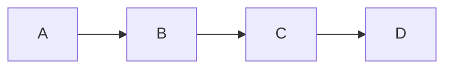
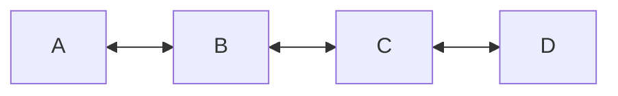
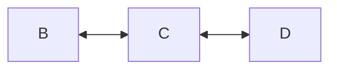
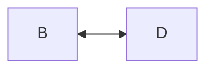

# Linked Lists as a Core Data Structure

## From Arrays to More Complex Structures

### Arrays Revisited

**Array definition:**  
An array is a contiguous memory structure that stores elements indexed numerically (0, 1, 2, …).

**Key limitations highlighted:**

- **Deletion:** You cannot truly delete an element; you typically overwrite it (e.g., set to `null` or `undefined`).
    
- **Insertion:** Inserting elements requires shifting other elements.
    
- **Index rigidity:** Indices are fixed; removing index `0` does not automatically reindex without extra logic.
    
- **Growth constraints:** Conceptually fixed-size; resizing requires copying or abstractions on top.

**Important insight:**  
When a structure allows insertion, deletion, and automatic index adjustment, something more than a raw array must be involved.

---

## Linked Lists: The First “Real” Data Structure

### Definition

A **linked list** is a **node-based data structure** where:

- Each element is wrapped in a **node**
    
- Each node stores:
    
    - A **value**
        
    - A **reference** (pointer) to another node

Unlike arrays, linked lists do not rely on contiguous memory.

---

## Nodes and Structure

### Node Concept

A **node** is a container that wraps:

- The data value
    
- One or more references to other nodes

Example (conceptual TypeScript-like structure):

- `value: T`
    
- `next: Node<T> | undefined`
    
- `previous: Node<T> | undefined` (for doubly linked lists)

---

## Singly Linked Lists

### Definition

A **singly linked list** is a linked list where:

- Each node points only to the **next** node
    
- Traversal is **one-directional**

### Key Properties

- Can move forward only
    
- Once you lose a reference to a previous node, it is inaccessible
    
- Garbage collection can reclaim nodes with no remaining references

### Visualization

---

## Doubly Linked Lists

### Definition

A **doubly linked list** extends a singly linked list by adding:

- A `previous` reference in each node

### Key Properties

- Bidirectional traversal
    
- Easier deletion and insertion at known positions
    
- Slightly higher memory cost due to extra reference

### Visualization

---

## Traversal and Indexing

### No Direct Index Access

- Linked lists **do not have indices**
    
- To access the nth element:
    
    1. Start at the head
        
    2. Traverse node by node
        
    3. Count steps until the desired node is reached

**Implication:**  
Access by position is slower than arrays.

---

## Memory Model

### Heap Allocation

- Nodes are **heap-allocated objects**
    
- Not stored contiguously
    
- More flexible but generally more expensive than stack allocation

---

## Insertion in a Doubly Linked List

### Goal

Insert a new node `F` between nodes `A` and `B`.

### Steps (Constant Time)

1. Set `A.next = F`
    
2. Set `F.previous = A`
    
3. Set `F.next = B`
    
4. Set `B.previous = F`

### Key Insight

- Only pointer updates are required
    
- No traversal cost if insertion point is already known

### Complexity

- **Time:** O(1)
    
- **Reason:** Fixed number of pointer updates

---

## Deletion in a Doubly Linked List

### Goal

Delete node `C` between nodes `B` and `D`.

### Steps

1. Store reference to `D = C.next`
    
2. Set `B.next = D`
    
3. Set `D.previous = B`
    
4. Set `C.next = null`
    
5. Set `C.previous = null`
    
6. Optionally return `C.value`

### Critical Rule: Order Matters

- Incorrect ordering can permanently lose access to nodes
    
- References must be preserved until reassignment is complete

### Visualization

After deletion:

### Complexity

- **Time:** O(1)
    
- **Reason:** Fixed number of pointer updates

---

## Operation Complexity Comparison

|Operation|Array|Linked List (Known Node)|
|---|---|---|
|Access by index|O(1)|O(n)|
|Insertion|O(n)|O(1)|
|Deletion|O(n)|O(1)|
|Memory layout|Contiguous|Non-contiguous (heap)|

---

## Practical Considerations

- Linked lists require careful pointer management
    
- Guard checks (e.g., `null` or `undefined`) are needed in real code
    
- Pseudocode often omits safety checks for clarity
    
- Singly linked lists are simpler to implement than doubly linked lists

---

## Key Takeaways

- Arrays are limited in insertion and deletion capabilities
    
- Linked lists use nodes and references instead of indices
    
- Singly linked lists allow forward traversal only
    
- Doubly linked lists support bidirectional traversal
    
- Insertion and deletion in linked lists are **constant time** when the node is known
    
- Operation ordering is crucial to avoid losing references