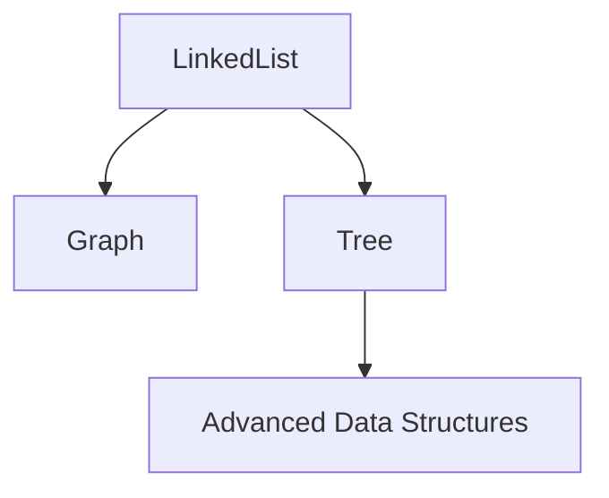

# Linked Lists: Access Patterns, Performance, and Foundations

## Accessing Values in a Linked List

### Sequential Access

**Definition:**  
Linked lists do not support direct indexed access. To retrieve a value at position _n_, traversal from the head is required.

**Process:**

1. Start at the `head` node.
    
2. Initialize a counter.
    
3. Move to `current.next` repeatedly.
    
4. Stop when the counter reaches the desired position.
    
5. Return `current.value`.

**Key Constraint:**

- The node itself is **not returned** to external callers.
    
- Returning nodes would expose internal links (`next`, `previous`), allowing external mutation and corruption of the list.

**Design Principle:**  
Nodes are an **internal abstraction**, not part of the public interface.

---

## Head and Tail Access

### Head

- **Definition:** Reference to the first node in the list.
    
- **Complexity:** O(1)
    
- **Reason:** Direct pointer access regardless of list size.

### Tail

- **Definition:** Reference to the last node in the list.
    
- **Complexity:** O(1)
    
- **Reason:** Maintained pointer to the end of the list.

**Implication:**  
Operations involving only head or tail avoid traversal costs.

---

## Deletion Operations

### Deletion at the Ends

- **Head deletion:** O(1)
    
- **Tail deletion:** O(1)

**Reason:**  
Only pointer reassignment is required using existing references.

### Deletion in the Middle

- **Traversal:** O(n)
    
- **Deletion step:** O(1)

**Total cost:** O(n), dominated by traversal.

**Key Insight:**  
The deletion logic itself is constant time; traversal is the expensive part.

---

## Insertion Operations

### Prepending (Insert at Head)

- **Time Complexity:** O(1)
    
- **Reason:** Reassign head pointers.

### Appending (Insert at Tail)

- **Time Complexity:** O(1)
    
- **Reason:** Reassign tail pointers.

### Insertion in the Middle

- **Traversal:** O(n)
    
- **Insertion step:** O(1)

**Total cost:** O(n)

---

## Strengths and Weaknesses of Linked Lists

### Strengths

- Dynamic size (no fixed length)
    
- Fast insertion and deletion at head and tail
    
- Non-contiguous memory allows flexible growth

### Weaknesses

- No random access
    
- Traversal costs can dominate performance
    
- Poor cache locality compared to contiguous memory structures

---

## Performance Summary Table

|Operation|Time Complexity|
|---|---|
|Get head|O(1)|
|Get tail|O(1)|
|Get nth element|O(n)|
|Insert at head|O(1)|
|Insert at tail|O(1)|
|Insert in middle|O(n)|
|Delete head|O(1)|
|Delete tail|O(1)|
|Delete in middle|O(n)|

---

## Traversal as the Central Cost

**Key Principle:**  
Traversal is the dominant cost in linked list operations.

- If you already have a reference to the node → operations are constant time.
    
- If you must find the node first → traversal cost applies.

**Design Recommendation:**  
Avoid frequent full traversals. If traversal is common, another data structure may be more appropriate.

---

## Linked Lists as Foundational Structures

### Conceptual Importance

- Every linked list is:
    
    - A **graph** (nodes connected by references)
        
    - A **tree** (in its simplest linear form)

### Why Linked Lists Matter

- Teach pointer/reference manipulation
    
- Build intuition for traversal
    
- Form the basis for more advanced data structures

### Relationship to Other Structures

Understanding linked lists simplifies learning:

- Trees
    
- Graphs
    
- Queues
    
- Dequeues
    
- Hash table chaining

---

## Key Takeaways

- Linked lists require traversal for indexed access.
    
- Head and tail operations are constant time.
    
- Insertion and deletion are fast when traversal is avoided.
    
- Traversal cost defines most performance tradeoffs.
    
- Linked lists are foundational for understanding graphs and trees.