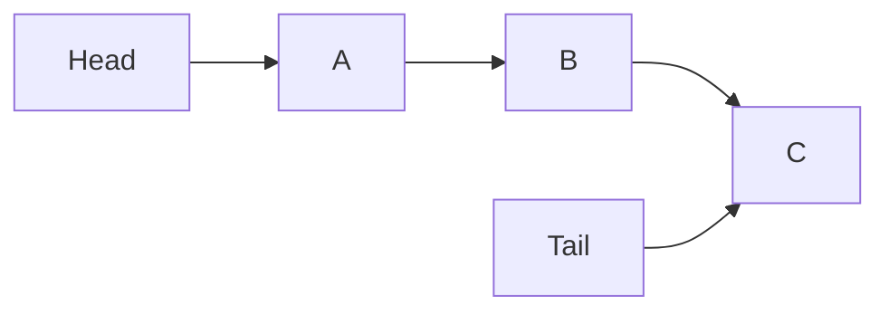

# Queues Built on Linked Lists

## Data Structures vs. Algorithms

### Conceptual Distinction

- **Data Structure:** Defines how data is organized and stored (e.g., linked list).
    
- **Algorithm:** Defines the steps or operations performed on a data structure (e.g., insertion, removal).

**Key Idea:**  
Many abstractions combine both:

- The **structure** provides storage.
    
- The **algorithm** constrains how the structure is used.

In practice, strict separation is unnecessary; what matters is behavior and performance.

---

## Queue: Definition and Purpose

### Definition

A **queue** is a data structure that follows the **FIFO (First In, First Out)** principle:

- The first element inserted is the first one removed.

**Real-world analogy:** A line where people join at the back and leave from the front.

### Relationship to Linked Lists

- A queue is commonly implemented using a **singly linked list**.
    
- It maintains:
    
    - A reference to the **head** (front of the queue)
        
    - A reference to the **tail** (back of the queue)

---

## Queue Structure

### Core Components

- **Head:** Points to the first element (next to be removed)
    
- **Tail:** Points to the last element (most recently added)

### Visualization

---

## Enqueue Operation (Insert)

### Definition

**Enqueue:** Add an element to the back of the queue.

### Step-by-Step

1. Create a new node `E`.
    
2. Set `tail.next = E`.
    
3. Update `tail = E`.

### Key Properties

- No traversal required
    
- Only pointer reassignment

### Complexity

- **Time:** O(1)
    
- **Reason:** Constant number of pointer updates

---

## Dequeue Operation (Remove)

### Definition

**Dequeue:** Remove and return the element at the front of the queue.

### Step-by-Step

1. Save a reference to the current head (`h`).
    
2. Move `head = head.next`.
    
3. Set `h.next = null` (detach the node).
    
4. Return `h.value`.

### Important Ordering Rule

- The reference must be saved **before** moving the head.
    
- Doing this incorrectly can lose access to the value and corrupt the queue.

### Complexity

- **Time:** O(1)
    
- **Reason:** No traversal; direct pointer manipulation

---

## Peek Operation

### Definition

**Peek:** View the value at the front of the queue without removing it.

### Operation

- Return `head.value`.

### Complexity

- **Time:** O(1)

---

## Why a Singly Linked List Is Sufficient

### Design Choice

- Doubly linked lists are unnecessary for queues.
    
- Only forward traversal is required.

### Benefits

- Less memory usage
    
- Fewer pointer updates
    
- Simpler implementation

---

## Performance Characteristics

|Operation|Time Complexity|Explanation|
|---|---|---|
|Enqueue|O(1)|Tail pointer update|
|Dequeue|O(1)|Head pointer update|
|Peek|O(1)|Direct access to head|
|Traverse|O(n)|Not used in standard queue operations|

---

## Constrained Interfaces and Performance

### Key Principle

Queues intentionally **limit allowed operations**:

- No random access
    
- No middle insertion or deletion

### Result

- Predictable performance
    
- Extremely fast operations
    
- Clear behavioral guarantees (FIFO)

This pattern—restricting usage to gain efficiency—is common in higher-level data structures.

---

## Summary of Key Points

- A queue enforces FIFO behavior.
    
- It is commonly implemented using a singly linked list.
    
- Head and tail pointers enable constant-time operations.
    
- Enqueue, dequeue, and peek are all O(1).
    
- Queues demonstrate how constraining a data structure yields strong performance guarantees.