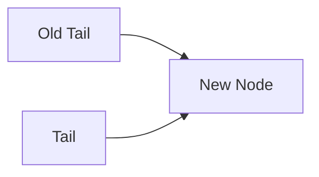

# Queue Implementation (Linked List) — Q&A Clarifications

---

## 1. Context

These notes clarify questions raised during a discussion of a **queue implemented using a singly linked list in TypeScript**, focusing on:

- Edge cases
    
- TypeScript constraints
    
- Correct bookkeeping of `head`, `tail`, and `length`
    
- Conceptual understanding of `peek`, `enqueue`, and `dequeue`
    

---

## 2. Key Concepts and Definitions

### Queue

A **FIFO (First In, First Out)** data structure where:

- Elements are added at the **tail**
    
- Elements are removed from the **head**
    

**Relevance:**  
Queues are foundational for task scheduling, buffering, and message processing.

---

### Head and Tail References

- **Head:** Points to the front element (next to be removed)
    
- **Tail:** Points to the last element (most recently added)
    

**Invariant:**

- `head` always points to the first node
    
- `tail` always points to the last node
    
- When the queue is empty, **both must be `undefined`**
    

---

### Length Bookkeeping

`length` is manually tracked to:

- Expose queue size in O(1)
    
- Correctly handle edge cases (empty queue, single-element queue)
    

---

## 3. Understanding the “No Tail” Condition

### What Does “No Tail” Mean?

When `this.tail === undefined`:

- The queue is **empty**
    
- There are **no nodes at all**
    
- Consequently, `this.head` must also be `undefined`
    

This condition is commonly encountered during:

- The first `enqueue`
    
- After dequeuing the last remaining element
    

---

### Why Not Just Use `length === 0`?

Conceptually, `length === 0` is sufficient.  
However, **TypeScript’s type system** requires explicit checks against `undefined` to ensure safe access to properties like `tail.next`.

Therefore, checks like:

```ts
if (!this.tail) { ... }
```

are used instead of relying only on `length`.

---

## 4. Correct Handling of `dequeue` and the Tail

### Problem Scenario

When dequeuing the **last remaining element**:

- `head` becomes `undefined`
    
- If not handled properly, `tail` may still reference a removed node
    

### Required Fix

After decrementing `length`:

- If `length === 0`, then:
    
    - `head = undefined`
        
    - `tail = undefined`
        

### Why This Matters

Failing to reset `tail`:

- Breaks the queue invariant
    
- Causes incorrect behavior on future enqueues
    

---

## 5. Clarifying the `peek` Operation

### Definition

**Peek** returns the value at the front of the queue **without modifying the queue**.

---

### Step-by-Step Behavior

1. Access `head`
    
2. If `head` exists:
    
    - Return `head.value`
        
3. If `head` does not exist:
    
    - Return `undefined`
        

---

### Key Insight

- The caller **never sees internal nodes**
    
- Only values (`T`) are exposed
    
- Internal structure and links remain encapsulated
    

This preserves abstraction and prevents accidental corruption of the queue.

---

## 6. Why Do We Set `tail.next` During Enqueue?

### Scenario: Inserting an Element at the End

Suppose the queue ends with node `E`, and we want to insert `F`.

### Required Operations

1. Link the old tail to the new node  
    `tail.next = F`
    
2. Update `tail` to point to the new node  
    `tail = F`
    

If step 2 is skipped:

- `tail` would incorrectly point to `E`
    
- The queue would lose track of its true end
    

---

### Visual Flow



**Invariant restored:** `tail` always points to the last node.

---

## 7. Enqueue vs Dequeue: Structural Comparison

|Operation|Modified Pointer(s)|Key Risk|
|---|---|---|
|Enqueue|`tail.next`, `tail`|Losing tail reference|
|Dequeue|`head` (and sometimes `tail`)|Leaving stale tail|

---

## 8. Relationship to Other Data Structures

### Queue vs Stack

|Structure|Order|Typical Operations|
|---|---|---|
|Queue|FIFO|enqueue, dequeue|
|Stack|LIFO|push, pop|

**Note:**  
While stacks can be efficiently implemented using arrays in JavaScript, queues benefit from linked lists to avoid costly shifts.

---

## 9. Key Takeaways

- `tail === undefined` means the queue is completely empty
    
- TypeScript requires explicit `undefined` checks for safety
    
- After removing the last element, both `head` and `tail` must be reset
    
- `peek` exposes values, not internal nodes, preserving abstraction
    
- Enqueueing requires **two updates**: linking the node and moving the tail
    
- Correct bookkeeping ensures all queue operations remain O(1)