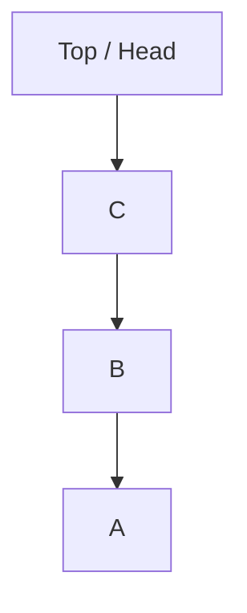
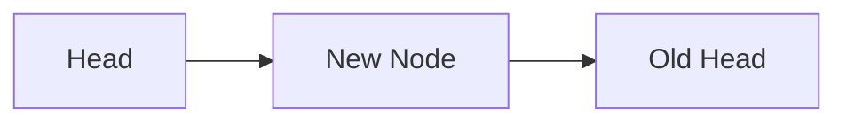

# Stack Data Structure Using Linked Lists

---

## 1. Review: Linked Lists

### Definition

A **linked list** is a node-based data structure where each node contains:

- A **value** of generic type `T`
    
- A **reference (pointer)** to the next node
    
- Optionally, a reference to the previous node (in doubly linked lists)

### Node Structure

- **Singly Linked List**:
    
    - `value: T`
        
    - `next: Node<T> | undefined`

**Relevance:**  
Linked lists allow efficient insertion and removal of elements without shifting memory, making them ideal for stacks and queues.

---

## 2. Queue Vs Stack (Conceptual Contrast)

|Structure|Insertion|Removal|Order|
|---|---|---|---|
|Queue|Tail|Head|FIFO (First In, First Out)|
|Stack|Head|Head|LIFO (Last In, First Out)|

A stack is conceptually similar to a queue but **all operations occur at one end only**.

---

## 3. Stack Overview

### Definition

A **stack** is a **Last In, First Out (LIFO)** data structure where:

- Elements are added to the **top**
    
- Elements are removed from the **top**

Only one reference is needed:

- **Head (Top of the Stack)**

---

## 4. Visual Representation of a Stack

Assume elements are pushed in this order: `A → B → C → D`

- `D` is the most recently added element
    
- `A` is the oldest element

This reversed visualization helps emphasize that **all operations happen at the head**.

---

## 5. Stack Operations

### 5.1 Push (Insert)

#### Definition

**Push** adds a new element to the top of the stack.

#### Steps

1. Create a new node `E`
    
2. Set `E.next` to the current `head`
    
3. Update `head` to point to `E`

#### Key Insight

- Order of operations matters
    
- Updating pointers incorrectly results in data loss

---

### 5.2 Pop (Remove)

#### Definition

**Pop** removes and returns the top element of the stack.

#### Steps

1. Save the current `head`
    
2. Update `head` to `head.next`
    
3. Detach the removed node
    
4. Return its value

**Result:**  
The stack shrinks from the top.

---

### 5.3 Peek (Inspect)

#### Definition

**Peek** returns the value at the top of the stack **without modifying the stack**.

#### Behavior

- If `head` exists → return `head.value`
    
- If stack is empty → return `undefined`

---

## 6. Performance Characteristics

### Time Complexity

|Operation|Time|
|---|---|
|Push|O(1)|
|Pop|O(1)|
|Peek|O(1)|

### Why It’s Fast

- No traversal required
    
- Only pointer updates
    
- Performance does not depend on stack size

---

## 7. Stack as a Mental Model

### Call Stack and Recursion

- Function calls are pushed onto the stack
    
- Function returns pop from the stack
    
- A **stack trace** shows the chain of active function calls

**Why This Matters:**  
Understanding stacks clarifies:

- Recursion behavior
    
- Memory usage
    
- Execution flow inside the computer

---

## 8. Constraints and Their Benefits

Stacks deliberately restrict operations:

- Only one insertion/removal point
    
- No random access

**Benefit:**  
These constraints guarantee:

- Predictable behavior
    
- High performance
    
- Simple implementation

---

## 9. Common Pitfalls

- Reversing pointer updates causes total data loss
    
- Confusing stack behavior with queue behavior
    
- Drawing arrows inconsistently when visualizing

---

## 10. Summary of Key Points

- A stack is a LIFO data structure implemented efficiently with a singly linked list
    
- All operations occur at the head
    
- Push, pop, and peek are constant-time operations
    
- Stacks are fundamental for understanding recursion and function calls
    
- Constraints simplify both reasoning and performance