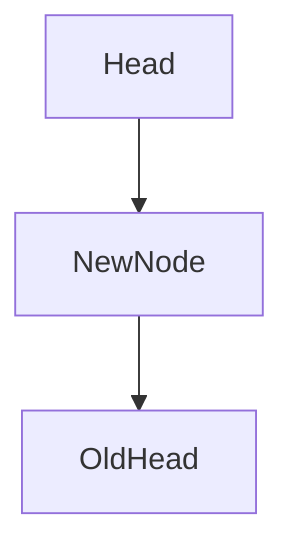
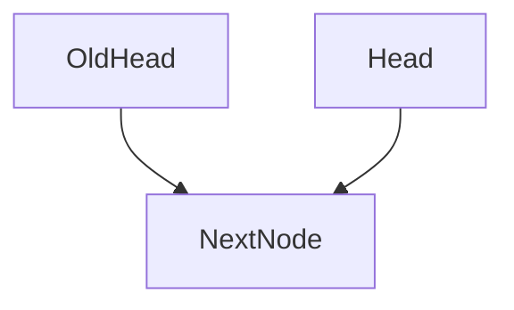

# Implementing a Stack Using a Linked List

---

## 1. Overview

This section covers the **implementation of a Stack data structure** using a **linked list**. The focus is on defining the node structure, managing the head pointer, and correctly implementing stack operations while maintaining proper bookkeeping.

---

## 2. Core Concepts

### 2.1 Stack

A **stack** is a linear data structure that follows **LIFO (Last In, First Out)** semantics.

- Elements are **added** and **removed** from the same end.
    
- Common operations: `push`, `pop`, `peek`.

**Relevance:**  
Stacks are fundamental for function calls, recursion, expression evaluation, and undo/redo mechanisms.

---

### 2.2 Linked List (Stack-Oriented)

A **singly linked list** is used, but instead of a `next` pointer, a `previous` pointer is chosen for visualization clarity.

Each node contains:

- A **value** of generic type `T`
    
- A **previous** pointer to another node

This structure supports constant-time stack operations.

---

## 3. Node Definition

### Node Structure

|Property|Type|Description|
|---|---|---|
|value|`T`|Stored data|
|previous|`Node<T> \| undefined`|Link to the next item down the stack|

**Design Choice:**  
Using `previous` instead of `next` makes it easier to visualize pushing onto the top of the stack.

---

## 4. Stack State

### Internal Properties

|Property|Purpose|
|---|---|
|`head`|Points to the top of the stack|
|`length`|Tracks the number of elements|

### Constructor Initialization

- `head = undefined`
    
- `length = 0`

Explicit initialization ensures predictable behavior and simplifies reasoning.

---

## 5. Stack Operations

### 5.1 Peek

#### Definition

Returns the value at the top of the stack **without modifying** the stack.

#### Steps

1. Check if `head` exists
    
2. If yes, return `head.value`
    
3. Otherwise, return `undefined`

#### Time Complexity

- **O(1)**

---

### 5.2 Push

#### Definition

Adds a new element to the top of the stack.

#### Steps

1. Create a new node with:
    
    - `value = item`
        
    - `previous = undefined`
        
2. If the stack is empty:
    
    - Set `head = node`
        
3. If the stack is not empty:
    
    - Set `node.previous = head`
        
    - Update `head = node`
        
4. Increment `length`

#### Visual Flow

#### Key Insight

- Order matters: the new node must point to the old head **before** updating the head reference.

#### Time Complexity

- **O(1)**

---

### 5.3 Pop

#### Definition

Removes and returns the top element of the stack.

#### Steps

1. If the stack is empty:
    
    - Return `undefined`
        
2. Save a reference to the current `head`
    
3. Update `head` to `head.previous`
    
4. Decrement `length` (never below 0)
    
5. Return the saved node’s value

#### Visual Flow

#### Important Notes

- Detaching the node allows garbage collection
    
- In non-garbage-collected languages, explicit memory deallocation would be required

#### Time Complexity

- **O(1)**

---

## 6. Bookkeeping and Safety

### Length Management

|Scenario|Action|
|---|---|
|Push|`length++`|
|Pop|`length = max(0, length - 1)`|

This prevents invalid negative lengths when popping repeatedly.

---

## 7. Error Handling and Type Safety

- Type systems may prevent unsafe access to `head`
    
- Repeated pops on an empty stack must safely return `undefined`
    
- Avoid unsafe casting when the stack may be empty

**Principle:**  
Always validate state before accessing node properties.

---

## 8. Comparison: Stack Vs Queue (Implementation Perspective)

|Aspect|Stack|Queue|
|---|---|---|
|Active pointers|Head only|Head and Tail|
|Operation points|One|Two|
|Complexity|Simpler|Slightly more complex|
|Typical methods|push/pop|enqueue/dequeue|

Stacks are simpler because only **one pointer** must be managed.

---

## 9. Summary of Key Points

- A stack can be efficiently implemented using a linked list
    
- Only a single pointer (`head`) is required
    
- Push, pop, and peek are all **constant-time operations**
    
- Correct pointer update order is critical to avoid data loss
    
- Proper bookkeeping ensures correctness and safety
    
- Stacks are among the simplest and most fundamental data structures