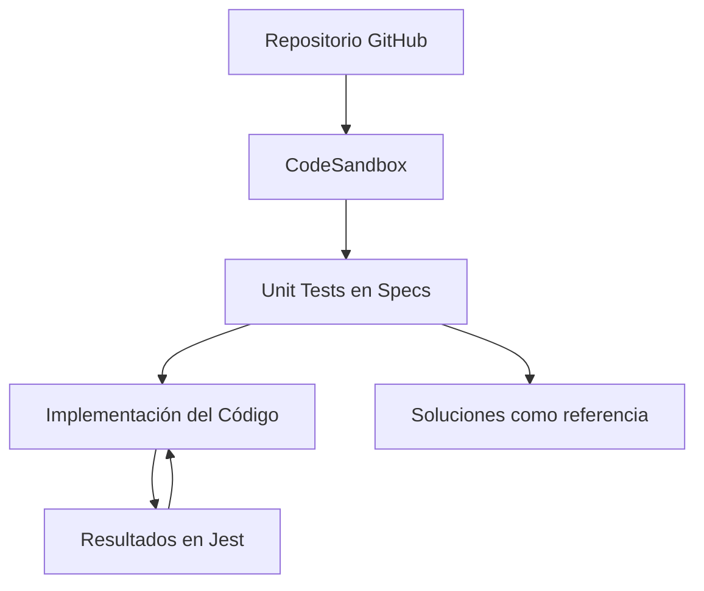

## Notas de Estudio

### Tema: Uso de CodeSandbox, estructura del proyecto y enfoque de aprendizaje para algoritmos

---

## 1. Introducción al entorno de trabajo

### CodeSandbox como plataforma

- CodeSandbox permite ejecutar un entorno muy similar a Visual Studio Code directamente en el navegador.
    
- El curso utiliza un repositorio de GitHub integrado en CodeSandbox.
    
- Se puede editar el código, ejecutar pruebas y visualizar archivos sin necesidad de instalación local.
    

### Estructura general del proyecto

- **Repositorio GitHub**: contiene todos los archivos del curso.
    
- **Directorio `src` (source)**: incluye pequeños visualizadores o ayudas gráficas usadas para temas como sorting y trees.
    
    - No es prioritario; se utiliza ocasionalmente para visualización.
        
- **Directorio `specs`**: contiene los **unit tests**.
    
    - Son los archivos que debes revisar constantemente, pues determinan qué debe cumplir tu código.
        
    - Ejemplo: `bubble-sort.test.js`.
        

---

## 2. Trabajo con Unit Tests

### ¿Qué es un “spec”?

- El instructor usa la palabra _spec_ como sinónimo de **test**.
    
- Este término proviene del ecosistema Ruby y RSpec, pero en este curso significa simplemente "archivo de pruebas".
    

### Contenido típico de un test

- Cada archivo `.test.js` incluye:
    
    - Casos de prueba.
        
    - Indicaciones implícitas sobre el comportamiento esperado.
        
    - Posibles ejemplos de entrada y salida.
        

### Archivo de solución

- Junto a cada ejercicio existe un archivo de solución.
    
    - Ejemplo: `bubblesort.solution.js`.
        
    - Puedes revisarlo cuando lo necesites. No hay penalización; el objetivo es aprender.
        

### Ejecución de pruebas

- CodeSandbox ejecuta **Jest** automáticamente.
    
- En la sección derecha (panel de “Tests”) puedes observar:
    
    - Cantidad de pruebas que pasan.
        
    - Cantidad total de pruebas.
        
    - Cuáles fallan y por qué.
        
- Estado inicial: 53 pruebas pasando de un total de 97.
    

### Manejo de `test.skip`

- Cuando un test está marcado como `test.skip`, Jest **no lo ejecuta**.
    
- Se utiliza para permitir que avances poco a poco sin que múltiples errores te saturen.
    
- Para comenzar a trabajar un ejercicio, remueve `.skip`.
    

---

## 3. Flujo de trabajo recomendado

### Pasos sugeridos para resolver cada ejercicio

1. Abrir el archivo de test correspondiente (ej. `bubble-sort.test.js`).
    
2. Leer con atención qué comportamiento debería tener la función.
    
3. Abrir el archivo de implementación (ej. `bubblesort.js`).
    
4. Escribir o corregir el código para que los tests pasen.
    
5. Observar los resultados en el panel de pruebas.
    
6. Usar `console.log` si es necesario, pero preferir la consola inferior de CodeSandbox (menos ruido).
    

### Ejemplo conceptual (Bubble Sort)

Aunque el transcript no incluye código, la dinámica es así:

- El test podría esperar que la función reciba un arreglo:  
    `bubbleSort([3, 2, 1]) → [1, 2, 3]`.
    
- Si la prueba falla, revisa:
    
    - ¿Comparas correctamente elementos adyacentes?
        
    - ¿Realizas múltiples pasadas hasta ordenar completamente?
        
    - ¿Modificas el arreglo original o regresas uno nuevo? Según el test.
        

Un ejercicio típico se resuelve leyendo el test e identificando exactamente qué comportamiento falta implementar.

---

## 4. Uso de consola y herramientas adicionales

### Consola en CodeSandbox

- En el panel inferior aparece la **consola real de ejecución**.
    
- Preferible a la consola integrada del navegador porque CodeSandbox agrega mucho ruido en la original.
    

### Logs inesperados

- Algunos ejercicios (por ejemplo, un algoritmo de pathfinding) incluyen herramientas internas que generan muchos logs.
    
- Puedes comentar esos `console.log` según avance el curso.
    

---

## 5. Ejecución local del proyecto

### Clonar el repositorio

- Es compatible con ejecución local utilizando Jest.
    
- Pasos:
    
    1. `git clone <repo>`
        
    2. `npm install`
        
    3. `npm run test`
        
- Esto ejecutará todos los tests sin necesidad de CodeSandbox.
    

---

## 6. Trabajo personal y aprendizaje

### Filosofía de aprendizaje del curso

- Es válido y recomendable:
    
    - Consultar Google.
        
    - Ver las soluciones.
        
    - Pedir ayuda a compañeros.
        
    - Usar ayudas como una “rubber duck”.
        
- Lo importante es **aprender**, no “adivinar sin apoyo”.
    

### Valor del esfuerzo

- Existe un valor significativo en el **struggle** (esfuerzo consciente).
    
- Recomendación:
    
    - Permite que exista cierto nivel de dificultad.
        
    - No llegues al punto de estrés excesivo.
        
    - Ajusta tu enfoque si te bloqueas.
        

---

## 7. Relación entre conceptos principales

---

## 8. Tabla resumen del entorno

|Elemento|Descripción|
|---|---|
|CodeSandbox|Entorno online similar a VS Code|
|Specs|Archivos de tests que determinan el comportamiento esperado|
|Jest|Framework que ejecuta los tests|
|Soluciones|Implementaciones correctas disponibles para consulta|
|Consola|Espacio para depurar con logs|
|Git Local|Alternativa para ejecutar el proyecto fuera del navegador|

---

## 9. Resumen de puntos clave

- Trabajarás en CodeSandbox dentro de un entorno estilo VS Code.
    
- Los **tests** en la carpeta `specs` definen exactamente qué debe hacer cada algoritmo.
    
- Los archivos de **solución** están disponibles y pueden consultarse.
    
- Jest se ejecuta automáticamente y muestra el estado de todas las pruebas.
    
- Usa `test.skip` para avanzar progresivamente.
    
- La consola inferior es la mejor para depuración.
    
- Puedes clonar el repositorio y trabajar localmente.
    
- El curso enfatiza el aprendizaje activo, el uso de recursos externos y el valor del esfuerzo razonado.
    

---

## MicroTest

_Escribe aquí tus propias preguntas para practicar._