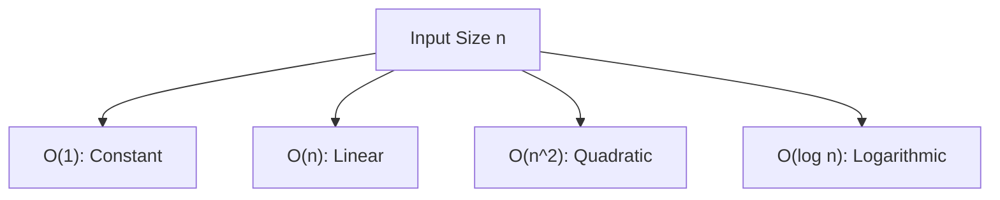

# Notes on Big O and Algorithmic Efficiency

## Introduction to Big O

Big O is a formal way to describe the efficiency of an algorithm. It measures how the runtime or space usage scales as the input size increases. Rather than focusing on exact timings, Big O abstracts away machine-specific details and focuses on growth patterns.

### Key Idea

Big O provides a high-level view by ignoring non-essential details (constants, lower-order terms) and retaining only the dominant term that most affects performance as input size grows.

---

## Mathematical Foundation of Big O

### Polynomial Example: 3x² + X + 1

To illustrate how Big O works, consider the expression:
$$
3x² + x + 1
$$
Each part between plus signs is a _term_. When x becomes large:

- 3x² dominates the total.
    
- x and 1 contribute very little compared to x².

Therefore, the entire expression simplifies to:

O(x²), which we write in algorithmic notation as O(n²).

### Rule for Determining Big O

- Identify the term that grows the fastest.
    
- Ignore coefficients and lower-order terms.
    
- Replace variable names (e.g., x) with n to indicate input size.

---

## Applying Big O to Algorithms

### Input Size (n)

In algorithms, n typically represents:

- The length of an array
    
- The number of elements to process

The scaling behavior of an algorithm depends on how many operations are tied to n.

### Identifying Complexity by Structure

A practical method:

- Look for loops.
    
- Each loop generally contributes a factor of n.
    
- Nested loops multiply complexities.

---

## Linear Time: O(n)

### Example: Summing Cross Pairs (crossAdd)

A function loops through an array once and performs constant work inside the loop.

Key observations:

- Setup (variable creation and return) happens once → negligible.
    
- The loop executes n times → dominant term.

Therefore:

O(n)

### Example: Linear Search

A loop searches for a target value in an array. Even if the value is found early:

- Best case: constant time (found at index 0)
    
- Worst case: n operations (found at end)
    
- Average case: n/2 operations

Big O considers the worst case → O(n).

---

## Quadratic Time: O(n²)

### Example: Generating Tuples of All Pairs

Two nested loops:

- Outer loop executes n times.
    
- Inner loop executes n times per outer iteration.

Total operations: n × n = n²

This grows rapidly as input increases:

- n = 3 → 9 operations
    
- n = 10 → 100 operations
    
- n = 500 → 250,000 operations

Nested loops → O(n²).

---

## Constant Time: O(1)

### Example: Get Middle of Array

Accessing an array element by index does not depend on array length.

- No loops
    
- No scaling with input size

Therefore:

O(1)

---

## Comparative Growth of Common Complexities

### Visual Interpretation (Mermaid Diagram)

### Growth Behavior Table

|Big O|Name|Growth Pattern|
|---|---|---|
|O(1)|Constant|No change as input increases|
|O(n)|Linear|Grows proportionally to input|
|O(n²)|Quadratic|Grows rapidly; nested loops|
|O(log n)|Logarithmic|Grows slowly even with large input|
|O(n log n)|Linear-logarithmic|Typical of efficient divide-and-conquer algorithms|

---

## Best Case, Worst Case, and Average Case

Algorithms may have different behaviors depending on input.

### Definitions

- Best case: minimal possible operations.
    
- Worst case: maximal possible operations.
    
- Average case: expected behavior for typical inputs.

Big O focuses on worst-case performance unless explicitly stated otherwise.

---

## Logarithmic Time: O(log n)

Appears when algorithms repeatedly divide the problem into smaller pieces. Though not explored in detail in the transcript, it is commonly seen in:

- Binary search
    
- Balanced tree operations
    
- Divide-and-conquer algorithms like merge sort

Logarithmic growth increases very slowly even as n becomes large.

---

## Summary of Key Points

- Big O describes how an algorithm scales with input size.
    
- Ignore constants and lower-order terms; focus on dominant growth.
    
- Loops → O(n). Nested loops → O(n²).
    
- Early exits typically do not change Big O classification.
    
- Constant-time operations remain O(1) regardless of input size.
    
- Different Big O classes grow at significantly different rates.
    
- Choosing the right algorithm often depends on balancing time complexity with practical constraints.

---

## MicroTest
