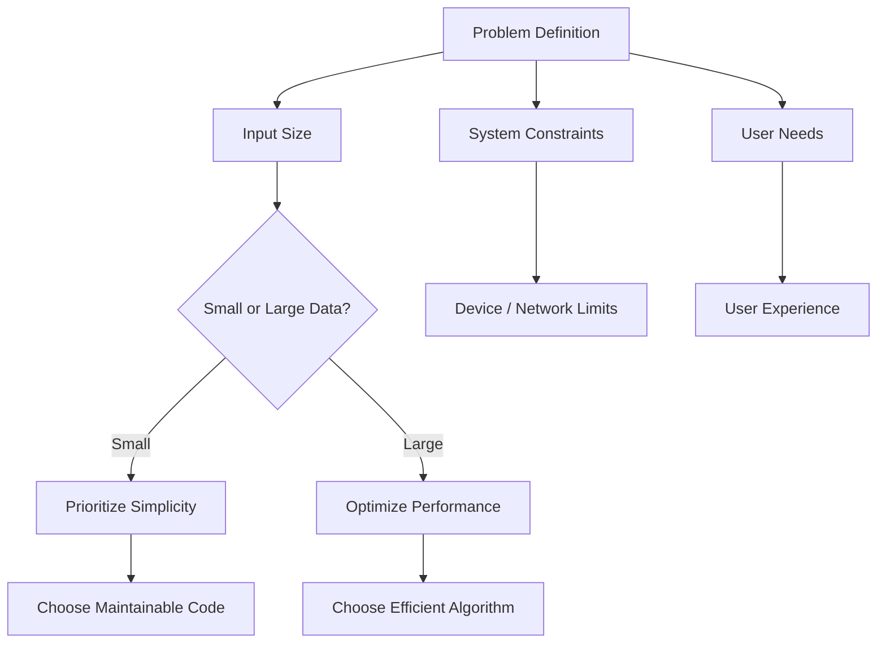
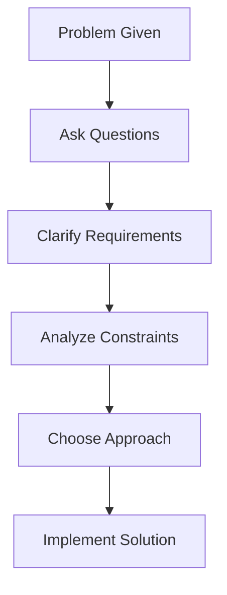

# 1. Purpose of Big O in Practice

## Definition: Big O Notation

**Big O notation** is a mathematical way to describe how the runtime or space requirements of an algorithm grow as the input size increases.

- Focuses on **scalability**, not exact execution time
    
- Describes **worst-case growth rate**
    
- Used to compare algorithms abstractly

## Key Idea

As input size increases:

- How much longer does the algorithm take?
    
- Does performance degrade linearly, exponentially, etc.?

---

# 2. Evaluating Algorithm Complexity

## Heuristic: Loop-Based Analysis

- Nested loops often indicate higher complexity
    
- Example:
    
    - 1 loop → O(n)
        
    - 2 nested loops → O(n²)
        
    - 3 nested loops → O(n³)

## Important Limitation

This is only a heuristic:

- Not all complexity comes from loops
    
- Other operations (recursion, data structures, hidden operations) can affect performance

---

# 3. Conceptual Approach to Complexity

## Key Question

Instead of relying only on loops:

- “If I increase the number of inputs, how does execution time change?”

This encourages:

- Critical thinking
    
- Understanding real-world scaling behavior

---

# 4. Real-World Application: Comment System Example

## Scenario

Designing a sorting/filtering system for comments.

## Key Insight

There is **no single correct Big O answer**.

## Principle: "It Depends"

The correct response depends on:

- Data size
    
- Frequency of operations
    
- System constraints

---

# 5. Trade-Off Analysis

## Case 1: Small Dataset

Example: 3–4 comments per post

|Factor|Impact|
|---|---|
|Algorithm complexity|Irrelevant|
|Performance difference|Negligible|
|Priority|Code readability and maintainability|

Even inefficient algorithms (e.g., O(n³)) are acceptable because:

- Execution time difference is minimal (milliseconds)

---

## Case 2: Large Dataset (e.g., Reddit)

|Factor|Impact|
|---|---|
|Algorithm complexity|Critical|
|Performance difference|Massive|
|Risk|System crashes or unusable performance|

Example:

- O(n³) sorting on millions of comments → infeasible
    
- Efficient algorithms required

---

# 6. Big O as a Tool

## Key Concept

Big O is **not a complete evaluation method**, but one of many tools.

## Analogy

- Big O is like a **ruler**
    
- Sometimes you need a **tape measure** (other metrics)

## Additional Factors to Consider

- Code readability
    
- Maintainability
    
- System constraints
    
- User experience
    
- Hardware/network limitations

---

# 7. Trade-Offs in Computer Science

## Definition: Trade-Off

A **trade-off** is balancing multiple competing factors when making decisions.

Common trade-offs:

- Speed vs readability
    
- Memory vs performance
    
- Simplicity vs optimization

---

## Mermaid Diagram: Trade-Off Decision Flow

---

# 8. Interview Strategy

## Key Insight

Interviewers expect **thought process**, not just code.

## Correct Approach

Do NOT:

- Jump directly into coding

DO:

- Ask clarifying questions

## Important Questions to Ask

- What is the input size?
    
- Who is the end user?
    
- What are the performance constraints?
    
- What devices or network conditions are involved?

---

## Mermaid Diagram: Interview Thinking Process

---

# 9. Key Concepts Summary Table

|Concept|Definition|Importance|
|---|---|---|
|Big O|Growth rate of algorithm performance|Helps compare scalability|
|Scalability|Behavior as input size increases|Critical for large systems|
|Trade-offs|Balancing competing factors|Core of engineering decisions|
|Context awareness|Understanding system constraints|Determines correct solution|
|Maintainability|Ease of modifying code|Often more important than speed|

---

# 10. Summary of Key Points

- Big O measures how algorithms scale, not exact speed.
    
- Loop counting is a useful but limited heuristic.
    
- The correct complexity depends on context (“it depends”).
    
- Small datasets prioritize simplicity; large datasets require efficiency.
    
- Big O is one tool among many for evaluating solutions.
    
- Engineering decisions involve trade-offs across multiple factors.
    
- In interviews, asking clarifying questions is essential before coding.