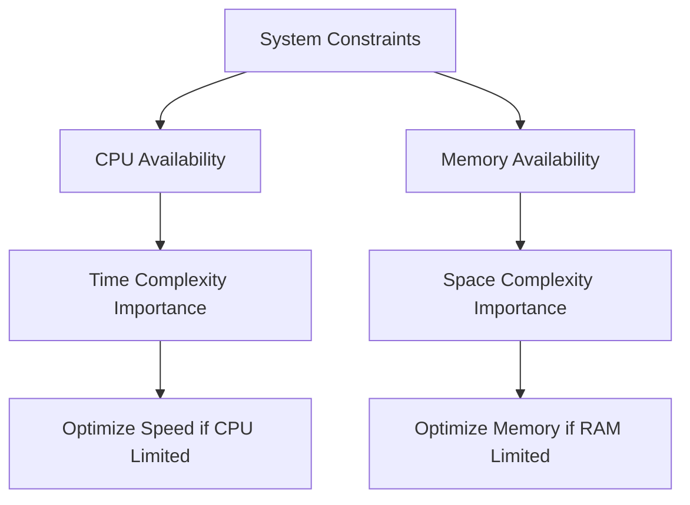
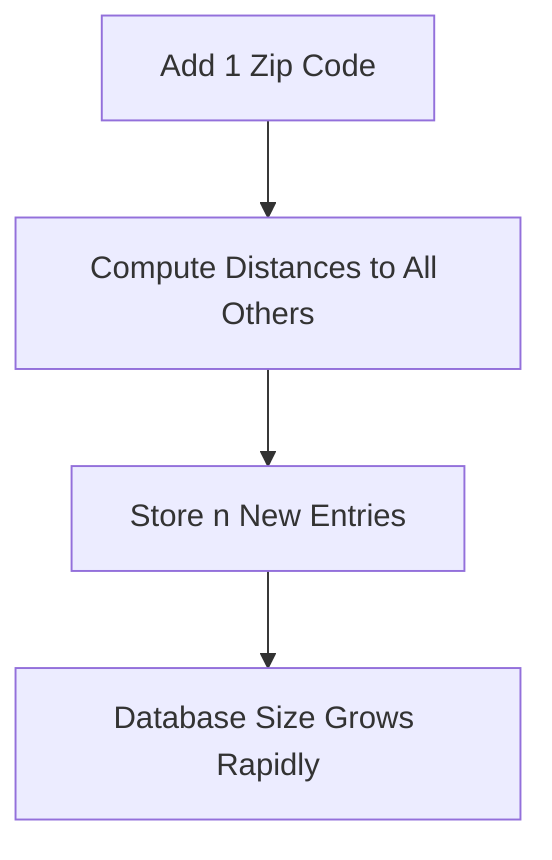
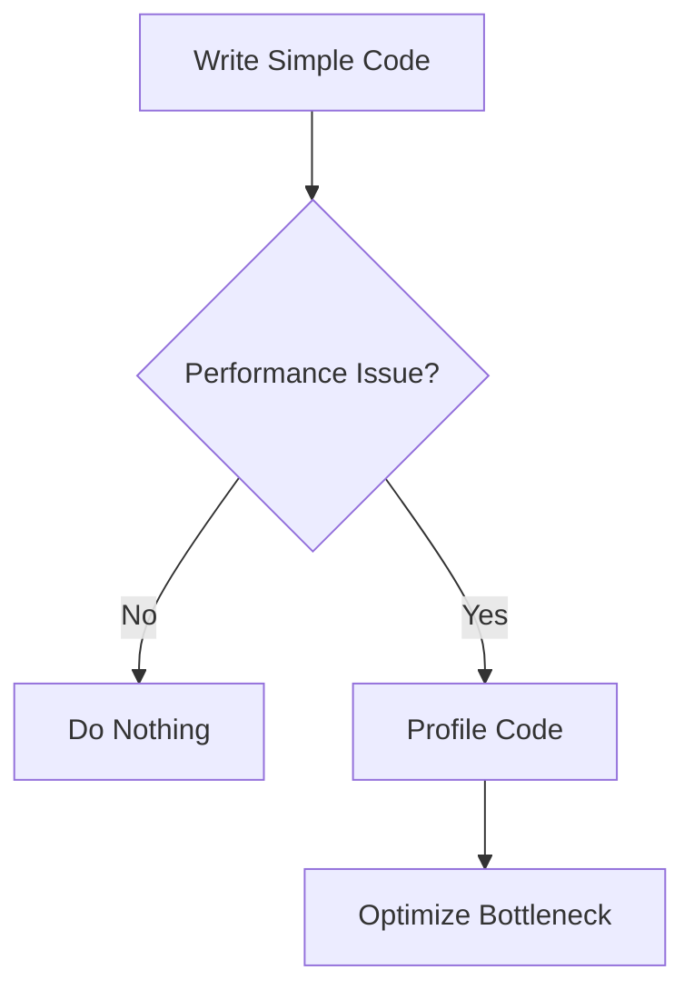

# 1. Computational Complexity Overview

## 1.1 Definition: Computational (Time) Complexity

**Time complexity** measures how the runtime of an algorithm increases as the number of inputs grows.

- Focus: CPU cycles / execution time
    
- Commonly referred to as **Big O notation**
    
- Answers: “If I increase inputs, how much longer does it take?”

### Key Insight

In most contexts:

- “Big O” ≈ “Time Complexity”

---

## 1.2 Definition: Space (Spatial) Complexity

**Space complexity** measures how much memory (RAM or storage) an algorithm uses relative to input size.

- Focus: Memory consumption
    
- Includes:
    
    - Arrays
        
    - Data structures
        
    - Temporary variables

### Relevance

- Critical in **memory-constrained environments**
    
- Less important in systems where memory is abundant

---

# 2. Time Vs Space Complexity

|Aspect|Time Complexity|Space Complexity|
|---|---|---|
|Measures|Execution time|Memory usage|
|Resource|CPU cycles|RAM / storage|
|Common focus|Yes|Sometimes overlooked|
|Critical when|Large datasets|Memory-constrained devices|

---

## 2.1 Network Complexity (Clarification)

- Network transfer is **not typically classified** as space complexity
    
- It can be analyzed separately (e.g., bandwidth cost)
    
- Can still be modeled using Big O, but treated as a distinct concern

---

# 3. Real-World Constraints Example

## Case: Netflix on Low-Memory Devices

Devices:

- Roku
    
- PS3

### Constraints

- CPU: Strong
    
- Memory: Very limited

### Implication

- Prefer inefficient CPU usage if needed
    
- Must minimize memory usage

---

### Mermaid Diagram: Resource Trade-Off



---

# 4. Space Complexity Categories

## 4.1 Linear Space Complexity (O(n))

### Definition

Memory usage grows proportionally with input size.

### Example (Array Duplication)

```javascript
function duplicateArray(arr) {
    let result = [];
    for (let i = 0; i < arr.length; i++) {
        result.push(arr[i]);
    }
    return result;
}
```

### Step-by-Step

1. Input array has size `n`
    
2. New array is created with size `n`
    
3. Total memory grows linearly

---

## 4.2 Logarithmic Space Complexity (O(log n))

### Definition

Memory grows slowly relative to input size.

### Behavior

- Growth rate decreases over time
    
- Example:
    
    - Input 10 → ~7 units
        
    - Input 100 → ~12 units

---

## 4.3 Constant Space Complexity (O(1))

### Definition

Memory usage remains fixed regardless of input size.

### Example

```javascript
function sumFirstTwo(arr) {
    let a = arr[0];
    let b = arr[1];
    return a + b;
}
```

### Step-by-Step

1. Only two variables are used
    
2. Memory does not increase with input size

---

## 4.4 Quadratic Space Complexity (O(n²))

### Definition

Memory grows exponentially relative to input size.

---

## Example: Precomputing Zip Code Distances

### Problem

Calculate distances between all pairs of zip codes.

### Code Example

```javascript
function computeDistances(zipCodes) {
    let distances = {};

    for (let i = 0; i < zipCodes.length; i++) {
        for (let j = 0; j < zipCodes.length; j++) {
            let key = zipCodes[i] + "-" + zipCodes[j];
            distances[key] = calculateDistance(zipCodes[i], zipCodes[j]);
        }
    }

    return distances;
}
```

### Step-by-Step

1. For each zip code (`n`)
    
2. Compare with every other zip code (`n`)
    
3. Store result for each pair
    
4. Total stored items = `n × n = n²`

---

### Mermaid Diagram: Quadratic Growth



---

### Insight

- Rarely desirable
    
- Only justified if:
    
    - Computation is extremely expensive
        
    - Storage is cheaper than computation

---

# 5. Functional Programming and Space Complexity

## Observation

Functional programming often:

- Creates many intermediate arrays
    
- Leads to higher memory usage

---

## Example

```javascript
const result = arr
    .map(x => x * 2)
    .filter(x => x > 10)
    .reduce((sum, x) => sum + x, 0);
```

### Step-by-Step

1. `map` creates a new array
    
2. `filter` creates another array
    
3. `reduce` processes final array
    
4. Multiple temporary arrays increase memory usage

---

## Key Insight

- Usually acceptable due to modern hardware
    
- Problematic in memory-constrained environments

---

# 6. Optimization Strategy

## Principle: Avoid Premature Optimization

### Definition

**Premature optimization** = optimizing before a real problem exists.

### Rules

1. If it doesn’t matter, ignore it
    
2. Optimize only when it becomes a real issue

---

### Mermaid Diagram: Optimization Decision



---

# 7. Decision-Making Framework

## Key Questions to Ask

- Where will this code run?
    
- What devices are targeted?
    
- How large is the dataset?
    
- What constraints exist (CPU, memory, network)?
    
- How critical is performance to the user?

---

## Example Scenarios

|Scenario|Strategy|
|---|---|
|Small dataset|Simplicity over optimization|
|Low-memory device|Optimize space complexity|
|High-performance server|Optimize time complexity|
|Unknown constraints|Gather more information|

---

# 8. Big O as a Tool

## Key Concept

Big O is:

- A **measurement tool**, not a decision-maker
    
- One dimension among many

---

## Real Example: Search Autocomplete

Options:

- Precompute using data structures (higher space)
    
- Compute on the fly (higher time)

### Correct Answer

- Depends on constraints (data size, device, performance needs)

---

# 9. Summary of Key Points

- Time complexity measures execution time; space complexity measures memory usage.
    
- Space complexity becomes critical in memory-limited environments.
    
- Linear, logarithmic, constant, and quadratic describe memory growth patterns.
    
- Functional programming can increase space usage due to intermediate data structures.
    
- Avoid premature optimization; optimize only when necessary.
    
- Always evaluate constraints (device, data size, performance needs).
    
- Big O is a tool for reasoning, not a universal solution.