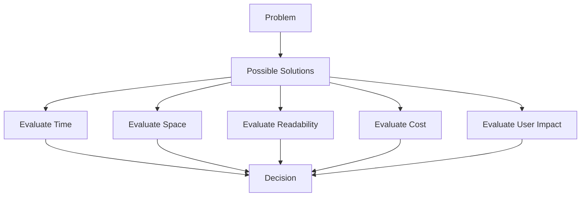
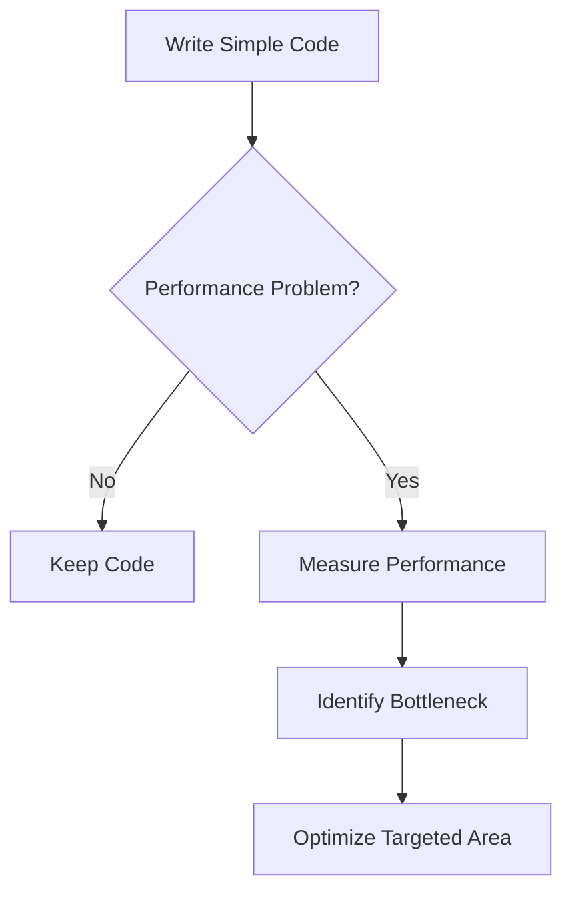
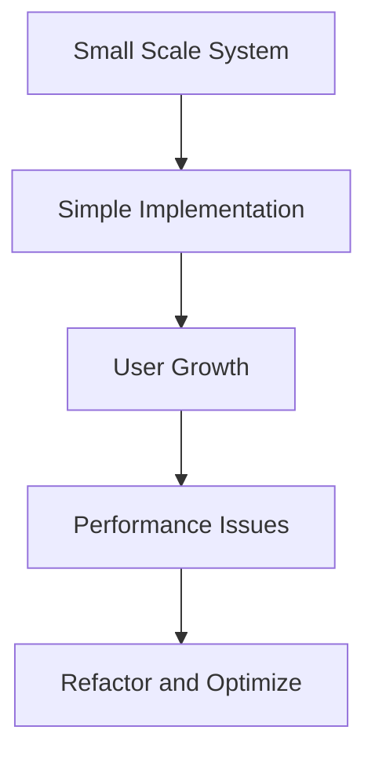
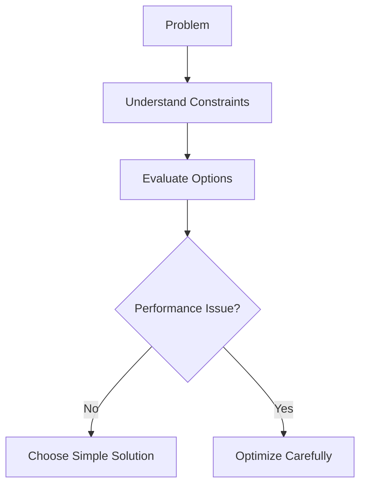

# 1. Trade-Offs in Algorithm Design

## 1.1 Definition: Trade-Off

A **trade-off** is the process of balancing competing factors when choosing a solution.

### Common Trade-Off Dimensions

- Time (speed)
    
- Space (memory)
    
- Readability
    
- Maintainability
    
- Cost (infrastructure, servers)
    
- User experience

### Key Insight

There is rarely a single “best” solution; the optimal choice depends on constraints.

---

## 1.2 Importance in Interviews

Demonstrating understanding of trade-offs:

- Shows deeper engineering thinking
    
- Differentiates candidates
    
- Reflects real-world decision-making

---

### Mermaid Diagram: Trade-Off Evaluation



---

# 2. No Absolute Rules

## 2.1 Principle: No Universal Best Practice

- No rule such as “always use X algorithm”
    
- Every problem must be evaluated independently

### Key Idea

- Multiple correct solutions can exist simultaneously

---

## 2.2 Best Case Vs Worst Case

### Definitions

- **Best case**: Most favorable input scenario
    
- **Worst case**: Least favorable input scenario
    
- **Average case**: Expected typical performance

### Decision Strategy

|Scenario|Strategy|
|---|---|
|Predictable inputs|Optimize for best case|
|Uncertain inputs|Optimize for worst/average case|

---

# 3. Limitations of Big O

## 3.1 Ignoring Constants

Big O ignores coefficients:
$$
- O(3n²) → O(n²)
$$
### Important Exception

Constants can matter in practice.

---

## Example

```javascript
function heavyLoop(arr) {
    for (let i = 0; i < arr.length; i++) {
        // imagine 10,000 operations here
    }
}
```

### Explanation

- Even though complexity is O(n)
    
- Large constant factor (10,000 operations) can significantly impact performance

---

## 3.2 When Big O Is Misleading

### Real Example: Batch Job Optimization

- Job runs once per day
    
- Execution time: ~45 seconds

### Insight

- Optimization effort was wasted
    
- No user impact
    
- Performance improvement provided no real value

---

# 4. Code Quality Principles

## 4.1 Code as Communication

### Definition

Code is a medium for communication between developers.

### Implications

- Must be readable by humans
    
- Must be maintainable over time

---

## 4.2 Readability Vs Performance

|Factor|Priority|
|---|---|
|Readability|High|
|Maintainability|High|
|Performance|Conditional|

### Key Rule

Prefer readable and maintainable code unless constraints demand optimization.

---

## Example Trade-Off

|Option|Complexity|Readability|Recommendation|
|---|---|---|---|
|Simple code|O(n²)|High|Often preferred|
|Optimized code|O(n)|Low|Use only if necessary|

---

## 4.3 Simplicity Principle

### Rule

Always favor simpler solutions when possible.

### Benefits

- Fewer bugs
    
- Easier debugging
    
- Faster development

---

# 5. Human Time Vs Machine Time

## Principle

Human time is more valuable than computer time.

### Example

- Adding servers (cheap) vs writing complex optimized code (expensive developer time)

---

# 6. Premature Optimization

## 6.1 Definition

Optimizing code before performance issues are identified.

## 6.2 Rules

1. Do not optimize without evidence
    
2. Optimize only when a real problem exists

---

### Mermaid Diagram: Optimization Workflow



---

# 7. Use of Built-In Tools

## 7.1 Principle

Prefer built-in language features over custom implementations.

### Reasons

- Highly optimized (often written in lower-level languages like C)
    
- Extensively tested
    
- Fewer bugs

---

## Example

```javascript
arr.sort((a, b) => a - b);
```

### Advantages

- Faster than most custom implementations
    
- Reliable
    
- Minimal maintenance

---

# 8. Scaling and Growth

## 8.1 Scaling Scenario

### Transition

- Small system → Large user base (e.g., 10 → 100,000 users)

### Impact

- Performance bottlenecks emerge
    
- Requires refactoring and optimization

---

## 8.2 Strategy: “Do Unscalable Things”

### Principle

- Build simple solutions early
    
- Optimize only after growth demands it

---

### Mermaid Diagram: Growth Vs Optimization



---

# 9. Load Testing Strategy

## 9.1 Definition

**Load testing** evaluates system performance under expected user load.

---

## 9.2 Best Practice

### Rule

Test for near-future scale, not extreme hypothetical scenarios.

---

## Example

|Current Users|Recommended Test Range|
|---|---|
|10,000|30,000 – 100,000|
|100,000|300,000+|

---

## Key Insight

- Avoid over-testing for unrealistic scale
    
- Focus on “visible future”

---

# 10. Real-World Example: Search Performance

## Scenario

- Slow search functionality
    
- Large dataset loaded into limited device

### Decision

- Delay optimization
    
- Prioritize feature development

### Insight

- Temporary inefficiency can be acceptable
    
- Business priorities may override performance concerns

---

# 11. Decision Framework

## Key Questions

- What are the constraints?
    
- What is the dataset size?
    
- Who are the users?
    
- What is the expected growth?
    
- Is performance currently a problem?

---

### Mermaid Diagram: Decision Flow



---

# 12. Summary of Key Points

- Trade-offs are central to algorithm and system design.
    
- There are no universal rules; decisions depend on context.
    
- Big O ignores constants, which can still matter in practice.
    
- Readability and maintainability are often more important than performance.
    
- Avoid premature optimization; optimize only when necessary.
    
- Built-in tools are preferred due to reliability and performance.
    
- Systems should be optimized incrementally as they scale.
    
- Load testing should target realistic near-term growth.
    
- Engineering decisions must balance technical and business considerations.