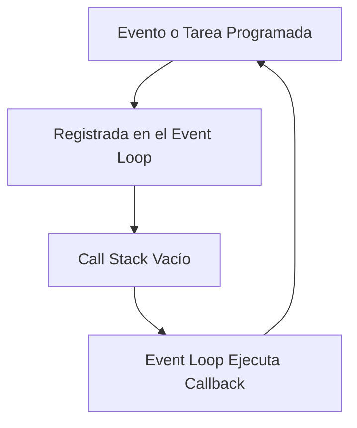

# Notas De Estudio

## Tema: Non-Blocking I/O, Event Loop Y la Relación Entre JavaScript Y Node.js

---

# 1. Introducción Al I/O Y Non-Blocking I/O

## ¿Qué Es I/O?

**I/O (Input/Output)** se refiere a las operaciones de entrada y salida:  
lectura de archivos, peticiones de red, acceso a bases de datos, etc.

## Non-Blocking I/O

En muchos lenguajes como **Python, Ruby o PHP**, el I/O es tradicionalmente **bloqueante**:  
el programa espera a que una operación determine antes de continuar.

En **JavaScript/Node.js**, el I/O es **no bloqueante**, lo que significa que:

- El código puede iniciar una operación (como leer un archivo o consultar una base de datos).
    
- Esa operación se delega al sistema para completarse más tarde.
    
- Mientras tanto, el hilo principal **no se bloquea**, y puede seguir ejecutando otras tareas.

Esto permite:

- Manejo eficiente de tareas concurrentes.
    
- Servidores capaces de atender miles de solicitudes simultáneas sin múltiples hilos.

---

# 2. Paralelismo En Node.js Con Un Solo Hilo

Node.js funciona principalmente con **un solo hilo**, pero:

- Puede realizar múltiples tareas de I/O “a la vez”.
    
- Esto se logra gracias a su **event loop** y un subsistema de callbacks.

No es adecuado para:

- Procesamiento intensivo de CPU  
    (IA, machine learning, cálculos pesados).  
    Porque solo usa un hilo, estas tareas bloquearían todo el runtime.

Es ideal para:

- Servidores web de alta concurrencia.
    
- Aplicaciones en tiempo real.
    
- API con muchas operaciones de entrada/salida.

---

# 3. El Event Loop

## Definición

El **event loop** es un mecanismo que registra tareas, espera su finalización y ejecuta los callbacks cuando corresponde.

## Función General

- Mantiene una **cola de tareas** (timers, I/O, promesas, etc.).
    
- Cuando el call stack está vacío, toma la siguiente tarea de la cola.
    
- Ejecuta su callback.
    
- Repite continuamente.

## Representación Simplificada Del Ciclo



---

# 4. Event Loop En JavaScript Vs Node.js

## ¿Son Diferentes?

- Conceptualmente son **lo mismo**: un mecanismo para manejar tareas asíncronas.
    
- Pero **la implementación** difiere:
    
    - En un navegador el event loop interactúa con APIs del DOM, timers, red del navegador.
        
    - En Node.js interactúa con el sistema operativo, módulos como fs, net, http, etc.

Para el desarrollador que escribe JavaScript:

- La experiencia es casi idéntica.
    
- `setTimeout`, callbacks, promesas funcionan igual.

---

# 5. Código Bloqueante Vs No Bloqueante

## Código Bloqueante (Síncrono)

Todo se ejecuta de arriba hacia abajo esperando el resultado de cada línea.

Ejemplo conceptual:

```js
function getUser(id) {
  const user = databaseLookup(id); // Bloquea hasta terminar
  return user;
}
const result = getUser(5);  // No sigue hasta obtener el resultado
```

## Código No Bloqueante (Asíncrono)

Usa callbacks, promesas o funciones asincrónicas.  
El flujo continúa sin esperar.

Ejemplo con `setTimeout` (simulación de I/O):

```js
function getUser(id, callback) {
  setTimeout(() => {
    callback({ id, name: "Alice" });
  }, 1000);
}

console.log("Inicio");
getUser(5, user => console.log("Usuario:", user));
console.log("Fin");
```

**Orden real de ejecución:**

1. "Inicio"
    
2. "Fin"
    
3. "Usuario: { … }" (después de 1000 ms)

## Explicación Paso a Paso

1. Se llama a `getUser`.
    
2. `setTimeout` registra una tarea para dentro de 1000 ms.
    
3. El código continúa; no espera.
    
4. Cuando pasa el tiempo, el event loop coloca el callback en la cola.
    
5. El callback se ejecuta cuando el call stack está libre.

## Diferencias Clave

|Tipo de Código|Flujo|Ventajas|Desventajas|
|---|---|---|---|
|Bloqueante|Sequential|Fácil de entender|No escala bien|
|No bloqueante|Asíncrono|Excelente concurrencia|Puede set más complejo|

---

# 6. JavaScript Como Lenguaje Vs Node.js Como Runtime

## Punto Clave

Si **ya sabes JavaScript**, ya conoces **90% de Node.js**.

## ¿Por Qué?

Porque:

- El lenguaje es exactamente el mismo.
    
- Node.js solo añade APIs especiales para trabajar fuera del navegador.

## Lenguaje Vs Runtime

|Elemento|JavaScript (Lenguaje)|Node.js (Runtime)|
|---|---|---|
|Qué es|Sintaxis, reglas, tipos, estructuras|Programa que ejecuta JavaScript en un servidor|
|APIs principales|DOM, BOM, Fetch del navegador|fs, http, process, módulos del SO|
|Objetivo|Interactividad en navegador|Servidores, CLI, scripts backend|

Un navegador también es un runtime de JavaScript, con APIs diferentes.

## Resumen Práctico

- **Funciones, variables, arrays, objetos → mismos en Node y navegador.**
    
- **APIs disponibles → distintas según el runtime.**

---

# 7. Importancia En El Diseño De Aplicaciones

- Comprender el **event loop** y el **non-blocking I/O** te obliga a pensar de forma asincrónica.
    
- Esto cambia cómo diseñas:
    
    - Flujo de datos.
        
    - Manejo de errores.
        
    - Secuencia de operaciones.

---

# Resumen De Puntos Clave

- Node.js usa **non-blocking I/O** y un **event loop** para manejar concurrencia en un solo hilo.
    
- El event loop registra tareas, espera su finalización y ejecuta los callbacks.
    
- JavaScript es el lenguaje; Node.js es el runtime (igual que el navegador).
    
- Saber JavaScript implica saber casi todo lo necesario para usar Node.js.
    
- Node.js es excelente para tareas concurrentes, pero no para cálculos intensivos de CPU.
    
- Código bloqueante detiene el flujo; código no bloqueante usa callbacks, promesas o async/await para continuar sin esperar.

---

# MicroTest

# H2