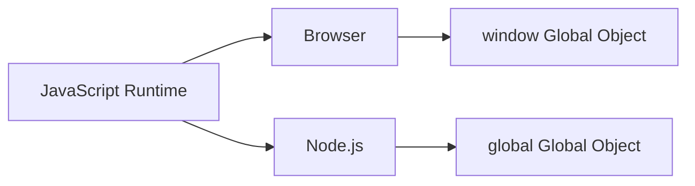

## Notes on Browser vs Node.js Environments, Globals, Modules, DOM, Servers, and the Node REPL

---

## 1. Browser vs Node.js: Global Environment

### The Global Object

Every JavaScript runtime provides a **global object** that exposes built-in APIs.

|Environment|Global Object|Example|
|---|---|---|
|Browser|`window`|`window.alert()`|
|Node.js|`global`|`global.setTimeout()`|

#### Browser Global (`window`)

- Everything declared globally becomes a property of `window`.
    
- Calling `alert` is equivalent to `window.alert`.
    
- Browser APIs like `document`, `localStorage`, `fetch` (modern), etc., are available.
    

#### Node Global (`global`)

- Node does **not** have `window`.
    
- Using `window` in Node throws: **ReferenceError: window is not defined**.
    
- Node's equivalent is `global`, but it is rarely used directly.
    
- Contains familiar functions:  
    `setTimeout`, `clearInterval`, `fetch` (recently added), etc.
    



---

## 2. Modules in Browser vs Node.js

### Browser Modules

Modern browsers support ES modules natively using:

```html
<script type="module" src="app.js"></script>
```

- Supports `import` and `export`.
    
- Still requires bundlers (Vite, Rollup, Webpack) for complex applications.
    

### Node.js Modules

Node also supports ES modules:

```js
import something from './file.js';
export function myFunc() {}
```

Differences:

- No DOM → no `<script>` tag.
    
- Modules are imported from JavaScript files directly.
    
- Node also historically used CommonJS (`require`, `module.exports`), but ES modules are now standard.
    

### Universal JavaScript

Code can run in both environments if it:

- Avoids browser-only objects like `document` unless guarded.
    
- Checks environment when necessary.
    

Example:

```js
if (typeof window !== "undefined") {
  // Browser-only code
}
```

---

## 3. DOM Availability

### Browser DOM

Browsers provide:

- `document`
    
- `querySelector`
    
- HTML elements
    
- Rendering capabilities
    

### Node.js Has No DOM

Node cannot execute DOM operations:

```js
document.getElementById("something") // Error in Node
```

Reason:

- Node runs **outside** the browser.
    
- No HTML, no visual output, no rendering engine.
    

### Server-Side HTML (Important Distinction)

- Node **can serve HTML**, but cannot **execute** it.
    
- The browser executes the HTML after receiving it from the server.
    

---

## 4. Server vs Client Roles

### Server (Node.js)

A **server**:

- Is a remote computer.
    
- Responds to requests.
    
- Sends back files or data (HTML, JSON, images, etc.).
    

### Client (Browser JavaScript)

A **client**:

- Displays web pages.
    
- Sends requests (fetch, form submissions).
    
- Interacts with DOM.
    

|Role|Typical Environment|Responsibilities|
|---|---|---|
|Server|Node.js|Serve data, handle logic, manage APIs|
|Client|Browser|UI rendering, DOM interaction|

---

## 5. Console in Browser vs Node

The `console` API is essentially the same (`log`, `error`, etc.) in both environments, though implementations differ.

---

## 6. Node.js REPL

### What is REPL?

**REPL = Read, Evaluate, Print, Loop**  
It is an interactive environment for running JavaScript line by line.

### How to Start the Node REPL

In terminal:

```sh
node
```

Now you can type JavaScript interactively:

```js
> 2 + 2
4
```

### Purpose of the REPL

- Useful for testing snippets.
    
- Good for quick experiments or debugging.
    
- Not suitable for building applications (no files, no saving, no structure).
    

### Exiting the REPL

Options:

- `Ctrl + C` twice
    
- `Ctrl + D`
    
- `.exit`
    

---

## 7. When to Use (or Avoid) the REPL

### Good for:

- Small tests
    
- Quick calculations
    
- Trying APIs
    

### Not good for:

- Building applications
    
- Versioning code
    
- File management
    

---

## Summary of Key Points

- Browsers and Node.js both run JavaScript, but provide **different globals**:
    
    - Browser → `window`
        
    - Node → `global`
        
- Node cannot use DOM APIs because there is **no DOM outside the browser**.
    
- Both environments support **ES modules**, but usage differs.
    
- Node is typically used for **servers**, browsers for **client-side UI**.
    
- The Node REPL allows interactive execution of JavaScript but is not used for full applications.
    

---

## MicroTest