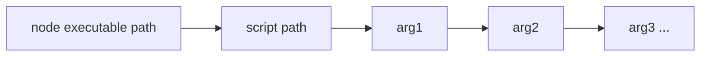
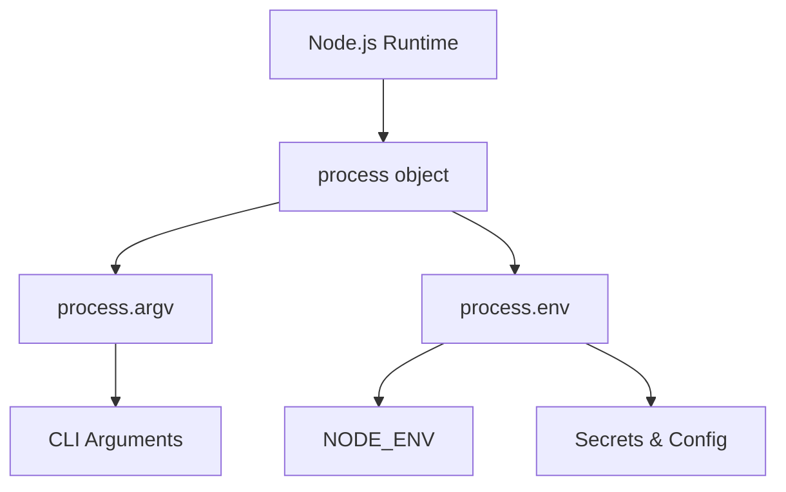

# CLI Note-Taking App: Study Notes

# What is a CLI?

## Definition

A **CLI (Command-Line Interface)** is an application that users interact with through text commands in a terminal.  
Examples: any command you type in the terminal (`node`, `cd`, `ls`, `git`) is part of a CLI.

## Context in Node.js

We are building a **CLI note-taking app** using Node.js.  
To understand how a CLI works, we need to understand:

- The **process** object
    
- The **environment**
    
- How Node.js runs JavaScript differently than the browser

---

# Runtime Environments

## JavaScript in the Browser Vs Node.js

|Browser JavaScript|Node.js JavaScript|
|---|---|
|Runs in a browser environment|Runs in the operating system environment|
|Limited to browser APIs (DOM, window, document)|Access to system-level APIs (filesystem, processes, environment variables)|
|No access to OS-level resources|Uses modules like `fs`, `path`, `process`|

---

# The `process` Object

## What is `process`?

`process` is a **global object** provided by Node.js that exposes information and functionality from the underlying OS environment.

It includes:

- Metadata about the OS
    
- Active processes
    
- Environment variables
    
- Arguments used to run the program
    
- Methods to exit, communicate, or modify process behavior

## Why it Matters

CLI apps need to:

- Read arguments from the user
    
- React to environmental differences
    
- Handle secrets securely

`process` provides these capabilities.

---

# `process.argv`

## Definition

`process.argv` is an array containing:

1. Path to the Node.js executable
    
2. Path to the executed script
    
3. Any additional arguments passed in the terminal

## Example

Command:

```bash
node index.js thing thing2 123
```

Value of:

```js
console.log(process.argv)
```

Result (simplified):

```Python
[
  "/path/to/node",
  "/path/to/index.js",
  "thing",
  "thing2",
  "123"
]
```

## Why it Matters for CLI Apps

It allows the CLI to behave dynamically depending on the arguments the user provides.

### Mermaid Diagram: Structure of `process.argv`



---

# Environment Variables: `process.env`

## What Are Environment Variables?

Values stored **outside** the code, injected by the operating system.  
Used for:

- API keys
    
- Database URLs
    
- Secrets
    
- Configuration modes

## Accessing Environment Variables

```js
process.env.MY_VARIABLE
```

## Why they’re Used

You _never_ hard-code sensitive information in code because:

- It can leak in GitHub
    
- Anyone with access to the code could see it

Environment variables allow secure injection of secrets during deployment.

---

# `NODE_ENV`

## Definition

A commonly used environment variable to define the "mode" the app is running in.

Typical values:

- `"development"`
    
- `"production"`
    
- `"test"`

## Why It's Important

Different modes should enable/disable different behaviors.

|Mode|Typical Behavior|
|---|---|
|development|verbose logging, disable authentication, skip performance optimizations|
|production|enable analytics, hide warnings, optimize rendering, enable auth|
|test|mock services, disable analytics, isolate effects|

Example:

```js
if (process.env.NODE_ENV === "development") {
   console.log("Debug logs enabled");
}
```

React and other frameworks also use `NODE_ENV` to optimize builds and adjust error messaging.

---

# Common Question: Is there `process.argc`?

- No, Node.js does **not** have `argc` (argument count).
    
- You can get the count with:

```js
process.argv.length
```

---

# Sharing `.env` Files

## Why it’s Hard

.env files contain secrets.  
If leaked, attackers can gain full access to your systems.

## Existing Approaches

|Method|Description|
|---|---|
|Password managers (1Password, LastPass)|Store environment variables securely|
|Team vault services|Store env vars in an encrypted shared vault|
|Automatic sync via external services|Example: one variable retrieves all others from a secure API|
|Manual sharing|Only for local development; may occur via Slack or other channels|
|DevOps-managed injection|Variables added directly into AWS, Vercel, etc., not shared with developers|

## Key point

There is **no perfect solution**; it's a high-value security problem with trade-offs.

GitHub now warns about leaked secrets in repos to reduce risks.

---

# Additional Notes

## Why Every Language Has Environment Variables

Any language running on an OS needs:

- Secure configuration management
    
- OS-level integration
    
- Deployment flexibility

Without environment variables:

- Secure deployment would be nearly impossible
    
- Secrets would have to be hard-coded

---

# Key Concept Relationships



---

# Summary of Key Points

- A **CLI** is a text-based interface used in the terminal.
    
- Node.js runs in an **OS environment**, giving access to globals like `process`.
    
- **`process.argv`** contains the command-line arguments used to run a script.
    
- **Environment variables** (`process.env`) store sensitive data and configuration.
    
- **`NODE_ENV`** toggles app behavior between development, production, and test.
    
- Sharing `.env` files is a hard security problem with no perfect solution.
    
- CLI applications rely heavily on arguments and environment variables for dynamic behavior.

---

# MicroTest