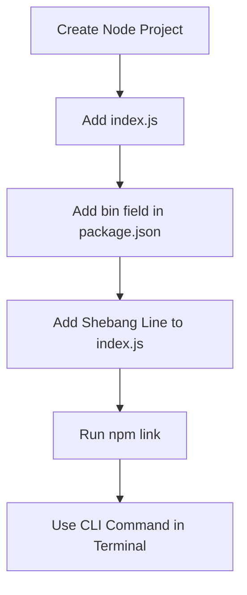

# Study Notes: Building a CLI in Node.js

## 1. What Is a CLI?

### Definition

A **CLI (Command Line Interface)** is an application that runs directly inside the terminal.  
It allows users to interact with the computer by typing commands rather than using a graphical interface.

### Key Characteristics

- Runs inside the terminal.
    
- Operates through commands, not natural language.
    
- Executes code associated with each command.
    
- Some CLIs are built-in (e.g., `ls`, `rm`, `cd`, `mkdir`).
    
- You can create your own custom CLI.

### Conceptual Analogy

A CLI is like _“chatting with your computer”_ using commands instead of human language.

---

## 2. CLIs and Programming Languages

### Language Flexibility

- A CLI can be built in **any language** that can run on your operating system.
    
- The runtime of the OS determines if the CLI can be executed.
    
- Many CLIs you use may be written in languages different from what you think.

### Operating System Integration

- CLIs run directly on the OS.
    
- They have access to the machine's resources (files, directories, processes, etc.).
    
- This makes CLIs extremely powerful, both locally and in cloud environments.

---

## 3. Initial Setup: Creating a Node.js Project

### Using `npm init`

`npm` is itself a CLI and comes bundled with Node.js.

To initialize a project:

```bash
npm init
```

This generates a **package.json**, which contains project metadata and configuration.

To skip the prompts:

```bash
npm init --yes
```

### Purpose of `package.json`

- Identifies the project.
    
- Allows usage of Node.js features (modules, scripts, dependencies).
    
- Important when creating packages, but less critical when creating an app/CLI.

---

## 4. Creating the CLI Script

### Creating `index.js`

Example:

```js
console.log("hello world");
```

This is the program the CLI will execute.

---

## 5. Enabling CLI Execution Through `bin` Field

### Editing `package.json`

Add a **bin** field:

```json
"bin": {
  "note": "./index.js"
}
```

Meaning:

- Create a CLI command called `note`.
    
- When executed, the OS should run `index.js`.

### How CLIs Work in the OS

Most systems have a `bin` directory where CLI executables live.  
The `bin` field instructs npm to create an entry for your CLI inside that directory.

Avoid naming your CLI with a name that already exists (e.g., `git`) to prevent collisions.

---

## 6. Installing the CLI Locally with `npm link`

### Purpose of `npm link`

Creates a **symbolic link (symlink)** between your local project and the OS CLI directory.

```bash
npm link
```

Benefits:

- Updates instantly without reinstalling.
    
- Faster development workflow.

To verify installation:

```bash
which note
```

If nothing appears, the link failed.

---

## 7. Common Error: CLI Not Recognized or Wrong Runtime

### Issue

Running the CLI produces a syntax error like:

```Python
syntax error near unexpected token
```

### Cause

The OS does not know which runtime should execute your file.

### Solution: Add Shebang (Hashbang)

Inside `index.js`, the first line must be:

```bash
#!/usr/bin/env node
```

Notes:

- Must be the **first line**, no spaces or blank lines before it.
    
- Not a JavaScript comment; it's for the OS only.
    
- Tells the system to run the file using Node.js.

### After Adding, Test

```bash
note
```

Expected output:

```Python
hello world
```

---

## 8. Troubleshooting `command not found`

If running your CLI gives:

```Python
command not found
```

Likely causes:

- `npm link` was not executed.
    
- Wrong working directory.
    
- The OS path did not register the CLI name.

Check with:

```bash
which note
```

If empty → run:

```bash
npm link
```

---

## Mermaid Diagram: CLI Creation Steps



---

## 9. Table Summary of Key Commands

|Purpose|Command|Description|
|---|---|---|
|Initialize Node project|`npm init`|Creates `package.json`|
|Initialize with defaults|`npm init --yes`|Skips prompts|
|Create symlink CLI|`npm link`|Installs CLI locally|
|Check CLI location|`which note`|Confirms installation|
|Run JS file directly|`node index.js`|Bypasses CLI system|

---

## Summary of Key Points

- A CLI is an application that runs in the terminal and responds to typed commands.
    
- CLIs can be built in any language that the OS can execute.
    
- `package.json` enables Node-based project configuration.
    
- The `bin` field registers a CLI command.
    
- `npm link` connects your local project to the OS CLI system.
    
- A shebang is required to tell the OS which runtime to use.
    
- Testing and debugging rely on `which`, `npm link`, and proper file paths.

---

## MicroTest